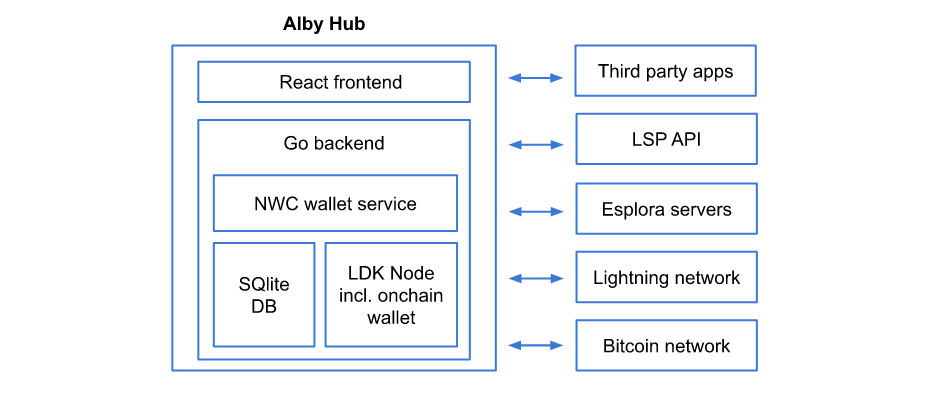

[Alby Hub](https://albyhub.com/) is a self-custodial Lightning wallet that combines ease of use, ownership, and seamless connectivity to apps. It serves as a central hub for managing bitcoin payments, featuring a simple plug-in mechanism that links the integrated Lightning node with apps across platforms and operating systems.
This setup allows users to control Alby Hub from mobile wallets, browser extensions, and directly within social media apps, games, and more—eliminating the need to deposit funds into apps or spread your Bitcoin balance across multiple accounts.

Alby Hub manages to improve ease of use of a self-custodial lightning wallet while giving users full control over their wallet and payment channels if desired, thus providing [lightning sovereignty for everyone](https://blog.getalby.com/what-is-alby-hub/).

# What we did

Alby Hub is a versatile application built with Go for the backend and React for the frontend. It integrates the Rust-based LDK Node implementation with custom UniFFI bindings.

Blockchain data is sourced from Esplora servers to minimize sync times and disk usage.

A SQLite database is used for storing transaction metadata, providing detailed context around each transaction.

The application supports two modes: - Wails (Desktop app): Compatible with Mac, Windows, and Linux. - HTTP (Web app): Deployable via Docker or run directly as a Linux binary.

Alby Hub also integrates with Lightning Service Providers (LSPs) through an API, enabling users to choose from a list of LSPs and purchase payment channels in two clicks to source inbound liquidity. With the help of the LSP API channel management will be automated and further abstracted away.

The integrated [NWC](https://nwc.dev/) wallet service is what makes Alby Hub a new kind of a self-custodial lightning wallet. NWC allows direct connections to [third-party apps](https://github.com/getAlby/awesome-nwc), greatly extending the app's functionality. This means users can plug in their Hub by copying a connection string into other apps instead of depositing funds before using an app.

# Results

Integrating LDK directly into Alby Hub, rather than relying on an external daemon, simplifies deployment and operation. This integration is what made building Alby Hub feasible. Its resource efficiency gives users the flexibility to choose [where to run Alby Hub](https://blog.getalby.com/run-alby-hub-on-servers-desktops-and-microcomputers/)—whether on servers, desktops, or microcomputers.

Another crucial factor was payment processing time. Alby is your companion for bitcoin payments wherever you go whether at a POS or directly within apps. Fast payment processing is crucial for delivering a seamless user experience in third-party apps.

LDK Node offers a well-structured and designed public API, making integration fast and development straightforward. When needed, the Spiral team provided consistent support throughout the integration process and continues to do so in the operation of Alby Hub. This collaboration has been crucial to delivering a sophisticated product.

As a consequence, Alby Hub lowers the cost barrier for running a lightning node, making self-custodial lightning payments accessible to those with limited budgets and without technical skills.
