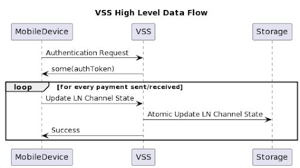

The Versioned Storage Service (VSS) provides a server-side storage solution for non-custodial mobile, web and hosted
wallets. VSS significantly simplifies the wallet development process by offering a reliable, secure, and robust
framework that stores and manages the various forms of state data required for the Lightning Network (LN) and Bitcoin
applications.

# What Is VSS?

VSS is a client-server storage framework for Lightning Network (LN) and Bitcoin wallet data. VSS primarily serves two
core functionalities:

* Recovery: VSS enables the restoration of states and wallet access, helping users regain their funds and control even
  in scenarios of device or data loss.
* Multi-device Access: While this isn’t available now, future phases will allow the same wallet app across multiple
  devices to securely share and access the LN state, leading to consistent access to funds.

Clients can also leverage VSS for general application metadata storage including payment history, user metadata, and
more.

# Why VSS?

VSS aims to lower the barriers to high-quality LN wallet development. Wallet builders can host the VSS service in-house
for straightforward interaction with the service or use reliable third-party VSS providers, if available.

VSS was designed with privacy in mind, offering features such as client-side encryption, key-obfuscation, and robust
authorization. It also ensures data and version number verifiability, and will support multi-device access in the
future. The software ensures modularity for seamless integration with different storage backend technologies.
Additionally, VSS can work with various applications with different key-level versioning and data-integrity mechanisms
and even allows disabling versioning for single-device wallet usage.

### Why do we need VSS as primary storage for lightning wallets?

Keeping VSS in sync with the latest Lightning state isn’t optional; if the server’s version lags and the user loses the
device, there is a risk for funds loss. That’s why VSS-powered wallets must be designed to hold off advancing the
lightning state until everything’s securely updated on the server.

The on-device state of a Lightning wallet changes every time a user sends or receives payments. While some backup
options offer frequency-based backups, these can lead to data being out of sync and do not ensure full funds or channel
recovery if the device is lost. Protocols that sync asynchronously based on intervals inherently have insufficient data
for complete recovery by design.

Using VSS as the primary storage ensures that every state change is securely stored in real-time, enabling full recovery
of funds and channels regardless of device loss.

<div style="text-align: center;">
    
    <p style="margin-top: 10px;">VSS High Level Data Flow (Simplified)</p>
</div>

# Customization

While VSS can be readily used, it is intended to be customized based on specific requirements. For example, clients
might need to implement custom authorization, encryption, or backend database integration with different cloud
providers. With the accurate facilitation of the API contract, wallets can easily switch between different instances of
VSS. For example, a wallet can easily switch from VSS-Provider-A to VSS-Provider-B by just downloading the whole state
and uploading it to the new provider.

By default, VSS incorporates a PostgreSQL implementation and can be hosted on preferred infrastructure/cloud providers
such as AWS, GCP, and others. Its backend storage can be interchanged with other implementations for KeyValueStore if
necessary.

# Usage

### Using with LDK Node:

[LDK Node](https://github.com/lightningdevkit/ldk-node) can be easily configured to run with VSS as primary storage. It
is integrated in LDK Node (written in Rust) using [VSS-rust-client](https://github.com/lightningdevkit/vss-rust-client),
and there is also support for other languages such as Swift, Kotlin and Python
through [UniFFI](https://mozilla.github.io/uniffi-rs/) bindings.

```rust  
use ldk_node::Builder;

fn main() {  
let mut node_builder = Builder::new();  
    ...  
    // Note: store_id can be freely set by the user and is useful for creating separate namespaces within storage.
    // However, it must remain fixed for the entire life of the node as it is used for database storage.
    let node = node_builder
                .build_with_vss_store_and_fixed_headers(
                    vss_endpoint,
                    store_id,
                    HashMap::new(),
                )
                .unwrap();

    node.start().unwrap();    
    ...  
    ...
}  
```

### Using with Other Applications

VSS is designed to store application-related metadata. Clients can use
the [VSS-rust-client](https://github.com/lightningdevkit/vss-rust-client) directly for this purpose. This can help
provide a complete user data recovery solution for applications, as well as enable turn-key multi-device support in the
future.

### Hosting

VSS can either be self-hosted or deployed in the cloud. If a service provider is hosting VSS for multiple users, it must
be configured with **HTTPS**, **Authentication/Authorization**, and **rate-limiting**.

Application/wallet vendors can choose to either self-host VSS instances or use one of the existing hosted VSS providers.

### Authentication & Authorization

Currently, the VSS-server supports [JWT](https://datatracker.ietf.org/doc/html/rfc7519)\-based authentication and
authorization, and can run without authentication for local testing or in trusted setups. The VSS-rust-client supports
LNURL-auth & JWT based authentication and authorization. Switching to simple HTTP header authentication is
straightforward by adding another implementation. Note that the security of authentication heavily relies on using HTTPS
for all requests.

### Scaling

VSS itself is stateless and can be horizontally scaled easily. VSS can be configured to point to a PostgreSQL cluster,
and further scaling considerations need to be addressed in the PostgreSQL cluster.

# Project Status

VSS execution is split into two phases: Phase I prioritizes recovery and single-device use, whereas Phase II covers
multi-device use. Phase I is ready to use and integrated within [LDK Node](https://github.com/lightningdevkit/ldk-node).
Phase II will be subject to monitoring for demand from wallets and may slip to a later date. Refer
to [LDK-Roadmap](https://lightningdevkit.org/blog/ldk-roadmap/#vss) for more details.

# Implementation

Currently, the VSS server has Java and Rust based implementations and is ready to use.
[VSS-rust-client](https://github.com/lightningdevkit/vss-rust-client) is a Rust-based client with support
for client-side encryption, key obfuscation, retry mechanisms, and LNURL-auth. VSS is also integrated starting
with [LDK Node](https://github.com/lightningdevkit/ldk-node) v0.4.x as alpha support.

# Future

In the future, LDK and VSS will introduce multi-device support. This will enable users to seamlessly access the same
Lightning node across multiple devices.

With synchronized updates and real-time access, users can manage their Lightning wallet from any preferred device,
enhancing convenience and accessibility while maintaining consistency across platforms.

# Conclusion

In summary, VSS provides an open-source, server-side cloud storage solution optimized specifically for non-custodial
Lightning/Bitcoin wallets as well as auxiliary application storage needs. Its key features include multi-device access,
recovery capabilities, user privacy protection, and data verifiability. With VSS, wallet developers can focus on
creating innovative Lightning wallets without the extra burden of crafting
complex [live backup storage](https://lightningdevkit.org/blog/the-challenges-of-developing-non-custodial-lightning-on-mobile/#live-backups)
solutions from scratch.

# Resources

1. [vss-server](https://github.com/lightningdevkit/vss-server) : A java and rust implementation of VSS server with
   PostgreSQL as default storage backend.

2. [vss-rust-client](https://crates.io/crates/vss-client) : A rust client for VSS, with in-built support for retries,
   client-side encryption and custom auth mechanism.

3. [LDK Node](https://github.com/lightningdevkit/ldk-node/blob/f1fdee50d5a8b628040fb2d584a7c4b831090de4/src/builder.rs#L441-L557) :
   VSS is integrated with LDK Node and currently has alpha/experimental support.

4. Bindings: On the client side, VSS is also usable with existing LDK Node bindings in Kotlin/swift/python.

# Support

If you encounter any issues or have questions, feel free to open an issue on
the [GitHub repository](https://github.com/lightningdevkit/vss-server/issues). For further assistance or to discuss the
development of VSS, you can reach out to us in the [LDK Discord](https://discord.gg/5AcknnMfBw) in the `#vss` channel.
