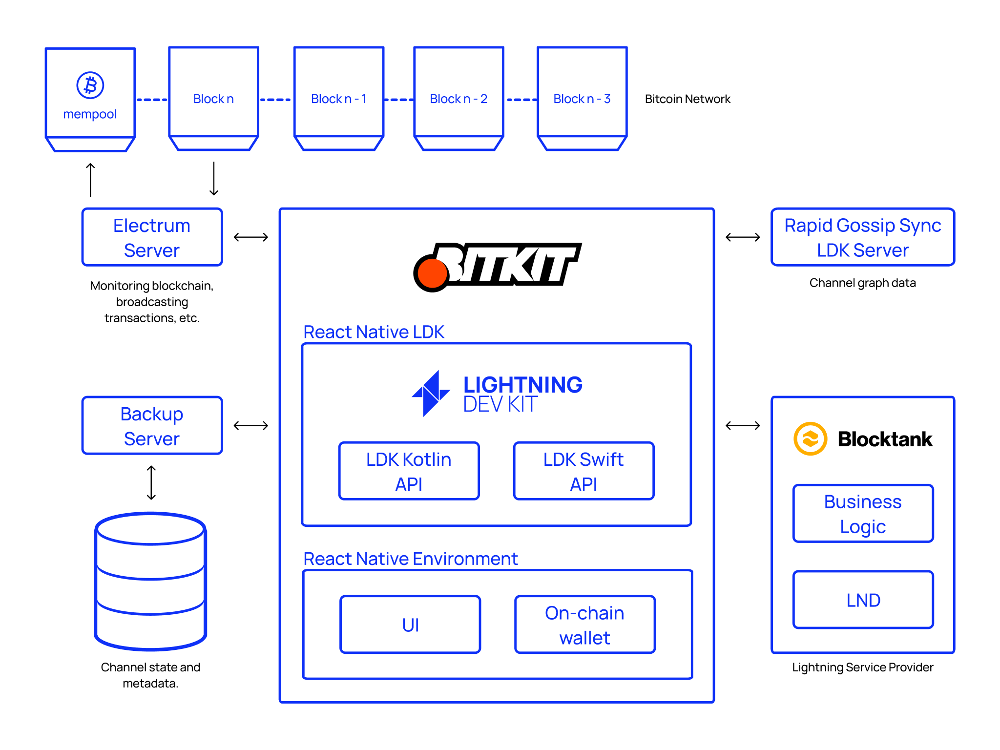

In 2020, the Lightning Network was in its early stages, and most people used custodial wallets. We believe this trend towards custodial wallets contradicts the Bitcoin ethos, so we decided to create a self-custodial alternative that offers a great user experience for all, not just technical users.

[And that's how Bitkit was born.](https://bitkit.to/)

# Before LDK

Choosing your tech stack is always challenging. When we first looked into the available Lightning Network implementations, we faced a difficult decision.

Rust-lightning, now known as LDK, had a promising modular architecture but was still in the early stages of development. We considered developing an implementation from scratch to meet Bitkit's specific needs, akin to Acinq's approach with Eclair, but other priorities led us to set this option aside. Ultimately, we adopted LND, the most prevalent implementation at the time. Breez had successfully showcased its potential, making it a logical choice for our stack.

We used LND as the backbone of Bitkit for more than a year, but one aspect stood in the way of providing an optimal user experience: the initialization time. LND utilizes Neutrino, a light Bitcoin client that downloads compact block filters to synchronize with the blockchain. Although it provides better privacy than Electrum Server or Esplora, it's not as fast.

The implications of the initial synchronization time extended well beyond waiting a few seconds. The longer the app stays closed, the longer the synchronization time. We often impatiently closed the app before it finished syncing, causing it to stay out of sync permanently. When we waited for it to fully synchronize, we often found our channel closed, forcing us to start over.

If we were frustrated, Bitkit users would be, too. This reminded us of the second-order effects caused by the technology stacked into our products. John, our CEO, said, “We can’t do this to our users.”

LND was not designed to be modular, making it challenging to swap out Neutrino. To provide the user experience we wanted, we'd need to develop Bitkit on top of a more flexible library. Otherwise, the user experience of self-custodial wallets would continue to fall short, and custodial wallets would remain more popular.

Meanwhile, LDK had come a long way since the early Rust-Lightning days. After revisiting it, its mobile-friendliness convinced us it was the right path forward. The switching cost was high, but we believed our decision would pay off in the long run. So we archived our [React Native Lightning library](https://github.com/synonymdev/react-native-lightning) and merged a [pull request](https://github.com/synonymdev/bitkit/pull/146), subtracting more than a year of work.

It was time for LDK.

# What we did

Bitkit is built on React Native, and LDK primarily supports Kotlin and Swift bindings. Not to mention, there wasn't an off-the-shelf [LDK Node](https://lightningdevkit.org/blog/announcing-ldk-node/) available back then. This led us to develop the [React Native LDK library](https://github.com/synonymdev/react-native-ldk) from the ground up, which has since been adopted by [Etta](https://github.com/EttaWallet/EttaWallet) and [Bay](https://github.com/bennyhodl/baywallet).

By the time we decided to implement LDK, we had already built an on-chain wallet into Bitkit. LDK's flexibility allowed us to preserve it while we focused on rebuilding the Lightning logic.

We've recently [refactored the on-chain logic out of Bitkit](https://github.com/synonymdev/bitkit/pull/1450) into a library, and LDK once again made it easy to retain the required methods and pass them through as needed.

We've also developed a custom [key manager](https://lightningdevkit.org/key_management/) so the outputs of channel closure transactions get spent directly to Bitkit's on-chain wallet, removing the need for a costly sweeping transaction.

Throughout both on-chain wallet migrations, LDK enabled us to use Electrum Servers as the source of blockchain data, significantly reducing the initial sync time we've previously encountered.

To further minimize initialization delays, we started using LDK's [Rapid Gossip Sync](https://lightningdevkit.org/blog/announcing-rapid-gossip-sync/). It skips client-side signature verification and compresses graph data, shrinking the required bandwidth and CPU resources. Without RGS, the easiest alternative to achieve fast initialization would be delegating routing to our servers, revealing users' payment destinations. With RGS, pathfinding is fast and client-side, preserving Lightning's privacy properties.

The customizability of the [probabilistic scorer](https://docs.rs/lightning/*/lightning/routing/scoring/struct.ProbabilisticScorer.html) parameters allowed us to further improve route-finding, translating into a higher payment success rate for users.

In addition, we've architected a custom backup server to meet Bitkit's specific requirements, which LDK was flexible enough to accommodate.

# Results

Migrating to LDK wasn't an easy decision, but time has proven it to be the correct one. The support from the Spiral team was instrumental in easing the migration.

LDK enables us to focus on building a great wallet instead of getting bogged down by the complexities of the Lightning Network protocol.

Ultimately, LDK helps us to narrow the user experience gap between custodial and self-custodial wallets. As long as the lack of options leads people to rely on custodians, LDK will be pivotal in helping us to build a better alternative.
