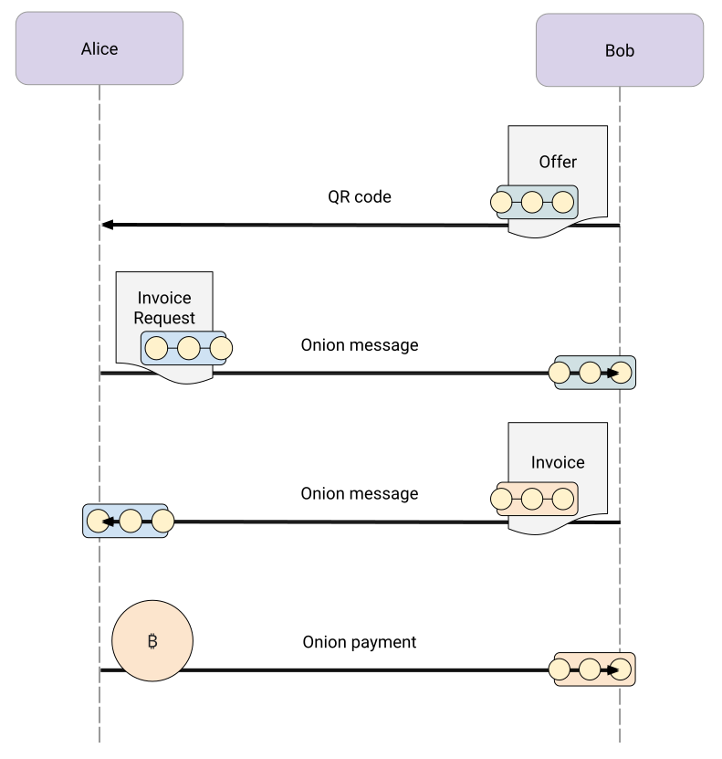
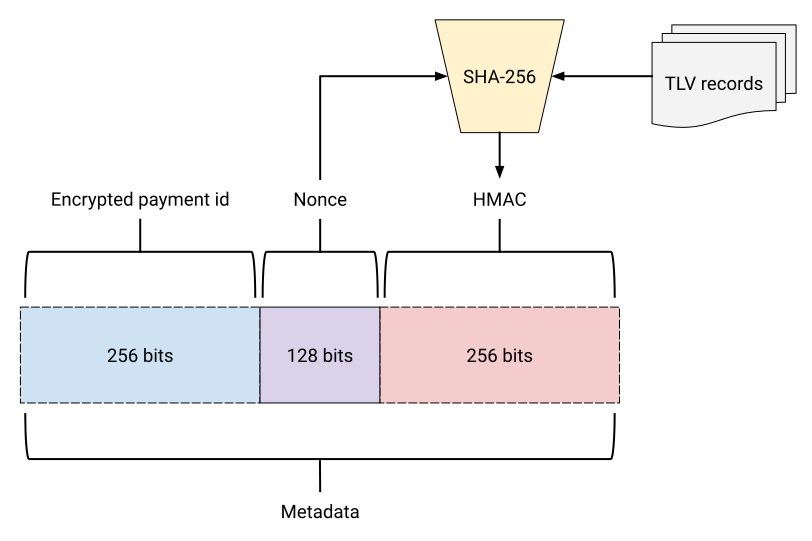

You may have heard of BOLT12—lovingly referred to as Offers—but what is it, and why should you care? In short, BOLT12 is a new payment protocol for Lightning that offers enhanced privacy, reusable payment codes, refunds, and much more, all natively over the Lightning Network. No additional servers are required. This is all possible using new technologies like onion messages and route blinding. Let’s further explore how to make use of BOLT12 in LDK.

## BOLT11 Invoices and Reusability
To understand why BOLT12 is essential, let’s briefly discuss what it’s replacing. BOLT11 defined an invoice format that, while useful, has some shortcomings. Invoices are communicated out-of-band—typically via a QR code—from recipient to sender. They are signed, making them large and thus difficult for some devices to scan. But more importantly, they can’t be safely reused since they contain a payment hash.

In Lightning, a payment is claimed by releasing the preimage of a payment hash. Once revealed, anyone with knowledge of the preimage—which could show up on-chain—may use it to claim a payment for an invoice using the same payment hash. So, reusing invoices is a no-no if you don’t want your payment stolen. While solutions have been built up around BOLT11 for requesting unique invoices, they have significant drawbacks. It requires either running a dedicated server or trusting a third party to do so on your behalf, including all the privacy implications that this entails.

## BOLT12 to the Rescue
That’s where BOLT12 comes in. The specification defines an *offer* that can be considered a precursor to an *invoice*. It contains less data than an invoice and is smaller to display as a QR code. Optionally, it may contain blinded paths—more on that in a moment. Someone scanning an offer sends an *invoice request* to the intended recipient, who replies with an invoice containing a unique payment hash. That’s it!


<p style="text-align: center;"><i>Comparison of typical BOLT11 (left) and BOLT12 (right) QR codes</i></p>

So how is this all happening without a dedicated server? The magic comes in with something called [onion messages](../onion-messages-demystified). The Lightning protocol is defined as messages exchanged between direct peers. An onion payment involves an interchange of messages along a path, collecting fees and transferring funds until the preimage is revealed and the funds claimed.

An onion message is very similar in that it involves sending messages along a path, encrypted as an onion such that each hop only knows where to send the message next. The difference is that they’re more efficient and don’t require locking any liquidity. Messages are forwarded until they reach the intended recipient. There is no interchange between adjacent peers to sign and revoke commitments or a round-trip along the path. Channel liquidity—or channels, for that matter—aren’t even required.

## OK, so what about privacy?
Ah, that’s where blinded paths come in. BOLT11 invoices reveal the recipient's node ID, which could be mapped to their IP address. But remember how an offer may contain some blinded paths? Those are to ensure recipient privacy. The recipient constructs a path leading to itself from some point in the Lightning Network, probably a few hops away. Then, it blinds the nodes along the route using fancy cryptography, leaving the first node unblinded. We call that the introduction node.


<p style="text-align: center;"><i>Depiction of a blinded path used in an offer where adjacent nodes are peers</i></p>

When the sender scans an offer, it constructs a path from itself to the blinded path’s introduction node. This combined path is then made into an onion for routing with the invoice request as the payload. It also contains a *reply path*—another blinded path—back to the sender, allowing the recipient to respond similarly to an invoice without revealing the sender’s node ID.

This is taken further with the invoice, which contains *blinded payment paths*—essentially blinded paths with some additional payment information. This allows the recipient to provide partial routes with enough liquidity for payment as requests are made—yet in a privacy-preserving manner, unlike BOLT11.



<p style="text-align: center;"><i>Offers flow of Alice paying Bob where onion messages and payments culminate over blinded paths</i></p>

Invoices and invoice requests are signed using keys corresponding to pubkeys in the offer and invoice request. But guess what? These can be unique since, in the presence of blinded paths, they aren’t needed for routing. By always generating new keys, payments are more difficult to correlate to the same sender or recipient, an added boon for privacy! Contrast this with a BOLT11 invoice containing the recipient’s node ID. This is so the sender can construct a route to the recipient for the payment.

## Offers in LDK
There’s a lot to BOLT12, but LDK helpfully hides all those details from you. Let’s take a look at how you would construct an offer in LDK using the familiar builder pattern.

```rust
let offer = channel_manager
    .create_offer_builder()?
    .description("coffee".to_string())
    .amount_msats(10_000_000)
    .build()?;
let bech32_offer = offer.to_string();
```

One cool thing about offers is that they can be stateless, meaning you don’t need to store any data about them once constructed. How does this work? LDK encodes some information in the offer’s metadata, allowing it to recognize incoming invoice requests for the offer.

Paying an offer is just as simple.

```rust
let payment_id = PaymentId([42; 32]);
let retry = Retry::Timeout(Duration::from_secs(60));
match channel_manager.pay_for_offer(
    offer, quantity, amount_msats, payer_note, payment_id, retry, max_total_routing_fee_msat
) {
    Ok(()) => println!("Requesting invoice for offer"),
    Err(e) => println!("Unable to request invoice for offer: {:?}", e),
}

// First the payment will be waiting on an invoice
let expected_payment_id = payment_id;
assert!(
    channel_manager.list_recent_payments().iter().find(|details| matches!(
        details,
        RecentPaymentDetails::AwaitingInvoice { payment_id: expected_payment_id }
    )).is_some()
);

// Once the invoice is received, a payment will be sent
assert!(
    channel_manager.list_recent_payments().iter().find(|details| matches!(
        details,
        RecentPaymentDetails::Pending { payment_id: expected_payment_id, ..  }
    )).is_some()
);
```

Here, LDK stores a small amount of data for outbound payments, which ensures you don’t pay an invoice more than once for a given payment ID.

As the recipient, you only need to wait for an event to claim the payment.

```rust
channel_manager.process_pending_events(&|event| match event {
    Event::PaymentClaimable { payment_hash, purpose, .. } => match purpose {
        PaymentPurpose::Bolt12OfferPayment { payment_preimage: Some(payment_preimage), .. } => {
            println!("Claiming payment {}", payment_hash);
            channel_manager.claim_funds(payment_preimage);
        },
        PaymentPurpose::Bolt12OfferPayment { payment_preimage: None, .. } => {
            println!("Unknown payment hash: {}", payment_hash);
    	},
        // ...
    },
    Event::PaymentClaimed { payment_hash, amount_msat, .. } => {
        println!("Claimed {} msats", amount_msat);
    },
    // ...
});
```

Similarly, the sender will receive an event when the payment is resolved.

```rust
channel_manager.process_pending_events(&|event| match event {
    Event::PaymentSent { payment_id: Some(payment_id), .. } => println!("Paid {}", payment_id),
    Event::PaymentFailed { payment_id, .. } => println!("Failed paying {}", payment_id),
    Event::InvoiceRequestFailed { payment_id, .. } => println!("Failed paying {}", payment_id),
    // ...
});
```

These examples work swimmingly when building a Lightning wallet programmatically. However, LDK uniquely exposes the underlying [offers](https://docs.rs/lightning/0.0.123/lightning/offers/index.html), [blinded paths](https://docs.rs/lightning/0.0.123/lightning/blinded_path/index.html), and [onion message](https://docs.rs/lightning/0.0.123/lightning/onion_message/index.html) modules for direct use. This means you can experiment with building your applications or add BOLT12 support to LND, such as the [LNDK](https://github.com/lndk-org/lndk) project.

## Wait, what about refunds?

Whereas an offer is an “offer to be paid,” a *refund* is an “offer for money.” Simply put, refunds allow a merchant to present a QR code to a customer to refund a purchase. The customer scans the refund just like it would an offer, but instead of sending the merchant an invoice request, the customer sends an invoice asking the merchant to pay.

LDK has a similar interface for constructing a refund and requesting payment.

```rust
let payment_id = PaymentId([42; 32]);
let retry = Retry::Timeout(Duration::from_secs(60));
let refund = channel_manager
    .create_refund_builder(
        amount_msats, absolute_expiry, payment_id, retry, max_total_routing_fee_msat
    )?
    .description("coffee".to_string())
    .payer_note("refund for order 1234".to_string())
    .build()?;
let bech32_refund = refund.to_string();
```

Like when paying an offer, LDK will track a pending payment and surface events just the same. However, for inbound payments the events will use `PaymentPurpose::Bolt12RefundPayment` instead.

## Achieving statelessness

Both offer and invoice requests contain a metadata field. This helps LDK store minimal information about a payment. For inbound payments, this equals nothing at all! So how does it work?

LDK generates a random nonce for an offer and, along with the offer’s TLV records, computes an HMAC using a secret key. The HMAC is used to derive a key to sign the invoice. The nonce is then stored in the offer’s metadata to re-derive the signing key later.

When an invoice request is received, it contains all the offer’s TLV records, including the metadata. By re-deriving the signing key from the metadata and TLV records, LDK can verify that the offer is authentic by checking whether the re-derived signing key corresponds to the offer’s signing pubkey. Now, it can create and sign an invoice with the key.

If you prefer to use your signing key, LDK will also include the HMAC in the metadata. Authentication then consists of re-computing the HMAC and comparing it against the one in the metadata.

An invoice request has its own payer metadata, which is similarly generated and includes an encrypted payment ID. Thus, when LDK receives an invoice, it can look up a pending payment with the ID and decide if the invoice should be paid after a similar authentication.



<p style="text-align: center;"><i>Metadata consists primarily of a nonce and an optional HMAC, while outbound payments include an encrypted payment ID used for look-up upon receiving an invoice</i></p>

## What’s next?

BOLT12 is still in a very early stage of adoption, but as you can see, there’s much promise. In the next post, we’ll explore one of the most crucial problems in Lightning—receiving offline—and how BOLT12 and asynchronous payments solve it.
