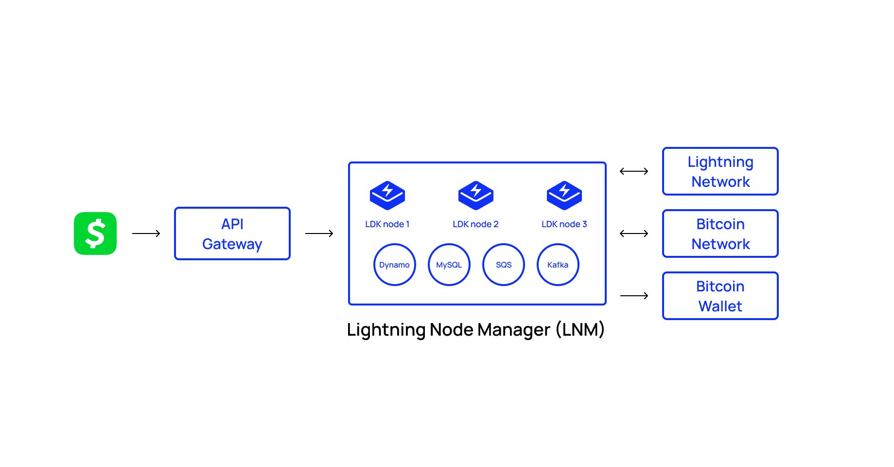

---
title: "CashApp enables lightning withdrawals & deposits using LDK"
description: "Learn how the CashApp team integrated with the Lightning Network, allowing its users to send and receive bitcoin instantly."
date: "2022-11-01"
authors:
  - Ryan Loomba
tags:
  - Case Studies 
--- 

# Overview
Our project is the Cash App lightning wallet. We power all lightning Bitcoin withdrawals and deposits within Cash App.

Cash App is a the #1 Finance App in the app store – we have extremely high standards for product development and the infrastructure that powers all our cool features. We were looking for a solution that would ensure high reliability, high scalability, and a stellar developer experience. Cash App is the financial hub for millions of people and often the first place an individual acquires Bitcoin, so having a slick user experience, and the infrastructure to onboard lots of new users is extremely important. As a publicly traded company, we take security very seriously, so having the ability to customize our wallet implementation to adhere to our security standards was necessary.

We chose LDK for various reasons over other implementations. It provided us with a lot of customizability and flexibility. The [Java bindings](https://github.com/lightningdevkit/ldk-garbagecollected) let us develop in Kotlin, which is the preferred language we use at Cash for backend services. We also had a great working relationship with the [Spiral](https://spiral.xyz/) folks and so it was great to collaboratively work together with them on more advanced feature asks (phantom invoices!).

# What we did
LDK allowed us to develop an extremely scalable lightning node infrastructure. We run multiple wallet nodes and have strict requirements on what peers we can connect to and strict parameters around opening channels. We have logic that does advanced probing in the background, to ensure we have an up to date snapshot of the liquidity on the lighting network.

We also do probing before every send, so that we can pre fetch a route and execute the send after a customer has confirmed the send. We have utilized LDK’s [phantom node](https://lightningdevkit.org/blog/introducing-phantom-node-payments/) feature, so we can generate invoices that can be claimed by more than one node. We use MySQL to save our channel state data + node metadata, this allows us to quickly shut down and start up nodes at will on different servers. LDK allows us to run AB tests on different pathfinding algorithms.

# Results

The outcome was that we were able to relatively quickly build a lightning wallet to power Bitcoin withdrawals and deposits on Cash App taking into the complicated constraints we had as a publicly traded company with tens of millions of users.

Users can now deposit and withdraw their Bitcoin to Cash App over lightning, so essentially instant BTC deposits and withdrawals for free.
