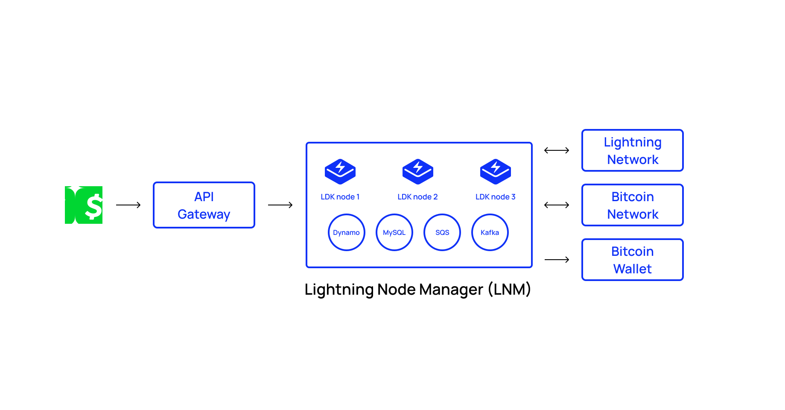

Cash App allows users to instantly deposit and withdraw bitcoin over the lightning network. As an engineer on the Cash App Lightning Wallet team, I was very involved in the entire implementation process.

Cash App is the #1 Finance App in the app store – we have extremely high standards for product development and the infrastructure that powers all our cool features. We were looking for a solution that would ensure high reliability, high scalability, and a stellar developer experience. Cash App is the financial hub for millions of people and often the first place an individual acquires bitcoin. It’s important to have a slick user experience and robust infrastructure that can onboard many new users. As a publicly traded company we take security seriously and need the ability to customize our wallet implementation in order to adhere to strict standards.

We chose LDK for various reasons over other implementations. It provided us with a lot of customizability and flexibility. The [Java bindings](https://github.com/lightningdevkit/ldk-garbagecollected) let us develop in Kotlin, which is the preferred language for backend services. We also have a great working relationship with the [Spiral](https://spiral.xyz/) folks, making it easy to collaborate on more advanced feature requests such as phantom invoices.

# What we did

LDK allowed us to develop a scalable lightning node infrastructure. Cash App runs multiple wallet nodes and has strict parameters around opening channels and connecting to peers. We have logic that does advanced probing in the background in order to ensure an up-to-date snapshot of liquidity on the lightning network.

Probing is done before every send, allowing us to pre-fetch a route and execute the send once the customer confirms. LDK’s [phantom node](https://lightningdevkit.org/blog/introducing-phantom-node-payments/) feature makes it possible to generate invoices that can be claimed by more than one node. We use MySQL to save our channel state data + node metadata in order to quickly shut down and start up nodes at will on different servers. Additionally, LDK lets us run AB tests on different pathfinding algorithms.

# Results

LDK made it possible to relatively quickly build an easy-to-use lightning wallet while adhering to the complicated constraints Cash App faces as a publicly traded company with tens of millions of users. Users can now instantly deposit and withdraw bitcoin to Cash App over lightning.

To learn more check out this [presentation](https://www.youtube.com/watch?v=kbhL5RqL8Aw) at btc++ explaining some of the trade-offs the Cash App team had to think about when comparing LDK to other solutions.
