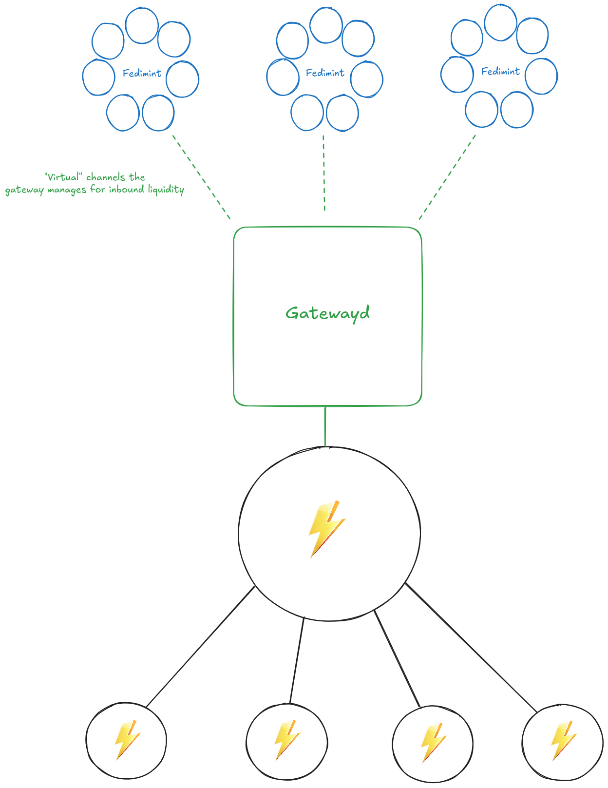
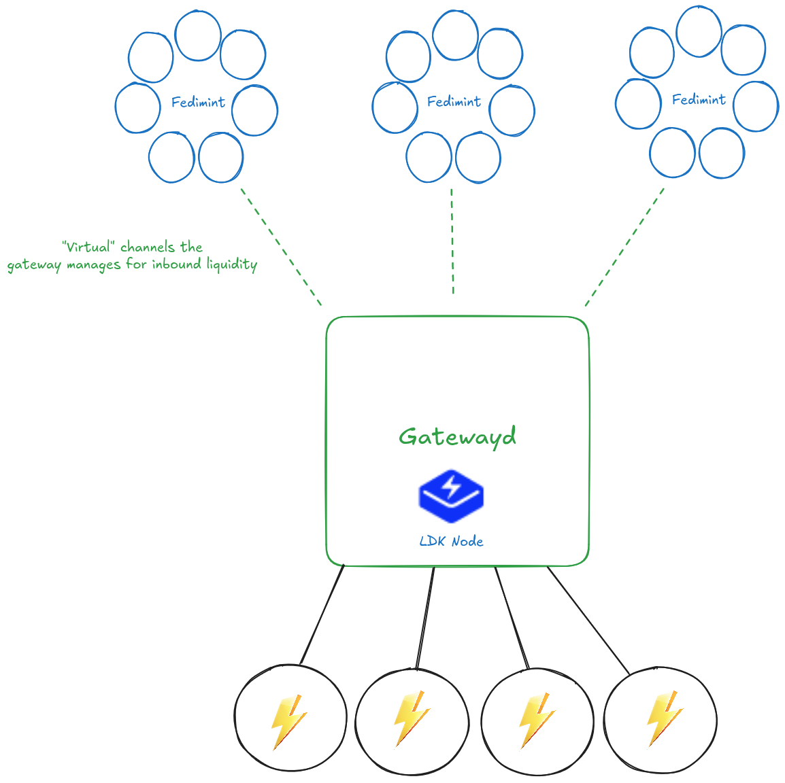

The [Fedimint Lightning Gateway](https://github.com/fedimint/fedimint/blob/master/docs/gateway.md) is a server application that powers the Lightning payments for Fedimints. Lightning Gateways enable Fedimint ecash users access to the broader Lightning network by offering a trustless ecash to Lightning swap service to the federation. A Fedimint user incentivizes the gateway to pay a Lightning invoice on its behalf by locking ecash to a hash time locked contract that is enforced by the federation. The gateway can then claim the locked ecash by revealing the preimage from the paid invoice. To receive ecash, the gateway will fund a Fedimint client as long as it receives a preimage in return that the gateway can use to claim a payment on the Lightning network. If this sounds similar to how HTLCs in Lightning work, that's because it is! However, there is the added caveat that Lightning Gateways must also manage an ecash balance alongside the Lightning channels.

Lightning Gateways can also be connected to more than one federation. This allows the gateway to provide Lightning services to many Fedimints at once and also short-circuit the Lightning network altogether if the payment is between connected federations (or within the same federation). The Lightning Gateway must hold a balance for each federation it services payments for, so that it can fund incoming payments. Conceptually, this is similar to a "virtual channel" between the Lightning Gateway and the target federation. The ecash balance that the gateway holds for each federation is analogous to inbound liquidity in Lightning.

Previously, gateway operators had the option of connecting their gateway to either a Core Lightning or LND node. While this deployment configuration is convenient for node runners who have existing liquidity, this comes with additional technical burden and operational difficulties for new gateways. Gateway operators need to deploy and operate two separate daemons (e.g `LND` and `gatewayd`) and monitor liquidity for their channels and connected federations in each. It is our goal to make it as easy as possible to use Fedimint, so to reduce these operational complexities, it made sense to integrate LDK node directly into the Lightning Gateway to provide a seamless ecash and Lightning experience.

# What we did

We chose to use LDK Node because of the ease of use for getting started. LDK Node has numerous pre-set defaults that make deploying a Lightning node easy, such as an integrated BDK wallet and a SQLite database. Because we already supported LND and CLN, we had done work previously to abstract away the interface to the Lightning node. This made the implementation of LDK Node into the Lightning Gateway straightforward - only a handful of functions needed to be implemented.

However, in order for the Lightning Gateway to receive a Lightning payment on behalf of a Fedimint user in a trustless manner, we needed the ability to create invoices where LDK Node does not know the preimage (i.e a HOLD invoice). This was not originally supported in LDK Node. LDK Node intentionally has a slim API, but after discussing our use case with the LDK team, the API was exposed.

Integrating LDK Node into the Lightning Gateway also exposed new challenges. Previously, for Lightning management operations such as opening and closing channels, we relied on the operator interacting directly with the underlying Lightning node. With LDK Node integrated into the gateway, the gateway operator no longer has another daemon to fall back to for channel or UTXO management; it must be done within the gateway itself. Most of the work we did was simply exposing Lightning operations and debugging logs to the gateway operator.

With ecash and Lightning management available in a single daemon, we are looking to explore automated methods of managing liquidity, such as the [LSPv1 spec](https://github.com/lightning/blips/blob/master/blip-0051.md). We believe that ecash presents an opportunity to make liquidity management more efficient and are hoping to build this directly into the gateway itself.

# Results

The LDK Gateway will be available to use as a Lightning node in the v0.5 Fedimint release and will be able to service new federations starting with v0.6. We hope to see new node operators deploy `gatewayd` and take advantage of the integrated Lightning node for simpler deployment and liquidity management. Feedback is always welcome, [please join our discord channel](https://discord.gg/cEVEmqCgWG) to get in touch with the developers or submit an issue on our [Github](https://github.com/fedimint/fedimint).

Shoutout to tnull, tvolk131, joschican, and elsirion for reviewing drafts of this document and their work on the LDK Gateway.
