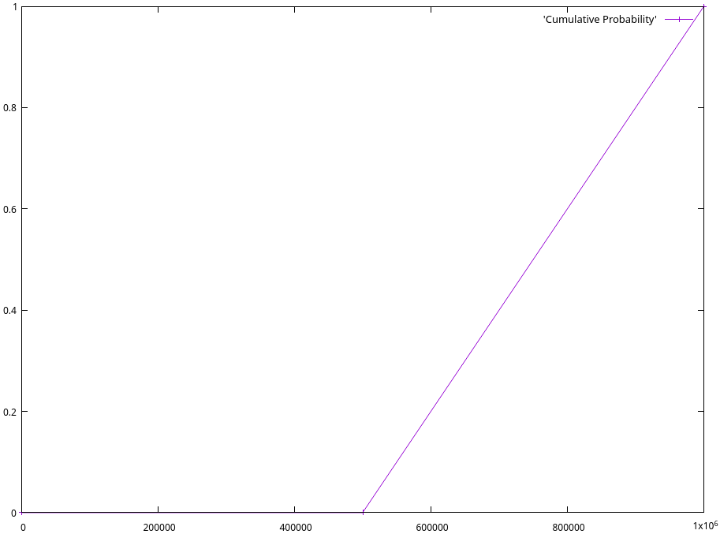
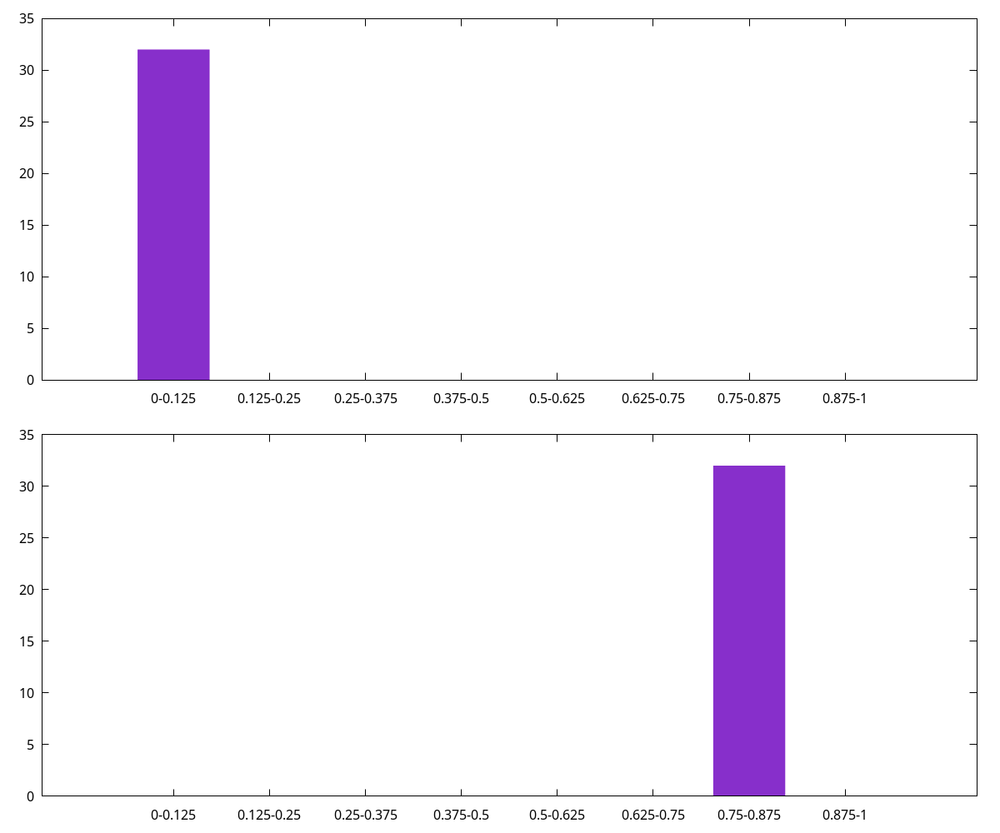
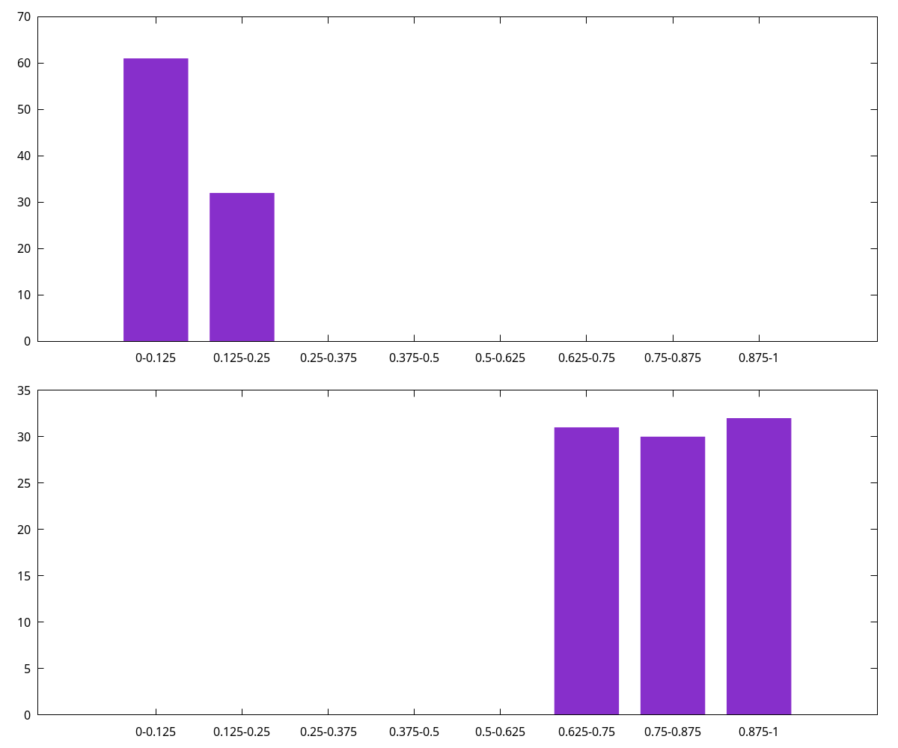
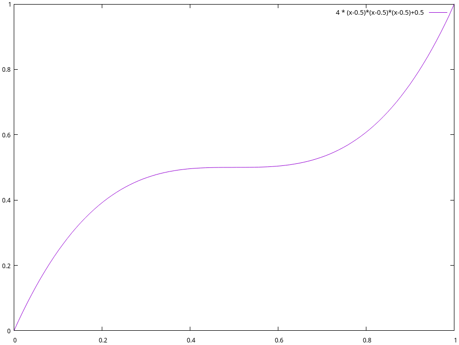
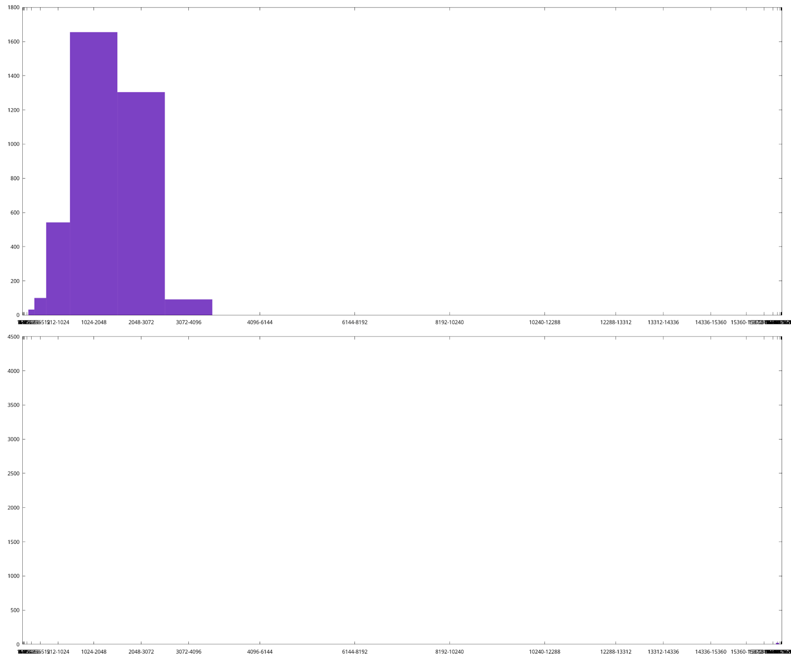
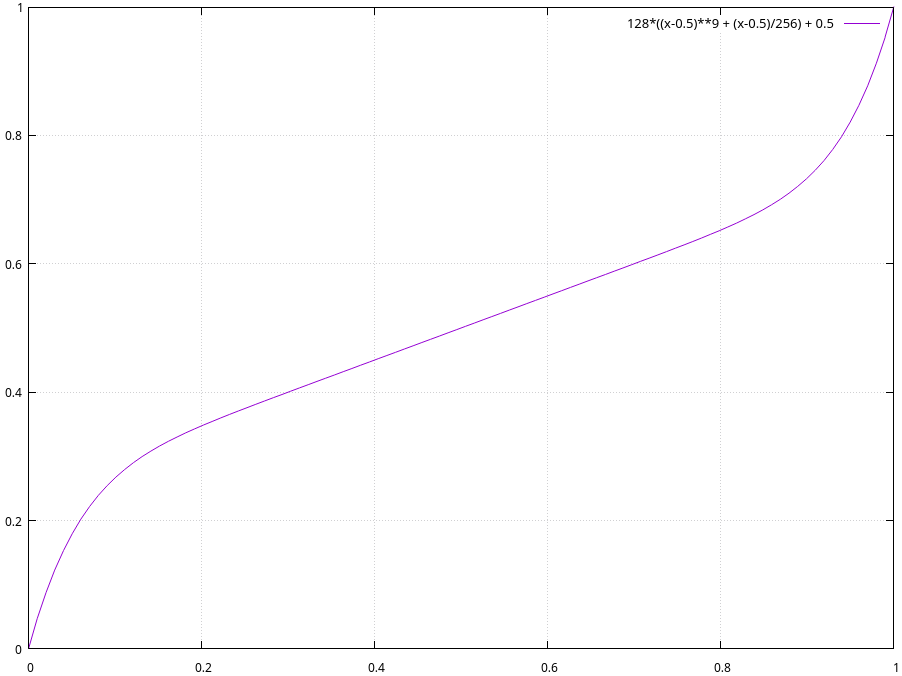

Some time ago, LDK shipped an overhaul of our pathfinding algorithm to incorporate substantially more learnings over time into each new path over which we sent a payment. At the time, we didn’t have any formal analysis framework for our pathfinder, so we didn’t run to our blog to declare it the most advanced pathfinder in the lightning world. As of Nov, 2024, [we do](https://bluematt.bitcoin.ninja/2024/11/22/ln-routing-replay/).

All lightning pathfinders start with a standard graph traversal algorithm (generally Dijkstra’s) to find the “shortest path” as determined by some scoring heuristic. Typically, that heuristic is some combination of the fee for each hop added to the (logarithm of) a success probability. As the fee is trivially determined by looking at the network graph, determining the probability that a payment successfully traverses a channel in the network ultimately forms the “core” of a pathfinder - its accuracy directly determines the latency and success rates of lightning payments.

Most pathfinders today owe much to [Rene Pickhardt’s observations](https://arxiv.org/abs/2107.05322). His proposed success probability calculation was straightforward but powerful - for each channel in the graph remember an upper bound and a lower bound on where liquidity in the channel lies. Whenever we send an HTLC, we can see if it succeeded, and if not where it failed. At each hop the HTLC successfully traversed, we can now learn a lower-bound on what the liquidity was before we sent the HTLC. Similarly, if an HTLC fails at a hop, we assume it was due to a liquidity limitation and learn an upper-bound on how much liquidity was available in the channel. When calculating a success probability, if the amount we want to send lies below the lower-bound, we simply assign a 100% chance, if it lies above the upper-bound 0%, and for payments in between our bounds, we simply compare at how close the amount we wish to send is to each bound.

For example, if the lower-bound on a channel’s liquidity is 500,000 sats, and the upper bound is 1 million sats, and we wish to pay 750,000 sats, we’d assign a success probability of 50%. If instead we’re trying to send 600,000 sats, we’d assign a success probability of 80% $((1,000,000 - 600,000) / (1,000,000 - 500,000))$. The resulting cumulative probability density function (CDF) is shown in the below chart.

This model has served lightning pathfinders well for quite some time, but ultimately suffers from a number of issues in practice. First of all, we must somehow slowly decay the bounds we store for each channel. After all, over time liquidity in channels moves around and whatever hard upper- and lower- bounds we had may no longer be correct. In practice, in LDK we found that for most rates of bounds decay we picked, we were decaying both too fast and too slow. We’d find that one failed payment across a channel we regularly use (i.e. that generally has sufficient liquidity for us, but where they didn’t only for a very short period of time) would cause us to avoid a great channel for much too long. At the same time, we’d find that we’d much too regularly retry channels that rarely if ever succeeded at all. While more complex strategies around decay tuning are certainly possible, the same issues would ultimately apply, just somewhat less frequently.

Instead, LDK decided to attempt a radically different direction, trying to learn the common upper- and lower- bounds on channels in the graph without any reference to time at all. In October, 2022, LDK shipped the first version of our “historical model”. This model relies on storing histograms of the upper- and lower- bounds for each channel in the network graph. Given a histogram for each bound, we can calculate an estimated success probability by using Rene’s probability density function (PDF), just on each pair of fields in the histograms.

In the first version, LDK’s historical model simply stored 8 buckets for each histogram - when we first sent an HTLC over a channel and saw it fail, if the lower-bound was in the lowest octile and the upper-bound was in the second-to-highest octile, we’d increment the lower bucket in the lower-bound histogram and the second-to-highest bucket in the upper-bound histogram, leaving us with the histogram below. We’d then calculate the success probability of sending a payment that is half the channel’s capacity by looking at the only bucket pair with data - the (0, 6) pair, and calculate the probability as $((0.875 - 0.5) / (0.875 - 0))$.

As we learn more about the channel over time, more buckets start to fill. For example, if we later failed to send an HTLC in the third-to-highest octile, and then successfully sent an HTLC in the second octile, we might have the below histogram (note that the values in our histogram decay with new data, rather than over time, and thus the older data has been slightly decayed). We then calculate success probability by iterating every min- and max-bucket pair using the same PDF and weighting by the bucket values. For example if we’re again attempting to send 50% of the channel’s total liquidity we’d sum each `max-bucket weight * min-bucket weight * (upper edge of max-bucket - 0.5) / (upper edge of max-bucket - lower edge of min-bucket)` and then divide by the total `max-bucket weight * min-bucket weights`. In the example below (with min-bucket weights 61, 32 and max-bucket weights 31, 30, 32) we get a probability of ~3852.6 / 8649, or roughly 44.5%. The actual LDK probability estimation is somewhat more complicated and handles a few degenerate cases better.

Around the same time LND was playing with a slight variation on Rene’s original model. Fundamentally, Rene’s model works on the basis of assuming a flat PDF for the liquidity across a channel’s capacity. In other words each potential liquidity split between a channel’s two participants is equally likely - an even split is just as likely as the liquidity being more on one side than the other. This doesn’t match the lightning network in practice, however; after all, many nodes send more payments than they receive, or vice versa, and many channels are opened and never see much use at all. Instead, LND proposed what they call their [“bimodal” model](https://lightning.engineering/posts/2024-04-11-pathfinding-1/). This model assumes liquidity lies at a fixed percentage (configurable between 75% and 99%) between the tracked upper- and lower-bounds on a channel’s liquidity. As the amount we’re trying to send approaches and passes this fixed percentage, the calculated payment success probability drops precipitously, but remains rather high before that.

LDK took inspiration from this, noting that we don’t know which side opened a channel and thus, absent a history of attempted payments across a channel, there’s no reason to think the liquidity in that channel is more to either side. LDK thus updated the core PDF from the original flat to a polynomial which assumes higher probability that liquidity lies on either end of the channel. Specifically, LDK as of October, 2023 assumes that the probability that the liquidity in a channel lies at any given point can be described by $12 \cdot (x-0.5)^2$ (for an x representing liquidity normalized to between 0 and 1, the channel’s capacity, the CDF is charted below). This gives us a probability of around 50% that the channel’s liquidity lies either within the first or last 10% of the channel’s capacity. From there we can calculate our success probability the same as above, but ignoring any parts of the channel’s liquidity that lie outside our tracked upper- and lower-bounds.

For example, if we believe a 1 million sat channel’s liquidity lower-bound is 500,000 sats, and its liquidity upper bound is 1 million sats, when trying to send an HTLC of 750,000 sats, we’d calculate its success probability as $\frac{\int_{0.75}^1 12 \cdot (x-0.5)^2dx}{\int_{0.5}^1 12 \cdot (x-0.5)^2dx}$ (recall that to get the CDF from a PDF we integrate over the range we care about). This gives us a success probability of 87.5%, much higher than our earlier 50%! This is because once we learned that the liquidity in a channel was not close to 0, we immediately assumed it must be closer to 1 million sats than 500,000, because our PDF says so. The resulting PDF after learning a lower-bound of 500,000 is charted below, note that it is simply the original PDF with the bottom half chopped off, scaled back up to 1.

At the same time, LDK also updated its historical model to provide substantially more granularity. Instead of only storing 8 evenly-sized buckets in our histograms, we started storing 32 variable-sized buckets, each representing different size ranges in liquidity bounds. The first bucket is only updated when the liquidity bounds of a channel is in the first 1/16,384th of the channel’s capacity. The second bucket represents liquidity bounds within the 2nd and 3rd 1/16,384th of the channel’s capacity, the third bucket the 4th, 5th, 6th, and 7th, and so on. This lines up roughly with our initial PDF of $(x-0.5)^2$ - if we assume that it's much more likely for a channel’s liquidity to be sitting near the edges, we should have much more resolution near a channel’s edges, giving us an equal probability of ending up in any given bucket and allowing us to calculate accurate probabilities when sending amounts that are much, much smaller than a channel’s capacity. The tradeoff is we cannot as accurately calculate success probabilities when sending amounts that are a large portion of a channel’s capacity, but such HTLCs aren’t particularly likely to succeed in any case. A real histogram might look like the following (pulled from a running LDK node). There is a line all the way on the right of the bottom chart up to 4,177, it's just less than a pixel wide as the buckets on the edges get much too small to display proportionally!

This design has worked quite well, somewhat accurately predicting successes and failures when pathfinding through the lightning network. In practice, LDK’s pathfinding wasn’t always the most successful as it defaulted to preferring lower-fee paths rather than more successful paths, but with LDK 0.1 we changed the default tuning to prefer higher-success-probability paths more strongly.

At the same time, we utilized our new past-probing data to better tune the ratio between successes and failures, as well as tweaked the PDF to maximize predictive ability, giving us $128 \cdot (\frac{1}{256} + 9 \cdot (x-0.5)^8)$ (the resulting CDF is shown below).

The bottom diagram shows the results of our simulation run - breaking down results by hops that succeeded and ones that failed and showing cumulatively how often (on the Y axis) we assigned different success probabilities (on the X axis). In total, our changes give us a result which is the equivalent, on log-average, of returning a 67% success probability for channels that ultimately succeed and a 33% success probability for channels that ultimately fail (this being a log2-loss score of -0.58; a measurement of how often and by how much we’re wrong, with the best being 0 and -1 being the equivalent of always returning 50/50).

