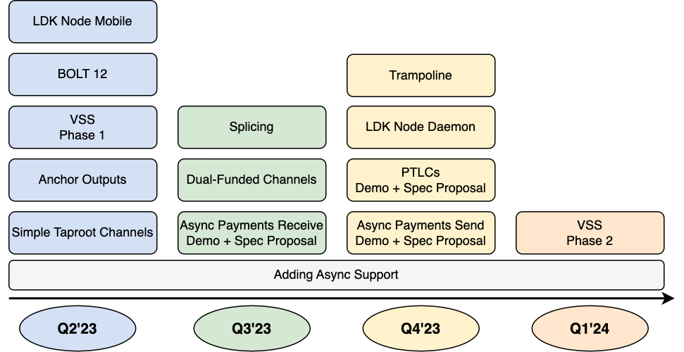

---
title: "LDK Roadmap"
description: "LDK is going to have a big year. Several key features are actively being developed or expected to be developed in the next few quarters."
date: "2023-03-13"
authors:
  - Steve Lee
tags:
  - Roadmap
--- 

LDK is going to have a big year. Several key features are actively being developed or expected to be developed in the next few quarters. There are also a few projects of interest that don’t yet have any committed developers. If you want to get involved, hop into the [Discord Server](https://discord.gg/5AcknnMfBw) or [GitHub repo](https://github.com/lightningdevkit).

As a reminder, the LDK project is community-driven with no centralized authority. Anyone is welcome to contribute and propose ideas at any point. Additionally, it’s extremely important to listen to LDK users. The timeline listed below is just an estimate that may shift if a user request needs to be prioritized over another project.

# Active/Commited Projects

## LDK Node

LDK Node is an implementation of an LDK-based LN wallet and node. The LDK API is a powerful, extensive API that gives developers significant control, which can be intimidating to the uninitiated user. The LDK Node project delivers a fully functional LN wallet/node. The mobile-optimized recipe includes a [BDK](https://bitcoindevkit.org)-based on-chain wallet, integration with Esplora/Electrum for block data, [RGS](https://docs.rs/lightning-rapid-gossip-sync/*/lightning_rapid_gossip_sync/) for performant mobile pathfinding, use of SQLite for local data storage, and VSS (once it is ready) for cloud backup of LN and other wallet state. The end result is a very small API surface (~15 methods vs. the >900 methods in LDK API), making it extremely easy to build a functioning mobile wallet in less than a day.

LDK Node can serve a variety of purposes for developers. For starters, it provides a simple way to get a mobile LN node/wallet up and running. Developers are then able to prototype the experience they’re imagining, and in some cases this will be sufficient for them to build and launch their product in production.

In other cases, developers will come to realize more customization is necessary, and they’ll have a couple of options at their disposal:
1. Build using the lower-level, more powerful LDK API and reference the LDK Node as an example.
2. Fork the LDK Node code and make custom modifications themselves. This has the benefit of reusing most of the LDK Node code. However, this requires knowledge of Rust and exposing more of the LDK API in LDK Node.

While LDK Node is written in Rust, it is anticipated many languages will be supported through [UniFFI](https://github.com/mozilla/uniffi-rs) or other mechanisms, including:
* Java/Kotlin (near term)
* Swift (near term)
* Python (near term)
* Flutter (near term)
* React Native (near term)
* Web (medium term)

Through the development of LDK Node, it has been observed that most of the code can also be leveraged for a server configuration. The LDK project is conducting ongoing customer research to identify the needs and requirements for this configuration. The end result might be an LDK Node server daemon with a small RPC API.

The plan is to launch an initial version of LDK Node for mobile in Q2 2023 with continued improvements over time.

## BOLT 12

As of the 114 release, LDK supports onion messages and parsing BOLT 12 messages. It is expected to have full BOLT 12 send/receive support including blinded paths and compatibility with other BOLT 12 implementations in Q2 of 2023. 

## Anchor Outputs

LDK should fully support anchor outputs by Q2 2023.

## VSS 

VSS (Versioned Storage Service) addresses two problems. First, it offers a cloud backup for (encrypted) LN state and other wallet data that is crucial for recovery if the phone is lost or otherwise unavailable. Second, VSS will enable support for multi-device access to the same wallet, handling the synchronization properly so the wallet doesn’t wind up in a confused state. The first phase is expected to be released in Q2 2023. The second phase will be subject to monitoring for demand from wallets and may slip to 2024.

## Improved Async-ness in LDK API

The Rust language originally did not support async but it was added after the rust-lightning project started. Thus, LDK itself initially only supported synchronous calls, but over time LDK is adding more async support throughout the API.

## Simple Taproot Channels

Work has been ongoing since last fall to add [simple taproot channels](https://github.com/lightning/bolts/pull/995). LDK developers have provided feedback to the Taproot protocol specification which has resulted in improvements, and it is now close to finalizing simple channels. While LDK has its own MuSig implementation for development purposes, the LDK project will wait for the [libsecp implementation](https://github.com/BlockstreamResearch/secp256k1-zkp/pull/211) as well as [Rust bindings](https://github.com/BlockstreamResearch/rust-secp256k1-zkp/pull/48) in order to have the highest security assurances. The hope is that the spec, libsecp, and the LDK implementation all come together for a Q2 2023 release.

## Dual-Funded Channels

Some work [has begun](https://github.com/lightningdevkit/rust-lightning/issues/1621) such as refactoring and implementing the [interactive tx protocol](https://github.com/lightning/bolts/pull/851). Dual-funded channels might make a release in Q2 2023, but more likely Q3 2023.

## Splicing

Work has not yet begun on splicing due to other commitments, but several developers have committed to working on it as a next project. Work is expected to commence in Q2. Given work hasn’t started yet, it is hard to estimate completion, but an aim for Q3 2023 seems reasonable at this point.

## Async Payments

The [async payments proposal](https://github.com/lightning/bolts/pull/989#issuecomment-1325389542) will substantially improve the mobile wallet user experience by allowing people to receive payments under any conditions. The general design and workflow has been [mostly fleshed out](https://gist.github.com/remyers/e0d2bedb7bc87371d1bdbbb6fff2edd1). The initial plan is to build a prototype and improve the specification along the way.

The work will be broken down into two phases. The first phase will support async receive and the second will support async send. The reasoning behind this two stage approach is that the first phase has value on its own. Any custodial service, which will naturally have persistent internet, would then be able to reliably send payments to recipients without a persistent internet connection (mobile phones, web browser wallets, etc.).

The second phase is of course necessary for wallets sending from a phone or web browser. This will require support of trampoline in order to retry payments in a trustless way from the sender’s peer (eg an LSP).

LDK is just starting this development, so timeframes have large error bars, but probably the best case scenario would be delivering a working demonstration of phase 1 in Q3 2023 and phase 2 in Q4 2023. In addition to a working demonstration, it is expected to publish a complete specification for each phase that will be available for feedback by the development community.

## PTLCs

The LDK project intends to contribute to the specification and development of PTLCs in 2023. The plan is to build upon previous work ([here](https://lists.linuxfoundation.org/pipermail/lightning-dev/2021-October/003278.html) and [here](https://lists.linuxfoundation.org/pipermail/lightning-dev/2021-December/003377.html)) by building a prototype and improving the specification. The ideal outcome is a specification that comes out later this year which gains developer consensus and a complete implementation in LDK. By 2024, hopefully there are multiple implementations and initial deployment throughout the network.

# Prospective Future Projects

## Additional Language Bindings

LDK already supports many languages, but there are several unsupported languages/frameworks that are used by existing applications, including:
* C#
* Python
* Go
* Flutter

## Custom Scripts

LDK currently only supports the standard LN protocol spec script, however, it is possible to make LDK more flexible and allow 3rd parties to create custom scripts for applications such as taproot, DLCs, or Taro.

## Dynamic Commitments

See [this mailing list post](https://lists.linuxfoundation.org/pipermail/lightning-dev/2022-March/003531.html) for reference.