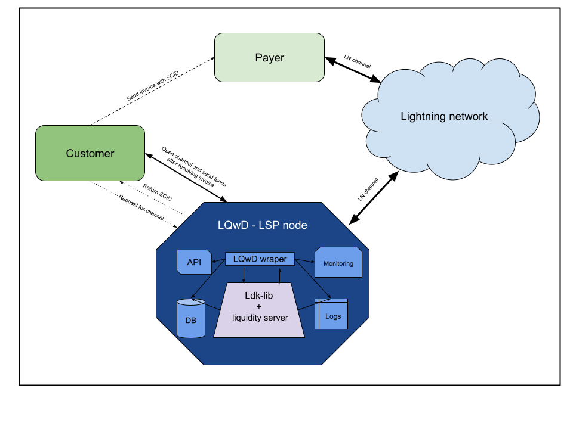

The rapid growth of the Lightning Network has created unprecedented demand for liquidity. Traditionally, receiving payments on the Lightning Network required pre-established channels which posed barriers to new users and hindered scalability. With the introduction of [LSPS2](https://github.com/lightning/blips/blob/master/blip-0052.md) and its Just-In-Time (JIT) channel negotiation capabilities, the Lightning Network can now provide liquidity exactly when needed, improving both accessibility and efficiency. By leveraging [LDK Node](https://lightningdevkit.org/blog/announcing-ldk-node/) (a higher-level wrapper of LDK) and the [Lightning Liquidity crate](https://github.com/lightningdevkit/rust-lightning/tree/main/lightning-liquidity)—both Rust-based implementations—we developed a specialized LSP Node [(LQwD)](https://lqwdtech.com/). This node enables real-time liquidity provisioning by dynamically creating channels, ensuring payments can be received without prior investments in channel capacity.

# Challenges Before LSPS2 / bLIP-52

Before the advent of LSPS2 / bLIP-52, receiving payments on the Lightning Network was fraught with limitations. Users were required to have pre-established channels, creating significant friction during the onboarding process and hindering adoption.

Liquidity allocation was inefficient: static channels often resulted in unused capacity, tying up valuable funds that could have been better utilized elsewhere. Furthermore, scaling liquidity across the network required substantial investment and extensive pre-planning, making it
challenging to achieve the flexibility and responsiveness required for a growing user base.

# Why LSPS2 with LDK Node and Lightning Liquidity?

LSPS2, integrated with LDK Node and the Lightning Liquidity crate, offers a transformative solution to these challenges. Its dynamic liquidity management enables channels to be created on demand, perfectly aligning with real-time payment requirements and eliminating the need for
pre-established liquidity.

The flexible and modular design of LDK Node, built on Rust and enhanced by the Lightning Liquidity crate, allows for the development of a highly customized and efficient LSP Node tailored to meet dynamic liquidity needs.

# Building the LSP Node (LQwD)

The integration of LDK and Lightning Liquidity allowed us to create a streamlined and algorithmically driven LSP Node capable of managing liquidity requests dynamically.

The process begins when a client initiates a liquidity request by interacting with the LSP Node. In response, the LSP Node generates a Short Channel ID (SCID), accompanied by routing information and timeout parameters, and sends these details back to the client.

Following this, the client prepares an invoice that embeds the SCID and the LSP Node ID as route hints, ensuring that the payment route is well-defined. This invoice is then shared with the payer.

When the payment is received with the SCID, the LSP Node takes over to execute a Just-In-Time(JIT) channel creation. A zero-confirmation channel is opened to the client, facilitating the payment transfer. The LSP Node seamlessly forwards the payment to the client while deducting
the applicable channel fees, ensuring both efficiency and reliability throughout the process

# Immediate Benefits

The implementation of LSPS2 brings significant advantages to liquidity management on the Lightning Network. Clients can now receive funds without the need for pre-established channels, which greatly reduces friction during the onboarding process. The dynamic nature of channel
creation eliminates the necessity for upfront investments in liquidity, making the solution both scalable and cost-effective. Furthermore, payment processing is optimized, with Just-In-Timechannels ensuring faster and more reliable transactions, enhancing the overall user experience.

# Conclusion

The LSP Liquidity Provider (LQwD), built on LDK Node and the Lightning Liquidity crate, showcases how LSPS2 can revolutionize liquidity management on the Lightning Network. By offering JIT channels, this solution simplifies onboarding, reduces costs, and aligns network resources with real-time needs, paving the way for a more accessible and scalable Lightning Network.

For more information or collaboration opportunities, visit the LQwD [website](https://lqwdtech.com/).
