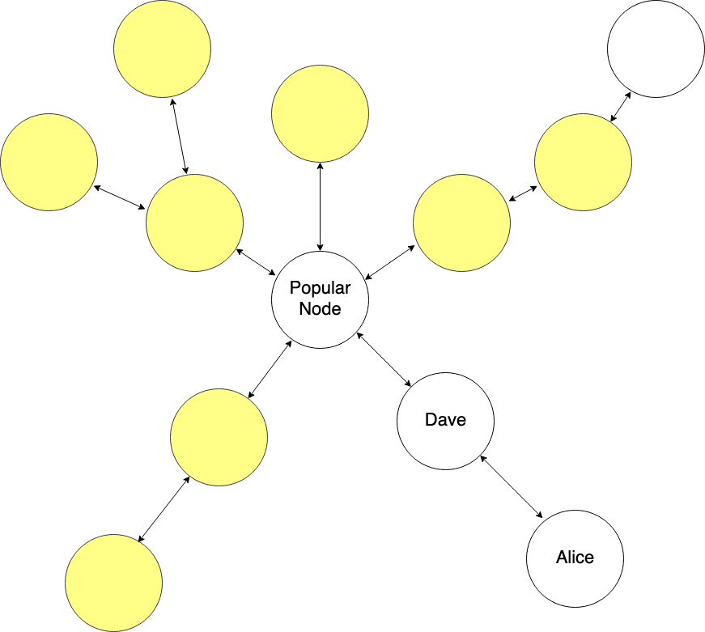
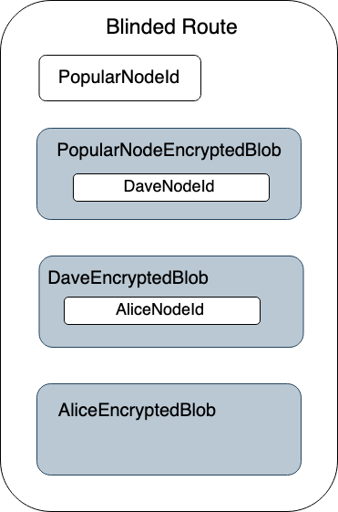
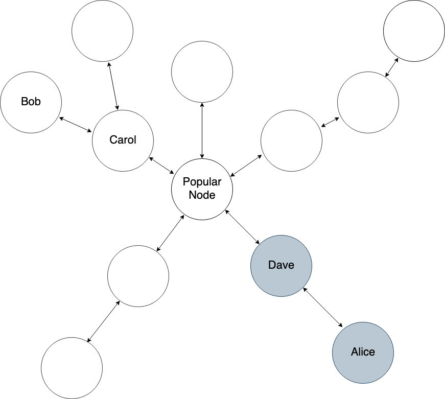
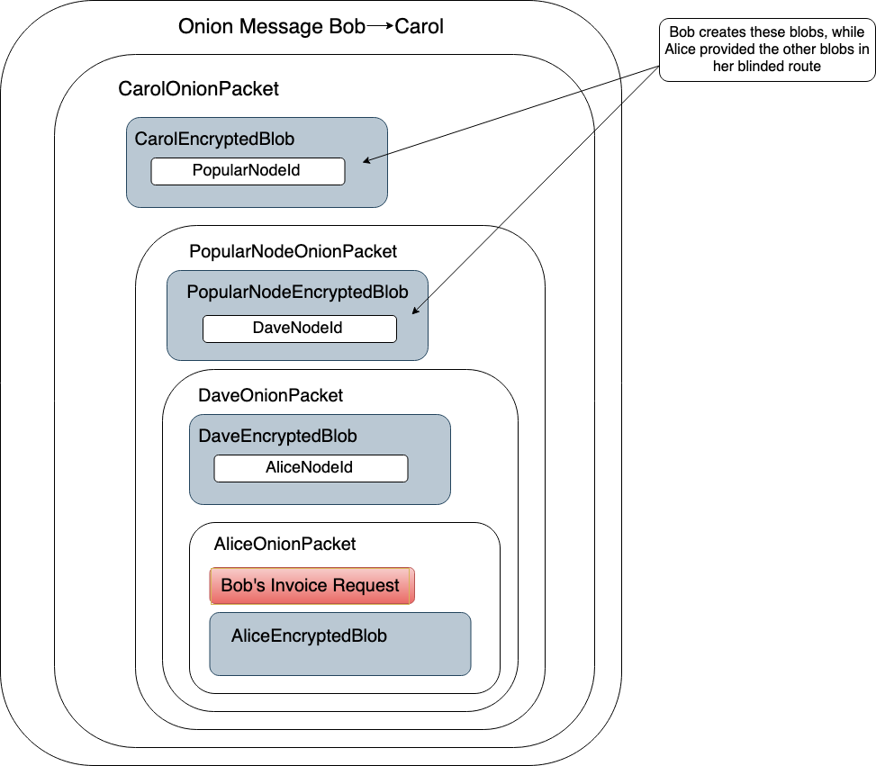

---
title: "Onion Messages Demystified"
description: "We recently merged support for onion message forwarding, a precursor to deprecating today’s Lightning invoice format, in favor of offers."
date: "2022-10-04"
authors:
  - Valentine Wallace
tags:
  - Onion Messages
  - Offers
--- 

We recently merged support for onion message forwarding, a precursor to deprecating today’s Lightning invoice format, in favor of [offers](https://github.com/lightning/bolts/pull/798). Offers bring many improvements to Lightning, including static invoices, refunds, and receiving payments in a way that doesn’t reveal your node ID or UTXOs. Then, once offer extensions are added, support for subscriptions follows.

So a lot is happening. Including…

Once the network supports [PTLCs](https://bitcoinops.org/en/topics/ptlc/), onion messages will help enable [asynchronous Lightning payments](https://github.com/lightning/bolts/pull/989) that remove the rule requiring nodes to be online when receiving payments. We expect onion messages to provide a better foundation for noncustodial Lightning payment UX, including privacy bonuses.

## How Onion Messages Work

Onion messages are lightweight, flexible messages sent between Lightning Network peers using onion routing. Unlike today’s payment messages, peers may send onion messages along a blinded route, thus concealing the recipient’s info. But what’s a blinded route?

## Blinded Routes

If Alice doesn’t want to reveal lots of personal information about her channels and UTXOs, she can use cryptography to create an obfuscated or “blinded” route to herself for the sender (we’ll call him Bob) to send an onion message along. To construct this route, she’ll first find a route to herself from some PopularNode in the graph that has a lot of peers. 

By selecting PopularNode from this network chart, Alice’s anonymity set includes all highlighted peers: 

To Bob and any other observers, any node within two hops of PopularNode could be the destination of the onion message. Adding more hops further expands Alice’s anonymity set. (Note that PopularNode’s direct peers are candidates because blinded routes may contain fake dummy hops.)

After selecting the path from PopularNode, she’ll create an encrypted blob for each hop that contains information about reaching the next hop, which ends at her node. At this point, the blinded route looks like this:

Finally, she’ll provide this blinded route to Bob, who will find a route to PopularNode and use Alice’s blinded route when constructing the last three hop payloads within the onion packet. 

## Onion Message Structure

Continuing with this example, let’s say Bob finds this path to Alice’s blinded route: 

If Bob sends an invoice request through Alice’s blinded route via onion message, his message would look like this:

So each intermediate layer of the onion contains encrypted forwarding information for the next hop, and the last layer contains the content of the onion message intended for the final hop. This content may include invoice requests and invoices for offers.

## Beyond Offers: Asynchronous Payments 

While offers were the original point of onion messages, their flexible format unlocks further opportunities to improve the Lightning Network.

For context, a significant problem facing the Lightning Network is that users running noncustodial Lightning wallets on phones must have their wallet app in the foreground to receive payments. This is a big departure from the Cash App-like UX that users want and even expect. 

A key part of the solution here is that all mobile wallets are likely to be using Lightning Service Providers (LSPs), which manage channel liquidity and stay online on behalf of end users.

Enter asynchronous Lightning payments. Async payments utilize LSPs on both ends, sender and receiver. The sender’s LSP will hold onto a payment until it receives an onion message from the recipient's LSP indicating the recipient is online and ready to receive funds. At this point, the sender’s LSP releases the payment.

While it may sound like it, this does not tie up network liquidity via long CLTV timeouts like today's "async payments" because the only locked liquidity is the sender's, and the sender has already bid farewell to those funds.

For more information, [follow the development of async payments](https://github.com/lightning/bolts/pull/989).

## Future Security Directions

The concept of onion messages might make you ask: “Free, flexible messages? What if there’s a ton of spam, or people stream videos over Lightning?”

The good news is that there are many ways to rate limit onion messages. For example, limiting peers to a few kilobytes worth of onion messages per second would not be enough bandwidth to allow for streaming. You can also restrict forwarded onion messages to channel peers only, meaning that even if someone attempted a full-on DoS attack, they would be forced to open a great deal of channels.

For more information, see this [mailing list post and replies](https://lists.linuxfoundation.org/pipermail/lightning-dev/2022-June/003623.html).

## Seeya

Thanks for taking the time to learn about onion messages and their use cases. We think it’s a big first step towards a grandparent-friendly noncustodial Lightning UX. 

Want to contribute to LDK? Join us on GitHub at our [LDK repo](https://github.com/lightningdevkit/).
