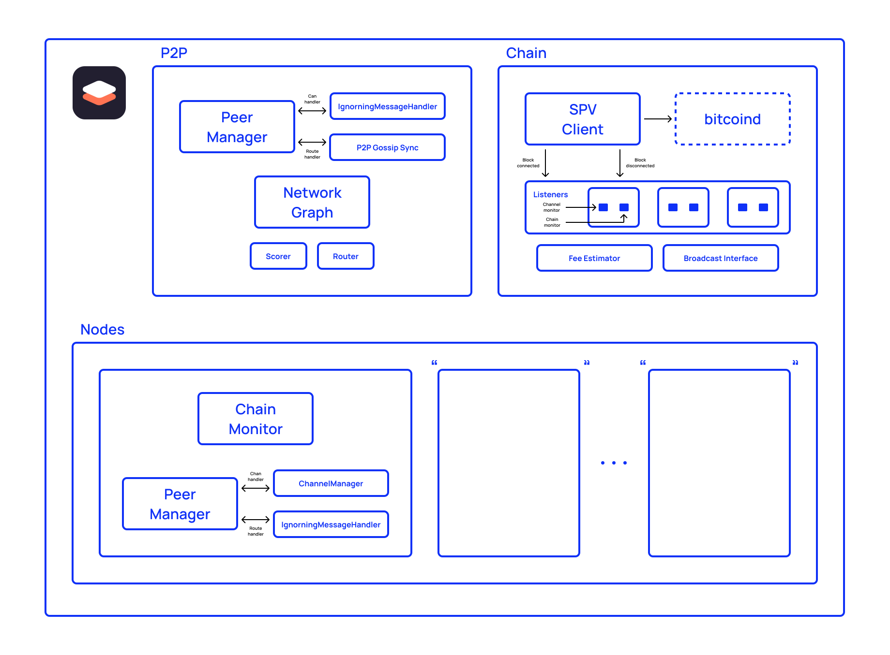

[Sensei](https://l2.technology/sensei) is a lightning node application optimized to serve many nodes within a single instance. It offers a beautiful web interface for admins to manage nodes as well as an interface for individual nodes to perform all of the common lightning network tasks such as connecting to peers, opening and closing channels, and creating and paying invoices. Sensei exposes http and grpc interfaces, allowing automation and programmatic control of the nodes.

One goal of the project was to design an application that could make running multiple lightning nodes as lightweight as possible in terms of resource utilization. Sensei needed a lightning implementation that was designed for low-resource environments and could enable sharing of specific components across a set of nodes.

# What we did?

LDK’s flexibility was the main reason I chose LDK as Sensei’s lightning implementation over other options. I really needed a way for all of the nodes to share certain components (block data, network graph message handling, pathfinding, etc) and LDK allowed this functionality out of the box.

To do something similar with the other implementations would have required maintaining project forks or running multiple instances of the full daemons. The former creates never-ending maintenance work and the latter could never achieve the desired performance characteristics.

# Results

LDK allowed a one-person development team to produce a standalone lightning node server with unique functionality. I was able to piece together the underlying lightning components exactly how I needed without having to maintain forks containing ugly hacks or be limited by the resource utilization of an existing daemon. LDK handles all of the low-level lightning network protocol details, which frees up my time to focus on Sensei’s core features. It’s still early days for Sensei but I’m already able to use it to run hundreds of lightning nodes on my laptop!
