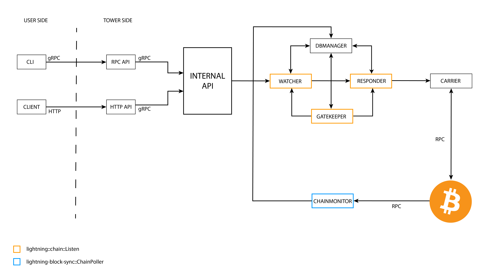

[The Eye of Satoshi (TEOS)](https://github.com/talaia-labs/rust-teos) is a bitcoin watchtower with a specific focus on lightning. Watchtowers are third-party viewing services that help prevent people from cheating on the lightning network by constantly monitoring the bitcoin blockchain for channel breaches. If found, a watchtower will react by penalizing the misbehaving party and sending all funds to its counterpart.

In order for TEOS to work, information is needed from several different building blocks. This includes block data processing (such as reacting to forks/chain splits), interaction with a bitcoin node (for transaction broadcasting), and general tooling around bitcoin/lightning (transaction parsing, data encoding/decoding, lightning P2P messaging, etc).

TEOS does not have strong performance requirements, as data is checked in newly processed blocks approximately every 10 mins. However, if it services a substantial amount of nodes at once or channels with high traffic, it may need to compare processed info against huge amounts of data.

# What we did?

We initially had a Python implementation, but as the project evolved we realized it could be beneficial to switch to a language that was more robust and had better tooling. Rust was an obvious choice given how well it works for other bitcoin-related projects. Moving away from Python allowed us to drop a substantial amount of dependencies that were unmaintained or maintained by us, and instead use properly maintained counterparts.

While it did take time to perform the Rust re-implementation, it was worth it for several reasons. LDK does a substantial amount of the low-level heavy lifting (e.g. reorg management), allowing us to remove several components of the original design and abstract interaction with bitcoind. Additionally, Python lacks proper support for most of lightning’s functionality, so we would have had to implement and maintain all of the related toolings to support lightning P2P communication features.

Furthermore, LDK supports various lightning features that we may need in the future, such as anchors. At the end of the day, LDK makes it possible to focus on the product/protocol you are building and care less about the low-level lightning/bitcoin parts that are needed.

# Results

The TEOS codebase is now more robust and stable, making it easier to contribute to and integrate with other projects.

In terms of functionality, we recently reached the same state as the old Python codebase. We are currently focusing on new features and integrations. Additionally, using Rust and LDK has allowed us to build a healthier community. It’s easier to make improvements to a project when you use the same tools and literally speak the same language.

It's been a pleasure working with the LDK team. They’ve helped us solve several Rust and LDK issues, and have been open to accepting PRs and implementing new functionality that we require.

Learn how you can deploy your own TEOS watchtower on the Bitcoin Developers Youtube [channel](https://www.youtube.com/watch?v=8vzNB_NZt2A).
