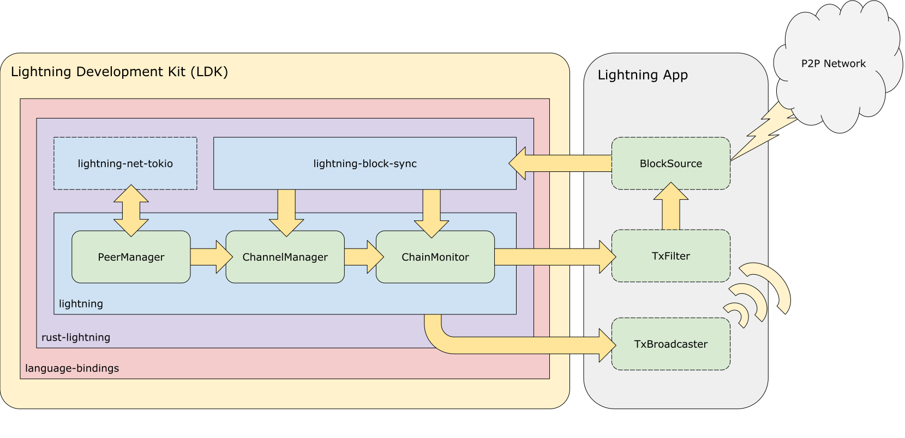

# Blockchain Data

## Introduction

In this guide, we'll explore how to provide chain data to LDK upon startup and
as new blocks are mined. This allows LDK to maintain channel state and monitor
for on-chain channel activity.

## Overview

LDK maintains channels with your node's peers during the course of node
operation. When a new channel is opened, the `ChannelManager` will keep track of
the channel's state and tell the `ChainMonitor` that a new channel should be
watched. The `ChainMonitor` does so by maintaining a `ChannelMonitor` for each
channel.

When a new block is mined, it is connected to the chain while other blocks may
be disconnected if reorganized out. Transactions are confirmed or unconfirmed
during this process. You are required to feed this activity to LDK which will
process it by:

* Updating channel state
* Signaling back transactions to filter
* Broadcasting transactions if necessary

We will walk through this process as depicted here:



## Chain Activity

Initially, our node doesn't have any channels and hence has no data to monitor
for on-chain. When a channel is opened with a peer, the `ChannelManager` creates
a `ChannelMonitor` and passes it to the `ChainMonitor` to watch.

At this point, you need to feed LDK any chain data of interest so that it can
respond accordingly. It supports receiving either full blocks or pre-filtered
blocks using the `chain::Listen` interface. While block data can sourced from
anywhere, it is your responsibility to call the `block_connected` and
`block_disconnected` methods on `ChannelManager` and `ChainMonitor`. This allows
them to update channel state and respond to on-chain events, respectively.

LDK comes with a `lightning-block-sync` utility that handles polling a block
source for the best chain tip, detecting chain forks, and notifying listeners
when blocks are connected and disconnected. It can be configured to:

* Poll a custom `BlockSource`
* Notify `ChannelManager` and `ChainMonitor` of block events

It is your choice as to whether you use this utility or your own to feed the
required chain data to LDK. If you choose to use it, you will need to implement
the `BlockSource` interface or use one of the samples that it provides.

::: tip Note
Currently, `lightning-block-sync` is only available in Rust.
:::

### Block Source   

Implementing the `BlockSource` interface requires defining methods for fetching
headers, blocks, and the best block hash.

:::: tabs
::: tab "Rust"

```rust
impl BlockSource for Blockchain {
	fn get_header<'a>(&'a mut self, header_hash: &'a BlockHash, _height: Option<u32>) -> AsyncBlockSourceResult<'a, BlockHeaderData> {
		// <insert code for fetching block headers>
	}

	fn get_block<'a>(&'a mut self, header_hash: &'a BlockHash) -> AsyncBlockSourceResult<'a, Block> {
		// <insert code for fetching block>
	}

	fn get_best_block<'a>(&'a mut self) -> AsyncBlockSourceResult<'a, (BlockHash, Option<u32>)> {
		// <insert code for fetching the best block hash>
	}
}
```

:::
::: tab "Java"

```java
// TODO
```

:::
::::

For instance, you may implement this interface by querying Bitcoin Core's JSON
RPC interface, which happens to be a sample implementation provided by
`lightning-block-sync`.

Let's walk through the use case where LDK receives full blocks.

### Full Blocks

If your Lightning node is backed by a Bitcoin full node, the operation is
straight forward: call the appropriate methods on `ChannelManager` and
`ChainMonitor` as blocks are connected and disconnected. LDK will handle the
rest!

So what happens? The `ChannelManager` examines the blocks transactions and
updates the internal channel state as needed. The `ChainMonitor` will detect
any spends of the channel funding transaction or any pertinent transaction
outputs, tracking them as necessary.

If necessary, LDK will broadcast a transaction on your behalf. More on that
later. For now, let's look at the more interesting case of pre-filtered blocks.

### Pre-filtered Blocks

For environments that are resource constrained, receiving and processing all
transaction data may not be feasible. LDK handles this case by signaling back
which transactions and outputs it is interested in. This information can then be
used to filter blocks prior to sending them to your node.

For example, if your block source is an Electrum client, you can pass along this
information to it. Or if you are making use of a BIP 157 client, you can check
if a block contains relevant transactions before fetching it.

So how does this work in practice? `ChainMonitor` is parameterized by an
optional type that implements `chain::Filter`:

:::: tabs
::: tab "Rust"

```rust
impl chain::Filter for Blockchain {
	fn register_tx(&self, txid: &Txid, script_pubkey: &Script) {
		// <insert code for you to watch for this transaction on-chain>
	}

	fn register_output(&self, output: WatchedOutput) -> Option<(usize, Transaction)> {
		// <insert code for you to watch for any transactions that spend this
		// output on-chain>
		// If you are fetching pre-filtered blocks, and do not fetch in-block
		// descendants of transactions, return any in-block spend of the given
		// output.
		// Otherwise return None.
	}
}
```

:::
::: tab "Java"

```java
Filter tx_filter = Filter.new_impl(new Filter.FilterInterface() {
	@Override
	public void register_tx(byte[] txid, byte[] script_pubkey) {
		// <insert code for you to watch for this transaction on-chain>
	}

	@Override
	Option_C2Tuple_usizeTransactionZZ register_output(WatchedOutput output) {
		// <insert code for you to watch for any transactions that spend this
		// output on-chain>
		// If you are fetching pre-filtered blocks, and do not fetch in-block
		// descendants of transactions, return any in-block spend of the given
		// output.
		// Otherwise return Option_C2Tuple_usizeTransactionZZ.none().
	}
});
```

:::
::::

When this is provided, `ChainMonitor` will call back to the filter as channels
are opened and blocks connected. This gives the opportunity for the source to
pre-filter blocks as desired.

Regardless, when a block is connected, its header must be processed by LDK.

### Confirmed Transactions

Up until this point, we've explored how to notify LDK of chain activity using
blocks. But what if you're sourcing chain activity from a place that doesn't
provide a block-centric interface, like Electrum?

LDK has a `chain::Confirm` interface to support this use case, analogous to the
block-oriented `chain::Listen` interface which we've been using up until now.
With this alternative approach, you still need to give LDK block headers but
only for blocks containing transactions of interest. These are identified by
`chain::Filter` as before. You also need to notify LDK of any transactions with
insufficient confirmation that have been reorganized out of the chain. Use the
`transactions_confirmed` and `transaction_unconfirmed` methods, respectively.

Additionally, you must notify LDK whenever a new chain tip is available using
the `best_block_updated` method. See the documentation for a full picture of how
this interface is intended to be used.

::: tip Note
Be advised that `chain::Confirm` is a less mature interface than
`chain::Listen`. As such, there is not yet a utility like `lightning-block-sync`
to use for interacting with clients like Electrum.
:::

## Transaction Broadcast

Inevitably, LDK will need to broadcast transactions on your behalf. As you
notify it of blocks, it will determine if it should broadcast a transaction and
do so using an implementation of `BroadcasterInterface` that you have provided.

And as those transactions or those from your peers are confirmed on-chain, they
will be likewise processed when notified of a connected block. Thus, continuing
the cycle.
