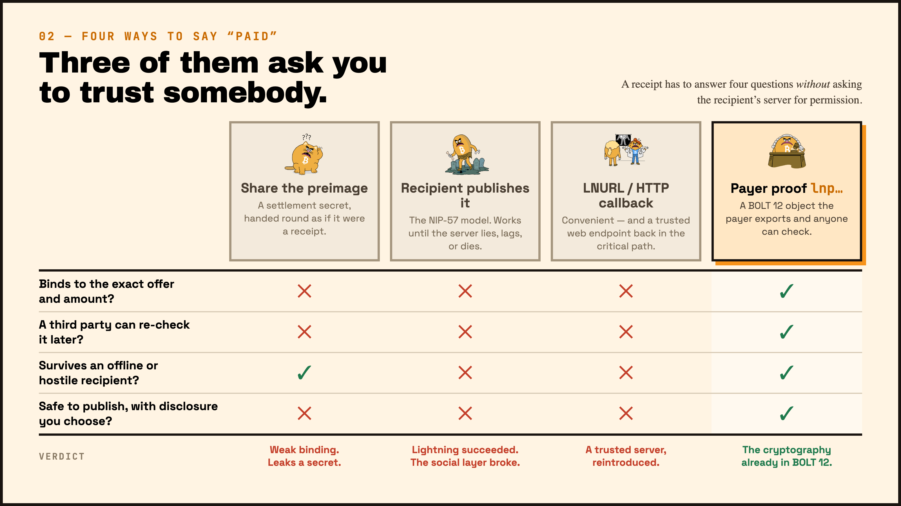
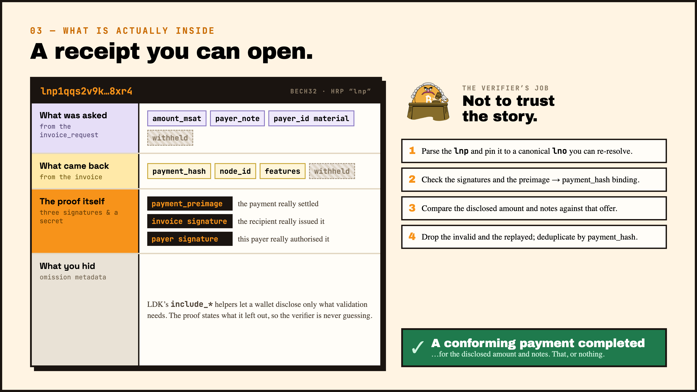
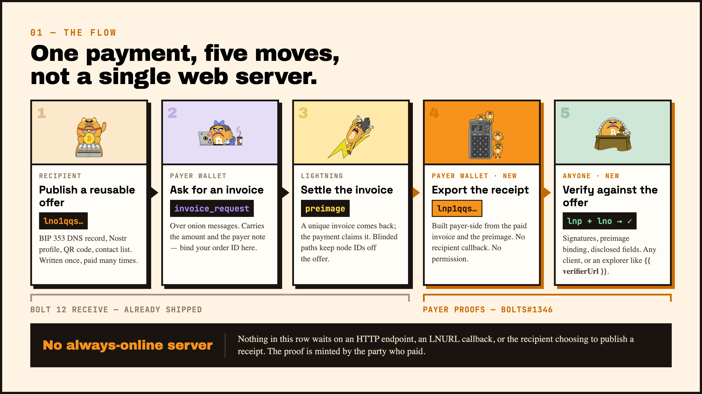
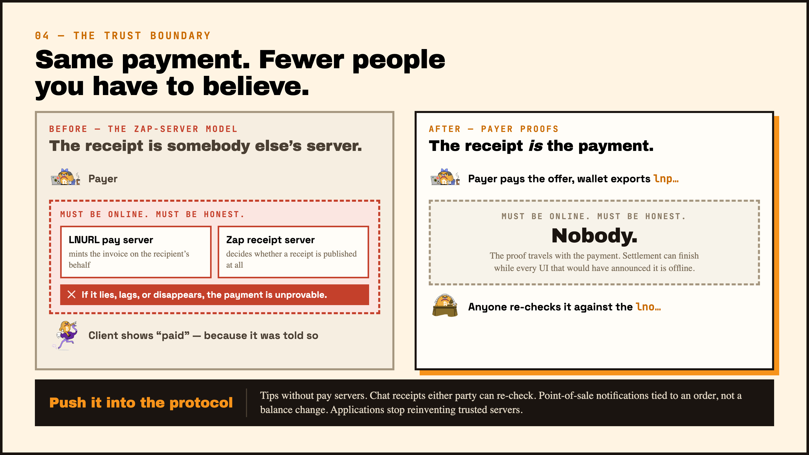

BOLT 12 finally made receiving usable. You can publish a reusable offer, negotiate a private invoice over onion messages, and not have the invoice die the moment you share it. That part works.

The payment side is still missing something though.

Once the payment settles, how does the person who actually paid prove it? To a messaging app, a Nostr client, a POS terminal, or basically anyone else — without standing up a web server, without asking the recipient to publish a receipt, and without falling back to LNURL callbacks or custodial zap servers?

Most of the time the answer is still “you don’t”. Or you just end up trusting someone else’s server again.

I’ve been working on the payer proof side of this for a while (the primitives are in LDK now). The idea is simple: after settlement the payer’s wallet can export a compact, verifiable receipt (`lnp…`) that anyone can check against the original offer. The recipient doesn’t need to cooperate or stay online. There’s no always-on HTTP endpoint. It’s just using the cryptography that already lives inside BOLT 12.

Core Lightning has already shipped support. Eclair checked the test vectors. The specification is in [bolts#1346](https://github.com/lightning/bolts/pull/1346). What’s left is treating the receipt as something the payer actually controls.

## Why the usual options don’t cut it

Lightning has always had the preimage as a cryptographic proof that an HTLC settled. For plain BOLT 11 that was often enough. With BOLT 12 and the kind of apps people are building now, the requirements changed.

A chat app wants a “paid” indicator that a third party can still re-verify later. A Nostr client wants public tip totals without running an LNURL zap server. A point-of-sale terminal needs to know *this specific order* was paid, not just that money arrived somewhere. An agent talking to a wallet over a connector needs a receipt it can keep and check offline.

Just sharing the preimage isn’t enough. It proves some HTLC settled, but a BOLT 12 offer isn’t bound to the payment hash. You still need the full chain: preimage → invoice → offer, plus the signed fields and any payer metadata the application cares about.

Letting the recipient publish the receipt is what Nostr zaps currently do under [NIP-57](https://github.com/nostr-protocol/nips/blob/master/57.md). It works until that server lies, lags, or disappears. Lightning itself succeeded; the social layer still depends on trust.

LNURL and HTTP callbacks are convenient for fetching invoices, but they put a trusted web endpoint back into the critical path for both the payment and the proof. As the cost of keeping payment servers online keeps rising, that model gets harder to justify for tips and chat payments.

Wallet screenshots or “I saw the PaymentSent event” are fine for the person who paid. They’re not something anyone else can cryptographically verify, and they’re useless on a different device that was offline when the payment settled.

Settlement can finish while the UI that would have shown it is offline. The proof has to be something the payer’s wallet can produce later, on its own schedule.

*Figure: comparison — a trusted server reintroduced vs the cryptography already in BOLT 12.*

## What a payer proof actually contains

A payer proof is a BOLT 12 object, usually encoded as bech32 with the `lnp` prefix. It lets a verifier check that a payment really settled against a known offer.

At a high level it combines:

- selected fields from the invoice request (amount, payer note, payer id material…),
- selected fields from the invoice (payment hash, node id, features…),
- the actual proof material: the preimage, the invoice signature, and the payer’s signature,
- optional omission metadata so a wallet can reveal only what a particular application needs.

The verifier doesn’t have to believe the payer. It just runs the validation: given this `lnp` and the original offer, does it correspond to a valid settled payment for the disclosed amount and notes?

That’s the difference between a screenshot and an actual receipt.

*Figure: anatomy — selected invoice-request fields, invoice fields, preimage and signatures that make up an `lnp`.*

## How the flow looks

1. The recipient publishes a reusable BOLT 12 offer. It’s just a string, so it can live in BIP 353 DNS, a Nostr profile, a QR code, a contact list, a chat message, whatever.
2. The payer requests an invoice over onion messages, including the amount (for variable offers) and any payer note or metadata the application wants bound to the payment.
3. The recipient returns a unique invoice and the payer settles it.
4. After settlement the payer’s wallet builds the `lnp` from the paid invoice, the preimage, and whichever fields it decides to disclose. This happens entirely on the payer side.
5. The application attaches the proof where it needs it — a public tip event, an encrypted chat receipt, a wallet-connector response, a POS notification.

Anyone who needs to can verify it. Clients parse the `lnp`, check the signatures and the preimage binding, and compare the disclosed fields against the offer they think was paid. Invalid or replayed proofs get dropped; duplicates are deduplicated by payment hash.

No LNURL. No “please host a zap callback”. The Lightning proof *is* the receipt. The application only decides whether that receipt should be public, private, or stored in some backend ledger.

*Figure: flow — publish offer → request invoice over onion messages → settle → export `lnp` → verify.*

## A couple of design points that matter

Selective disclosure is important. Not every verifier needs every TLV. LDK gives you helpers so wallets can include only what is required for validation and leave the rest out. Follow the rules in the specification about what can safely be omitted, especially if the proof will be posted publicly.

Privacy is the user’s choice. A publicly posted proof is a public statement about amount, timing, offer, and (depending on what was disclosed) the payer. Wallets should make publishing an explicit action. The same cryptographic object can be used for private chat receipts without broadcasting it. Blinded paths on the offer still hide the recipient’s node ID from casual observers; they don’t anonymise a proof the user chooses to post somewhere public.

*Figure: trust boundary — what the verifier checks locally without asking the recipient’s server.*

## Current status

| Component | Status |
|---|---|
| Specification (bolts#1346) | Open and approved |
| LDK (rust-lightning) | Primitives merged (#4297) |
| LDK Node | Planned for the next release |
| Core Lightning | Shipped |
| Eclair | Test vectors verified; maintainer ACK |
| LND | No known implementation yet |

## What becomes possible

Once you have offers for receiving and payer proofs for receipts, a lot of the custodial middleware that apps currently rely on becomes unnecessary.

Tips and zaps no longer need LNURL pay servers to publish receipts on the recipient’s behalf.  
In-chat payments can carry receipts that either party (or an auditor) can re-check later.  
Point-of-sale systems can reference a specific order instead of just watching a node balance.  
Scoped app wallets can return a proof on payment the same way card APIs return a transaction ID — except this one is verifiable without the wallet vendor.

Same theme as the rest of the BOLT 12 stack: push the policy and the cryptography into the protocol so applications don’t have to reinvent trust.

If you maintain a wallet, export `lnp` after a BOLT 12 settlement.  
If you maintain an app, stop inventing yet another receipt format. Bind your context, pay the offer, attach the proof, and verify it when you read it.

The open question is the usual one for any self-custody feature that actually works: will the builders ship it, or will we keep papering over the gap with another trusted server?
