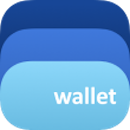
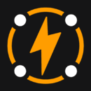
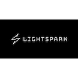
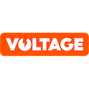

<h1 class="more-cases-heading">
   Meet the projects building with LDK
</h1>

<CodeSwitcher :languages="{all: 'All', mobile:'Mobile', web:'Web', desktop:'Desktop', custodial: 'Custodial', infra:'Infrastructure', misc:'Misc',}">
  <template v-slot:mobile>
    

     

      
      <h3><a href="https://10101.finance/" target="_blank">10101</a></h3>
      
An on and off-chain wallet infused with trading

    

    

      
      <h3><a href="https://bitkit.to/" target="_blank">Bitkit</a></h3>
      
The ultimate bitcoin toolkit, take charge of your digital life

    

    

      
      <h3><a href="https://bluewallet.io/" target="_blank">Blue Wallet</a></h3>
      
A radically simple and powerful bitcoin and Lightning wallet

    

    

      
      <h3><a href="https://github.com/EttaWallet/EttaWallet" target="_blank">EttaWallet</a></h3>
      
A simple open-source wallet with a strong bias toward usability, accessibility, and UX

    

    

    
    <h3><a href="https://twitter.com/kumulydev" target="_blank">Kumuly</a></h3>
    
Colombian-based mobile bitcoin and Lightning wallet

    

     

      
      <h3><a href="https://mercurywallet.com/" target="_blank">Mercury</a></h3>
      
A layer 2 bitcoin wallet that enables users to send and swap bitcoin privately

    

     

      
      <h3><a href="https://www.velascommerce.com/" target="_blank">Velas</a></h3>
      
A way to integrate Lightning into websites, mobile applications, and more

    

    

  </template>

  <template v-slot:web>

  

    

      <h3></h3>
      <h3><a href="https://mutinywallet.com/" target="_blank">Mutiny</a></h3>
      
A web-first unstoppable bitcoin wallet for everyone

    

  

  </template>

  <template v-slot:desktop>
      

      

        
        <h3><a href="https://atomicdex.io/en/" target="_blank">AtomicDEX</a></h3>
        
A multi-coin wallet, bridge, and DEX rolled into one app

      

      

        
        <h3><a href="https://hydranet.ai/" target="_blank">Hydranet</a></h3>
        
A layer 3 decentralized exchange, allowing trading with native tokens between blockchains

      

      

        
        <h3><a href="https://mercurywallet.com/" target="_blank">Mercury</a></h3>
        
A layer 2 bitcoin wallet that enables users to send and swap bitcoin privately

      

      

  </template>

  <template v-slot:custodial>

  

  

    
    <h3><a href="https://cash.app/" target="_blank">Cash App</a></h3>
    
Send and spend, bank, and buy stocks or bitcoin

  

  

  </template>

  <template v-slot:infra>

  

  

    
    <h3><a href="https://github.com/aciedo" target="_blank">Aciedo</a></h3>
    
A financial infrastructure suite for developers and users

  

  

    
    <h3><a href="https://cequals.xyz/" target="_blank">c=</a></h3>
    
Tools and services that connect people to the Lightning Network

  

  

    
    <h3><a href="https://github.com/kuutamolabs/lightning-knd" target="_blank">kuutamo</a></h3>
    
A turn-key, end-to-end solution for running self-hosted nodes, anywhere

  

  

    
    <h3><a href="https://github.com/lndk-org/lndk" target="_blank">LNDK</a></h3>
    
A standalone daemon that aims to externally implement BOLT 12 functionality for LND

  

  

    
    <h3><a href="https://github.com/lexe-tech" target="_blank">Lexe</a></h3>
    
Managed non-custodial Lightning nodes inside secure hardware

  

  

    
    <h3><a href="https://www.lightspark.com/" target="_blank">Lightspark</a></h3>
    
Enterprise-grade, fast, secure payments on Lightning

  

  

    
    <h3><a href="https://github.com/L2-Technology/sensei" target="_blank">Sensei</a></h3>
    
A Lightning node implementation for everyone

  

  

    
    <h3><a href="https://github.com/talaia-labs/rust-teos" target="_blank">TEOS</a></h3>
    
A bitcoin watchtower with a specific focus on Lightning

  

  

    
    <h3><a href="https://vls.tech/" target="_blank">VLS</a></h3>
    
Separates Lightning private keys and security rule validation from nodes, into a discrete signing device

  

  

    
    <h3><a href="https://voltage.cloud/" target="_blank">Voltage</a></h3>
    
Enterprise-grade infrastructure for the Lightning Network

  
  
  

  </template>

  <template v-slot:misc>
      

        

          
          <h3><a href="https://github.com/fiksn/gossiper" target="_blank">Gossiper</a></h3>
          
Lightning Gossip Ingestion

        

         

          
          <h3><a href="https://github.com/BitcoinDevShop/hidden-lightning-network" target="_blank">The Hidden LN</a></h3>
          
Probes the Lightning Network for the detection of private channels

        

        

          
          <h3><a href="https://github.com/TonyGiorgio/ldk-sample-tor" target="_blank">ldk-sample with Tor</a></h3>
          
An experimentation with tor that adapts the ldk-sample node

        

        

          
          <h3><a href="https://github.com/RGB-Tools/rgb-lightning-node" target="_blank">rgb-lightning-node</a></h3>
          
LN node based on ldk-sample supporting RGB assets

        

         

          
          <h3><a href="https://github.com/p2pderivatives/rust-dlc" target="_blank">rust-dlc</a></h3>
          
A Rust library for working with Discreet Log Contracts

        

        

          
          <h3><a href="https://github.com/ConorOkus/uMlando-wallet" target="_blank">uMlando</a></h3>
          
An educational Android demo wallet

        

      

  </template>

  <template v-slot:all>
  

    

      
      <h3><a href="https://10101.finance/" target="_blank">10101</a></h3>
      
An on and off-chain wallet infused with trading

    

    

    
    <h3><a href="https://github.com/aciedo" target="_blank">Aciedo</a></h3>
    
A financial infrastructure suite for developers and users

    

    

      
      <h3><a href="https://atomicdex.io/en/" target="_blank">AtomicDEX</a></h3>
      
A multi-coin wallet, bridge, and DEX rolled into one app

    

    

      
      <h3><a href="https://bitkit.to/" target="_blank">Bitkit</a></h3>
      
The ultimate bitcoin toolkit, take charge of your digital life

    

    

      
      <h3><a href="https://bluewallet.io/" target="_blank">Blue Wallet</a></h3>
      
A radically simple and powerful bitcoin and Lightning wallet

    

    

      
      <h3><a href="https://cequals.xyz/" target="_blank">c=</a></h3>
      
Tools and services that connect people to the Lightning Network

    

    

      
      <h3><a href="https://cash.app/" target="_blank">Cash App</a></h3>
      
Send and spend, bank, and buy stocks or bitcoin

    

    

        
        <h3><a href="https://github.com/EttaWallet/EttaWallet" target="_blank">EttaWallet</a></h3>
        
A simple open-source wallet with a strong bias toward usability, accessibility, and UX

    

    

        
        <h3><a href="https://github.com/fiksn/gossiper" target="_blank">Gossiper</a></h3>
        
Lightning Gossip Ingestion

    

    

      
      <h3><a href="https://hydranet.ai/" target="_blank">Hydranet</a></h3>
      
A layer 3 decentralized exchange, allowing trading with native tokens between blockchains

    

   

    
    <h3><a href="https://twitter.com/kumulydev" target="_blank">Kumuly</a></h3>
    
Colombian-based mobile bitcoin and Lightning wallet

   

   

      
      <h3><a href="https://github.com/kuutamolabs/lightning-knd" target="_blank">kuutamo</a></h3>
      
A turn-key, end-to-end solution for running self-hosted nodes, anywhere

   

   

    
    <h3><a href="https://github.com/TonyGiorgio/ldk-sample-tor" target="_blank">ldk-sample with Tor</a></h3>
    
An experimentation with tor that adapts the ldk-sample node

   

   

    
    <h3><a href="https://github.com/lexe-tech" target="_blank">Lexe</a></h3>
    
Managed non-custodial Lightning nodes inside secure hardware

  

   

    
    <h3><a href="https://www.lightspark.com/" target="_blank">Lightspark</a></h3>
    
Enterprise-grade, fast, secure payments on Lightning

  

  

    
    <h3><a href="https://github.com/lndk-org/lndk" target="_blank">LNDK</a></h3>
    
A standalone daemon that aims to externally implement BOLT 12 functionality for LND

  

  

    
    <h3><a href="https://mercurywallet.com/" target="_blank">Mercury</a></h3>
    
A layer 2 bitcoin wallet that enables users to send and swap bitcoin privately

  

  

    
    <h3><a href="https://mutinywallet.com/" target="_blank">Mutiny</a></h3>
    
A web-first unstoppable bitcoin wallet for everyone

  

  

    
    <h3><a href="https://github.com/RGB-Tools/rgb-lightning-node" target="_blank">rgb-lightning-node</a></h3>
    
LN node based on ldk-sample supporting RGB assets

  

  

    
    <h3><a href="https://github.com/p2pderivatives/rust-dlc" target="_blank">rust-dlc</a></h3>
    
A Rust library for working with Discreet Log Contracts

  

  

    
    <h3><a href="https://github.com/L2-Technology/sensei" target="_blank">Sensei</a></h3>
    
A Lightning node implementation for everyone

  

  

    
    <h3><a href="https://github.com/talaia-labs/rust-teos" target="_blank">TEOS</a></h3>
    
A bitcoin watchtower with a specific focus on Lightning

  

  

    
    <h3><a href="https://github.com/BitcoinDevShop/hidden-lightning-network" target="_blank">The Hidden LN</a></h3>
    
Probes the Lightning Network for the detection of private channels

  

  

    
    <h3><a href="https://github.com/ConorOkus/uMlando-wallet" target="_blank">uMlando</a></h3>
    
An educational Android demo wallet

  

  

    
    <h3><a href="https://www.velascommerce.com/" target="_blank">Velas</a></h3>
    
A way to integrate Lightning into websites, mobile applications, and more

  

  

    
    <h3><a href="https://vls.tech/" target="_blank">VLS</a></h3>
    
Separates Lightning private keys and security rule validation from nodes, into a discrete signing device

  

  

    
    <h3><a href="https://voltage.cloud/" target="_blank">Voltage</a></h3>
    
Enterprise-grade infrastructure for the Lightning Network

  

  

  </template>

</CodeSwitcher>
