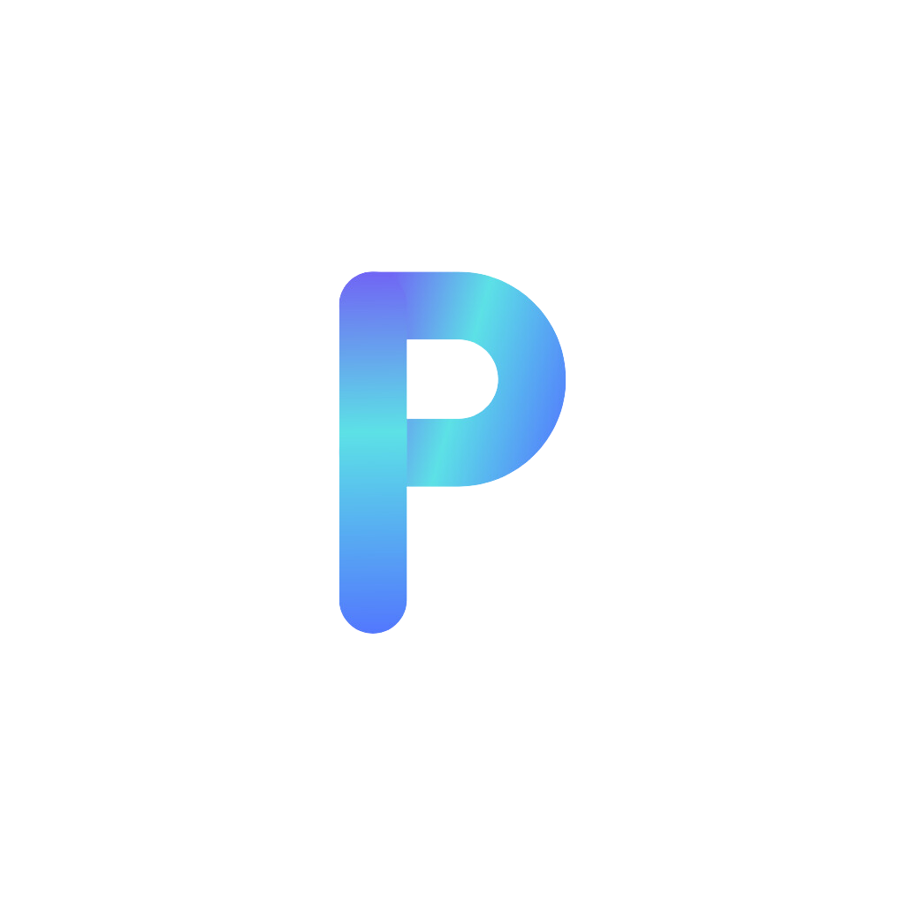

<h1 class="more-cases-heading">
   Meet all the projects using LDK!
</h1>

<CodeSwitcher :languages="{all: 'All', mobile:'Mobile', web:'Web', desktop:'Desktop', custodial: 'Custodial', infra:'Infrastructure', library: 'Libraries', misc:'Misc',}">
  <template v-slot:mobile>
    

    

    
    <h3><a href="https://bluewallet.io/" target="_blank">Blue Wallet</a></h3>
    
A radically simple and powerful bitcoin and Lightning wallet

    

   

    
    <h3><a href="https://bitkit.to/" target="_blank">Bitkit</a></h3>
    
A mobile app that hands you the keys to your money, profile, contacts, and web accounts

    

    

    
    <h3><a href="https://twitter.com/kumulydev" target="_blank">Kumuly</a></h3>
    
Colombian-based mobile bitcoin and Lightning wallet

    

    

    
    <h3><a href="https://lipa.swiss/" target="_blank">Lipa</a></h3>
    
Swiss-based mobile app that offers a bitcoin wallet for individuals and businesses

    

     

      
      <h3><a href="https://mercurywallet.com/" target="_blank">Mercury</a></h3>
      
A Lighting wallet that enables BTC transfers without requiring an on-chain transaction

    

     

      
      <h3><a href="https://porticoexchange.github.io/porticoexchangev2.github.io/" target="_blank">Portico</a></h3>
      
A DEX that enables people to swap between bitcoin layers and sidechains

    

     

      
      <h3><a href="https://www.velascommerce.com/" target="_blank">Velas</a></h3>
      
Enables businesses to integrate Lightning payments into websites, mobile applications, and more

    

     

      
      <h3><a href="https://10101.finance/" target="_blank">10101</a></h3>
      
An on-chain and off-chain wallet that allows trading

    

    

  </template>

  <template v-slot:web>

  

     

      
      <h3><a href="https://mercurywallet.com/" target="_blank">Mercury</a></h3>
      
A Lighting wallet that enables BTC transfers without requiring an on-chain transaction

    

    

      <h3></h3>
      <h3><a href="https://mutinywallet.com/" target="_blank">Mutiny</a></h3>
      
Mutiny is a web-first lightning wallet

    

  

  </template>

  <template v-slot:desktop>
      

       

        
        <h3><a href="https://mercurywallet.com/" target="_blank">Mercury</a></h3>
        
A Lighting wallet that enables BTC transfers without requiring an on-chain transaction

       

      

        
        <h3><a href="https://atomicdex.io/en/" target="_blank">AtomicDEX</a></h3>
        
A multi-coin wallet, bridge, and DEX that can run on mobile and desktop

      

      

        
        <h3><a href="https://hydranet.ai/" target="_blank">Hydranet</a></h3>
        
A DEX that offers trading between blockchains without the need for a layer 2 bridge

      

      

  </template>

  <template v-slot:custodial>

  

  

    
    <h3><a href="https://cash.app/" target="_blank">Cash App</a></h3>
    
A mobile P2P payments app and bitcoin wallet

  

  

  </template>

  <template v-slot:infra>

  

  

    
    <h3><a href="https://github.com/lexe-tech" target="_blank">Lexe</a></h3>
    
An LN-in-the-cloud soultion that uses LDK on Intel SGX

  

  

    
    <h3><a href="https://voltage.cloud/" target="_blank">Voltage</a></h3>
    
Provides enterprise grade infrastructure for the Lightning Network

  

  

    
    <h3><a href="https://valera.co/" target="_blank">Valera</a></h3>
    
Building a financial infrastructure suite for developers and users

  

  

    
    <h3><a href="https://github.com/kuutamolabs/lightning-knd" target="_blank">Kuutamo</a></h3>
    
A turn-key, end-to-end solution for running self-hosted nodes, anywhere

  

  

    
    <h3><a href="https://cequals.xyz/" target="_blank">c=</a></h3>
    
Building tools and services to help connect people to the Lightning Network

  

  

  </template>

  <template v-slot:library>

  

  

    
    <h3><a href="https://github.com/carlaKC/lndk" target="_blank">LNDK</a></h3>
    
LNDK is an experimental attempt at using LDK to implement BOLT12 features for LND

  

  

    
    <h3><a href="https://vls.tech/" target="_blank">VLS</a></h3>
    
Separates lightning private keys and security rule validation from nodes, into a discrete signing device

  

  

    
    <h3><a href="https://github.com/talaia-labs/rust-teos" target="_blank">TEOS</a></h3>
    
A bitcoin watchtower with a specific focus on lightning

  

  

  </template>

  <template v-slot:misc>
      

        

          
          <h3><a href="https://github.com/p2pderivatives/rust-dlc" target="_blank">rust-dlc</a></h3>
          
A Rust library for working with Discreet Log Contracts

        

         

          
          <h3><a href="https://github.com/BitcoinDevShop/hidden-lightning-network" target="_blank">The Hidden Lightning Network</a></h3>
          
Probes the Lightning Network for the detection of private channels

        

        

          
          <h3><a href="https://github.com/TonyGiorgio/ldk-sample-tor" target="_blank">ldk-sample with Tor</a></h3>
          
An experimentation with tor by adapting the ldk-sample node

        

        

          
          <h3><a href="https://github.com/ConorOkus/uMlando-wallet" target="_blank">uMlando</a></h3>
          
An educational Android demo wallet

        

      

  </template>

  <template v-slot:all>
  

    

    
    <h3><a href="https://bluewallet.io/" target="_blank">Blue Wallet</a></h3>
    
A mobile bitcoin and lightning wallet.

    

  

    
    <h3><a href="https://bitkit.to/" target="_blank">Bitkit</a></h3>
    
A mobile wallet that features portable web profiles and passwordless web accounts

  

   

    
    <h3><a href="https://twitter.com/kumulydev" target="_blank">Kumuly</a></h3>
    
Colombian-based mobile bitcoin and Lightning wallet

  

  

    
    <h3><a href="https://lipa.swiss/" target="_blank">Lipa</a></h3>
    
Swiss-based mobile app that offers a bitcoin wallet for individuals and businesses

  

  

    
    <h3><a href="https://porticoexchange.github.io/porticoexchangev2.github.io/" target="_blank">Portico</a></h3>
    
A DEX that enables people to swap between bitcoin layers and sidechains

  

  

    
    <h3><a href="https://mercurywallet.com/" target="_blank">Mercury</a></h3>
    
A Lighting wallet that enables BTC transfers without requiring an on-chain transaction

  

  

    
    <h3><a href="https://10101.finance/" target="_blank">10101</a></h3>
    
An on-chain and off-chain wallet that allows trading

  

  

    <h3></h3>
    <h3><a href="https://mutinywallet.com/" target="_blank">Mutiny</a></h3>
    
Mutiny is a web-first lightning wallet

  

  

    
    <h3><a href="https://www.velascommerce.com/" target="_blank">Velas</a></h3>
    
A way to integrate Lightning into websites, mobile applications, and more.

  

  

    
    <h3><a href="https://atomicdex.io/en/" target="_blank">AtomicDEX</a></h3>
    
A multi-coin wallet, bridge, and DEX that can run on mobile and desktop

  

  

    
    <h3><a href="https://hydranet.ai/" target="_blank">Hydranet</a></h3>
    
A DEX that offers trading between blockchains without the need for a layer 2 bridge

  

  

    
    <h3><a href="https://cash.app/" target="_blank">Cash App</a></h3>
    
A mobile P2P payments app and bitcoin wallet

  

  

    
    <h3><a href="https://github.com/talaia-labs/rust-teos" target="_blank">TEOS</a></h3>
    
A bitcoin watchtower with a specific focus on lightning

  

  

    
    <h3><a href="https://vls.tech/" target="_blank">VLS</a></h3>
    
Separates lightning private keys and security rule validation from nodes, into a discrete signing device

  

  

    
    <h3><a href="https://github.com/lexe-tech" target="_blank">Lexe</a></h3>
    
Managed non-custodial Lightning nodes based on Intel SGX, accessible via mobile app

  

  

    
    <h3><a href="https://voltage.cloud/" target="_blank">Voltage</a></h3>
    
Provides enterprise grade infrastructure for the Lightning Network

  

  

    
    <h3><a href="https://valera.co/" target="_blank">Valera</a></h3>
    
Building a financial infrastructure suite for developers and users

  

  

    
    <h3><a href="https://github.com/kuutamolabs/lightning-knd" target="_blank">Kuutamo</a></h3>
    
A turn-key, end-to-end solution for running self-hosted nodes, anywhere

  

  

    <h3></h3>
    <h3><a href="https://cequals.xyz/" target="_blank">c=</a></h3>
    
Building tools and services to help connect people to the Lightning Network

  

  

    
    <h3><a href="https://github.com/p2pderivatives/rust-dlc" target="_blank">rust-dlc</a></h3>
    
A Rust library for working with Discreet Log Contracts

  

  

    
    <h3><a href="https://github.com/BitcoinDevShop/hidden-lightning-network" target="_blank">The Hidden Lightning Network</a></h3>
    
Probes the Lightning Network for the detection of private channels

  

  

    
    <h3><a href="https://github.com/TonyGiorgio/ldk-sample-tor" target="_blank">ldk-sample with Tor</a></h3>
    
An experimentation with tor by adapting the ldk-sample node

  

  

    
    <h3><a href="https://github.com/ConorOkus/uMlando-wallet" target="_blank">uMlando</a></h3>
    
An educational Android demo wallet

    

  

  </template>

</CodeSwitcher>
