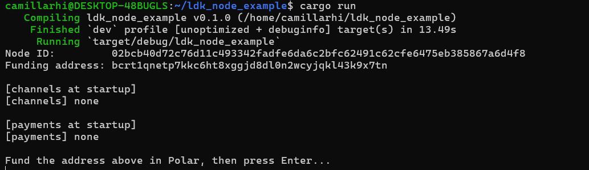
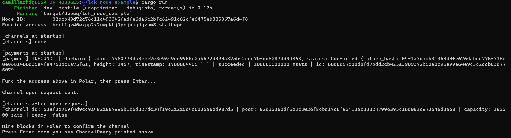
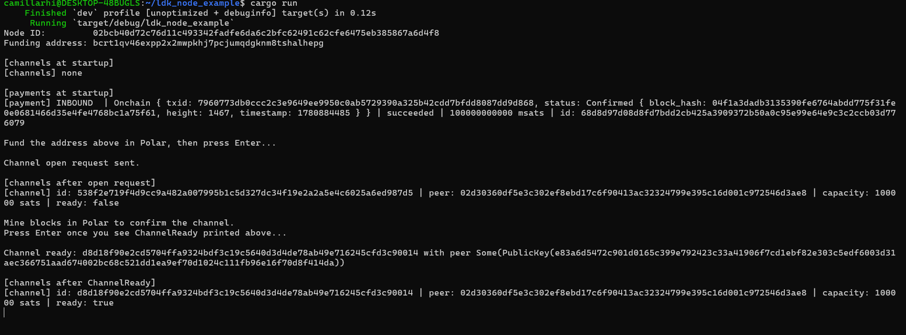
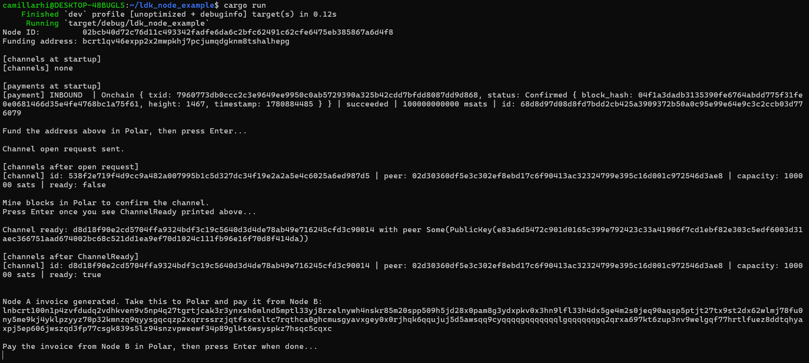
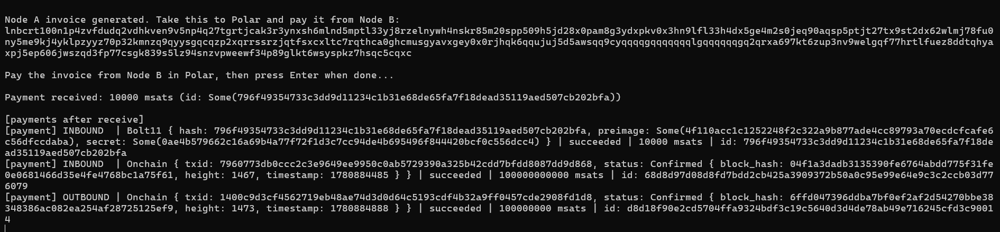
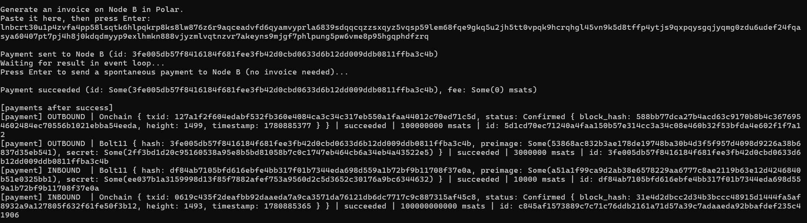
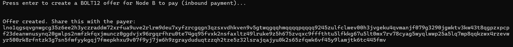
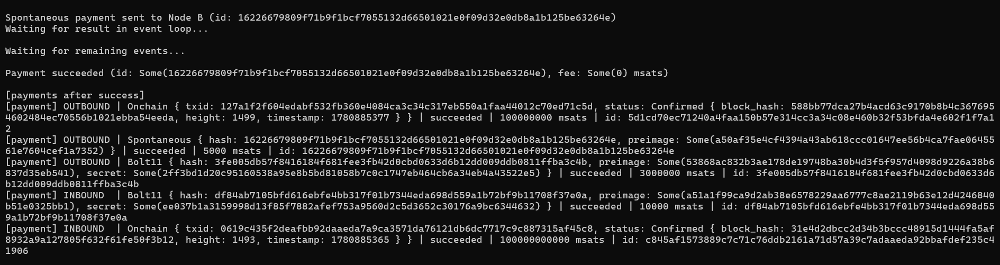

# Getting Started with LDK Node: Building a Lightning Node

If you've spent time in the Bitcoin developer space, you've probably heard of [LDK (the Lightning Development Kit)](https://lightningdevkit.org/). It's a fully modular Rust library that lets you build a Lightning node exactly the way you want. It's powerful and deeply configurable, but it can be a lot to take in when you're just trying to get something running.

That is the gap [`ldk-node`](https://github.com/lightningdevkit/ldk-node) fills. You shouldn't need to understand every layer of the Lightning protocol just to send a payment. LDK Node is LDK with the hard decisions already made for you. It has a small API surface, sensible defaults, and enough structure to be useful in production.

This guide walks you through building a working Lightning node from scratch. By the end, you'll have a node that connects to a peer, opens a channel, handles the channel-ready event, receives a [BOLT11](https://github.com/lightning/bolts/blob/master/11-payment-encoding.md) payment, sends one, creates a [BOLT12](https://github.com/lightning/bolts/blob/master/12-offer-encoding.md) offer and pays one, and sends a spontaneous payment without an invoice. At each step, as you run the code, you'll see exactly what the node returns, building a real mental model of what's happening under the hood.

No prior Lightning implementation experience required. Familiarity with your chosen language and a working knowledge of Bitcoin and Lightning are enough to follow along.

---

## What LDK Node is, and what it’s not

LDK (the underlying library) exposes a vast array of methods. This level of control is ideal for building systems that require custom peer management, exotic channel configurations, or strict key handling. However, it’s not the right tool when you simply need to embed a node in an app.

LDK Node reduces the API surface by making concrete choices on your behalf. [BDK (the Bitcoin Dev Kit)](https://bitcoindevkit.org/) handles the on-chain wallet, while chain data comes from Esplora, Electrum, or Bitcoin Core RPC. State is persisted to SQLite or the filesystem, with Postgres support coming in the next release. Gossip is sourced from Lightning's P2P network or Rapid Gossip Sync, and entropy is derived from raw bytes or a [BIP39](https://github.com/bitcoin/bips/blob/master/bip-0039.mediawiki) mnemonic.

You trade some configurability for speed of iteration. Those defaults cover most real use cases, and if you eventually need more control, the underlying LDK is still accessible.

It’s written in Rust and ships with [UniFFI](https://mozilla.github.io/uniffi-rs/latest/)-based bindings for Swift, Kotlin, and Python if you are targeting mobile.

---

## Prerequisites

Before writing any code, ensure you have the required tools installed for your language of choice.

::: code-group

```bash [Rust]
# Install Rust via rustup
curl --proto '=https' --tlsv1.2 -sSf https://sh.rustup.rs | sh

# Follow the on-screen instructions, then reload your shell environment:
source ~/.cargo/env

# Verify the installation worked:
rustc --version
cargo --version
```

```bash [Kotlin]
# Ensure you have JDK 17 or higher installed
java -version

# Install Gradle if you don't have it
# On macOS
brew install gradle

# On Linux
sudo snap install gradle --classic

# Verify installation
gradle --version
```

:::

For a fully interactive experience with real payments between two nodes, you'll also need Polar. Polar is a desktop app that lets you spin up a local Lightning network with one click. If you don't have it installed, grab it from the [Polar website](https://lightningpolar.com/) to get two nodes running. This guide uses Node A (the `ldk-node` we build) and Node B (a Polar-managed node) to demonstrate every payment direction.

Note: [LDK Server](https://github.com/lightningdevkit/ldk-server) is being added to Polar ([PR #1374](https://github.com/jamaljsr/polar/pull/1374)). Once merged, you will be able to use it directly as your local node backend, since LDK Server is essentially ldk-node with an RPC interface. It will also work as an onion-message-capable peer for BOLT12 offer creation.

Note: To create BOLT12 offers, your ldk-node needs to connect to an onion-message-capable peer. In Polar, this means adding a CLN node to your network. LND does not currently support onion messages, so offer creation will fail if CLN is not present.

With that in place, create a new binary project:

::: code-group

```bash [Rust]
cargo new ldk_node_example
cd ldk_node_example
```

```bash [Kotlin]
mkdir ldk_node_example
cd ldk_node_example
# When prompted, follow the on-screen instructions and accept the defaults.
gradle init --type kotlin-application
```

:::

This generates the following structure:

::: code-group

```text [Rust]
ldk_node_example/
├── Cargo.toml
└── src/
    └── main.rs
```

```text [Kotlin]
ldk_node_example/
├── app/
│   ├── build.gradle.kts
│   └── src/
│       └── main/
│           └── kotlin/
│               └── org/
│                   └── example/
│                       └── App.kt
├── gradle/
│   └── libs.versions.toml
├── settings.gradle.kts
└── gradle.properties
```

:::

Open your main source file. You'll find a default entry point program. Everything that follows replaces it.

---

## Project setup

::: code-group

```toml [Rust]
[dependencies]
ldk-node = "0.7"
tokio = { version = "1", features = ["full"] }
```

```kotlin [Kotlin]
// app/build.gradle.kts
// Add ldk-node to the existing dependencies block:
dependencies {
    // ... existing dependencies ...
    implementation("org.lightningdevkit:ldk-node-jvm:0.7.0")
}

// Connect the terminal's stdin to the app so readLine() blocks for input.
tasks.named<JavaExec>("run") {
    standardInput = System.`in`
}
```

:::

The full source file will be built up function by function through this guide. Each section adds one function, and `main()` calls them in order. By the end, you'll have a single file that compiles and runs as a complete working node.

---

## Helper functions: printing node state

Before writing any node logic, add two helper functions at the top of your main source file. These get called after each meaningful action so you can see exactly what the node knows at that point: channels, payment directions, statuses, and amounts all printed in one place.

::: code-group

```rust [Rust]
use ldk_node::payment::{PaymentDirection, PaymentStatus};

fn print_channels(node: &ldk_node::Node) {
    let channels = node.list_channels();
    if channels.is_empty() {
        println!("[channels] none");
        return;
    }
    for c in channels {
        println!(
            "[channel] id: {} | peer: {} | capacity: {} sats | ready: {}",
            c.channel_id,
            c.counterparty_node_id,
            c.channel_value_sats,
            c.is_channel_ready,
        );
    }
}

fn print_payments(node: &ldk_node::Node) {
    let payments = node.list_payments();
    if payments.is_empty() {
        println!("[payments] none");
        return;
    }
    for p in payments {
        let direction = match p.direction {
            PaymentDirection::Inbound  => "INBOUND ",
            PaymentDirection::Outbound => "OUTBOUND",
        };
        let status = match p.status {
            PaymentStatus::Pending   => "pending",
            PaymentStatus::Succeeded => "succeeded",
            PaymentStatus::Failed    => "failed",
        };
        println!(
            "[payment] {} | {:?} | {} | {} msats | id: {:?}",
            direction,
            p.kind,
            status,
            p.amount_msat.unwrap_or(0),
            p.id,
        );
    }
}
```

```kotlin [Kotlin]
import org.lightningdevkit.ldknode.Node
import org.lightningdevkit.ldknode.PaymentDirection
import org.lightningdevkit.ldknode.PaymentStatus

fun printChannels(node: Node) {
    val channels = node.listChannels()
    if (channels.isEmpty()) {
        println("[channels] none")
        return
    }
    for (c in channels) {
        println(
            "[channel] id: ${c.channelId} | peer: ${c.counterpartyNodeId} | capacity: ${c.channelValueSats} sats | ready: ${c.isChannelReady}"
        )
    }
}

fun printPayments(node: Node) {
    val payments = node.listPayments()
    if (payments.isEmpty()) {
        println("[payments] none")
        return
    }
    for (p in payments) {
        val direction = when (p.direction) {
            PaymentDirection.INBOUND  -> "INBOUND "
            PaymentDirection.OUTBOUND -> "OUTBOUND"
        }
        val status = when (p.status) {
            PaymentStatus.PENDING   -> "pending"
            PaymentStatus.SUCCEEDED -> "succeeded"
            PaymentStatus.FAILED    -> "failed"
        }
        println(
            "[payment] $direction | ${p.kind} | $status | ${p.amountMsat ?: 0} msats | id: ${p.id}"
        )
    }
}
```

:::

`print_channels` shows every open or pending channel with its capacity and whether it's ready to route payments. `print_payments` shows every payment the node has seen, with direction, kind (bolt11, spontaneous, or onchain), status, and amount. You'll see both grow as the guide progresses.

---

## Building the node

The entry point into `ldk-node` is `Builder`. You configure it, call `build()`, and get back a `Node` that manages everything from that point forward.

This guide uses Bitcoin Core RPC as the chain source, which is what Polar runs under the hood. Open Polar, click on the Bitcoin Core node, and find the RPC credentials in the node settings panel. You'll need the host, port, username, and password.

Add this function to your main source file:

::: code-group

```rust [Rust]
use ldk_node::Builder;
use ldk_node::bitcoin::Network;

fn build_node() -> ldk_node::Node {
    let mut builder = Builder::new();

    builder.set_network(Network::Regtest);

    builder.set_storage_dir_path("./ldk_node_data".to_string());

    builder.set_chain_source_bitcoind_rpc(
        "127.0.0.1".to_string(),  // RPC host from Polar
        18443,                     // RPC port from Polar
        "polaruser".to_string(),   // RPC username from Polar
        "polarpass".to_string(),   // RPC password from Polar
    );

    builder.set_gossip_source_p2p();

    builder.build_with_fs_store().unwrap()
}
```

```kotlin [Kotlin]
import org.lightningdevkit.ldknode.Builder
import org.lightningdevkit.ldknode.Network

fun buildNode(): org.lightningdevkit.ldknode.Node {
    val builder = Builder()

    builder.setNetwork(Network.REGTEST)

    builder.setStorageDirPath("./ldk_node_data")

    builder.setChainSourceBitcoindRpc(
        "127.0.0.1",   // RPC host from Polar
        18443u,         // RPC port from Polar
        "polaruser",   // RPC username from Polar
        "polarpass",   // RPC password from Polar
    )

    builder.setGossipSourceP2p()

    return builder.buildWithFsStore()
}
```

:::

On network: Polar runs a local Regtest network by default, so `Network::Regtest` is the right choice. Working against Mutinynet or another Signet instead? Swap this to `Network::Signet` and use an Esplora endpoint with `set_chain_source_esplora()`. The full list of chain source and store options is in the [`ldk-node` docs](https://docs.rs/ldk-node/latest/ldk_node/struct.Builder.html).

On gossip: On a local Regtest network with Polar, P2P gossip is the natural choice. Rapid Gossip Sync is better suited for connecting to the public Lightning network where bootstrapping from a snapshot is faster than crawling peers.

On storage: set this path explicitly, `ldk-node` defaults to `/tmp/ldk_node`, and everything that matters lives there: the `keys_seed` file your wallet and node identity are derived from, and every channel monitor. Plenty of systems clear `/tmp` on reboot. Losing `keys_seed` loses the wallet. Losing the channel monitors loses your ability to penalize a counterparty who broadcasts a revoked state, which means losing the funds in those channels. `./ldk_node_data` is fine for following along; pick a real, backed-up location for anything else.

On entropy: with no entropy source configured, `ldk-node` generates a seed on first run, writes it to `keys_seed` in the storage directory, and reuses it on every subsequent start. Your node identity and wallet therefore persist across restarts, but only for as long as that file does, which is the whole reason the storage path above matters. In a real application, generate a BIP39 mnemonic once, persist it yourself, and pass it to the builder with `set_entropy_bip39_mnemonic()` so the seed is something you control and can back up, rather than a file you have to remember not to delete.

On persistence: `build_with_fs_store()` persists node state to the storage directory set above. For production, you would likely prefer `build()` (which defaults to SQLite) or `build_with_vss_store()` depending on your storage requirements. A Postgres backend (`build_with_postgres_store()`) will be available in the next release.

---

## Starting the node

Add a `start_node` function:

::: code-group

```rust [Rust]
use std::sync::Arc;

fn start_node(node: Arc<ldk_node::Node>) {
    node.start().unwrap();

    let node_id = node.node_id();
    let funding_address = node.onchain_payment().new_address().unwrap();

    println!("Node ID:         {}", node_id);
    println!("Funding address: {}", funding_address);

    println!("\n[channels at startup]");
    print_channels(&node);

    println!("\n[payments at startup]");
    print_payments(&node);
}
```

```kotlin [Kotlin]
import org.lightningdevkit.ldknode.Node

fun startNode(node: Node) {
    node.start()

    val nodeId = node.nodeId()
    val fundingAddress = node.onchainPayment().newAddress()

    println("Node ID:         $nodeId")
    println("Funding address: $fundingAddress")

    println("\n[channels at startup]")
    printChannels(node)

    println("\n[payments at startup]")
    printPayments(node)
}
```

:::

`node.start()` launches the background threads that handle chain sync, peer connections, and event delivery. After that call returns, the node is live.

`node_id()` is your node's public key, the identity other peers use to find and connect to you.

`onchain_payment().new_address()` derives a fresh address from the BDK wallet. In Polar, send some Regtest BTC to this address using the Bitcoin Core node before moving on.

Now add `main()` and run it:

::: code-group

```rust [Rust]
#[tokio::main]
async fn main() {
    let node = Arc::new(build_node());
    start_node(Arc::clone(&node));

    println!("\nFund the address above in Polar, then press Enter...");
    let mut input = String::new();
    std::io::stdin().read_line(&mut input).unwrap();

    node.stop().unwrap();
}
```

```kotlin [Kotlin]
fun main() {
    val node = buildNode()
    startNode(node)

    println("\nFund the address above in Polar, then press Enter...")
    readLine()

    node.stop()
}
```

:::

Run with `cargo run` (Rust) or `gradle run` (Kotlin). You should see your node ID, a Regtest address, and empty channel and payment lists.



_Terminal showing node ID, funding address, [channels] none, [payments] none_

---

## Opening a channel

With funds on-chain, add an `open_channel` function. You'll need Node B's pubkey and listening address from Polar. Click on Node B in the Polar interface and find them in the node info panel. Both are passed in as arguments, so they're filled in once in `main()`.

::: code-group

```rust [Rust]
use ldk_node::lightning::ln::msgs::SocketAddress;
use ldk_node::bitcoin::secp256k1::PublicKey;
use std::str::FromStr;

fn open_channel(node: Arc<ldk_node::Node>, peer_pubkey: PublicKey, peer_addr: SocketAddress) {
    node.open_channel(
        peer_pubkey,
        peer_addr,
        100_000,          // channel capacity in satoshis
        Some(50_000_000), // push amount in millisatoshis (50,000 sats to Node B)
        None,             // channel config: None uses defaults
    ).unwrap();

    println!("Channel open request sent.");

    println!("\n[channels after open request]");
    print_channels(&node);
}
```

```kotlin [Kotlin]
fun openChannel(node: Node, peerPubkey: String, peerAddr: String) {
    node.openChannel(
        peerPubkey,
        peerAddr,
        100_000u,          // channel capacity in satoshis
        50_000_000u,       // push amount in millisatoshis (50,000 sats to Node B)
        null,              // channel config: null uses defaults
    )

    println("Channel open request sent.")

    println("\n[channels after open request]")
    printChannels(node)
}
```

:::

The push amount is worth pausing on. It’s the balance you hand to the peer the moment the channel opens. That balance sits on Node B's side of the channel, which is outbound capacity for Node B and inbound capacity for Node A, so Node B can pay Node A immediately. Without it, all the liquidity sits on Node A's side, Node A has no inbound capacity at all, and nobody can pay Node A over this channel until Node A has first spent some of it outward. This trips up a lot of developers building their first integrations.

After `open_channel()` returns, the funding transaction has been broadcast but not yet confirmed. `print_channels` will show the channel with `ready: false`. That is expected. The channel becomes usable once the funding transaction confirms, which the event loop will signal.

---

## The event loop

In a real application, the event loop is purely reactive. It handles what the node surfaces and nothing else. Payment initiation, invoice generation, user interaction, all of that happens elsewhere, driven by API calls or user input. The event loop just responds.

This is exactly how the code is structured here. The event loop runs on its own spawned task, always free to process events. `main()` drives the interactive flow separately, prompting you at each step.

Add the event loop function:

::: code-group

```rust [Rust]
use ldk_node::Event;

async fn run_event_loop(node: Arc<ldk_node::Node>) {
    loop {
        let event = node.next_event_async().await;

        match event {
            Event::ChannelReady { channel_id, counterparty_node_id, .. } => {
                println!(
                    "\nChannel ready: {} with peer {:?}",
                    channel_id, counterparty_node_id
                );
                println!("\n[channels after ChannelReady]");
                print_channels(&node);
                node.event_handled().unwrap();
            }

            Event::PaymentReceived { payment_id, amount_msat, .. } => {
                println!(
                    "\nPayment received: {} msats (id: {:?})",
                    amount_msat, payment_id
                );
                // Persist the payment to your database before calling
                // event_handled(). Once acknowledged, the node moves on
                // and the event will not be re-delivered after a restart.
                println!("\n[payments after receive]");
                print_payments(&node);
                node.event_handled().unwrap();
            }

            Event::PaymentSuccessful { payment_id, fee_paid_msat, .. } => {
                println!(
                    "\nPayment succeeded (id: {:?}, fee: {:?} msats)",
                    payment_id, fee_paid_msat
                );
                println!("\n[payments after success]");
                print_payments(&node);
                node.event_handled().unwrap();
            }

            Event::PaymentFailed { payment_id, reason, .. } => {
                println!(
                    "\nPayment failed (id: {:?}, reason: {:?})",
                    payment_id, reason
                );
                // reason is a PaymentFailureReason that tells you whether
                // the failure was a routing problem, invoice expiry, and so on.
                // Useful for surfacing meaningful error messages to users.
                println!("\n[payments after failure]");
                print_payments(&node);
                node.event_handled().unwrap();
            }

            Event::ChannelClosed { channel_id, reason, .. } => {
                println!("\nChannel closed: {} ({:?})", channel_id, reason);
                print_channels(&node);
                node.event_handled().unwrap();
            }

            _ => { node.event_handled().unwrap(); }
        }
    }
}
```

```kotlin [Kotlin]
import org.lightningdevkit.ldknode.Event

fun runEventLoop(node: Node) {
    while (true) {
        val event = node.waitNextEvent()

        when (event) {
            is Event.ChannelReady -> {
                println("\nChannel ready: ${event.channelId} with peer ${event.counterpartyNodeId}")
                println("\n[channels after ChannelReady]")
                printChannels(node)
                node.eventHandled()
            }

            is Event.PaymentReceived -> {
                println("\nPayment received: ${event.amountMsat} msats (id: ${event.paymentId})")
                // Persist the payment to your database before calling
                // eventHandled(). Once acknowledged, the node moves on
                // and the event will not be re-delivered after a restart.
                println("\n[payments after receive]")
                printPayments(node)
                node.eventHandled()
            }

            is Event.PaymentSuccessful -> {
                println("\nPayment succeeded (id: ${event.paymentId}, fee: ${event.feePaidMsat} msats)")
                println("\n[payments after success]")
                printPayments(node)
                node.eventHandled()
            }

            is Event.PaymentFailed -> {
                println("\nPayment failed (id: ${event.paymentId}, reason: ${event.reason})")
                // reason tells you whether the failure was a routing problem,
                // invoice expiry, and so on. Useful for surfacing meaningful
                // error messages to users.
                println("\n[payments after failure]")
                printPayments(node)
                node.eventHandled()
            }

            is Event.ChannelClosed -> {
                println("\nChannel closed: ${event.channelId} (${event.reason})")
                printChannels(node)
                node.eventHandled()
            }

            else -> { node.eventHandled() }
        }
    }
}
```

:::

Always call `event_handled()` at the end of every branch, including the wildcard. That call is what removes the event from the queue. Skip it and the node hands you the same event again on the next pass, so the branch runs over and over. The symptom is repeated output, not a hang.

Call it last, after anything you need to persist. Once acknowledged, the event is gone and won't come back after a restart.

Note: If you use `bolt11_payment().receive_for_hash()` from the next section, give `PaymentClaimable` its own branch. Answer it with `claim_for_hash()` or `fail_for_hash()` on that same handle. Acknowledging it without either lets the payment expire.

---

## Receiving a BOLT11 payment

Add a `create_invoice` function:

::: code-group

```rust [Rust]
use ldk_node::lightning_invoice::{Bolt11InvoiceDescription, Description};

fn create_invoice(node: Arc<ldk_node::Node>) {
    let invoice_description =
        Bolt11InvoiceDescription::Direct(Description::new(String::from("coffee")).unwrap()).into();

    let invoice = node
        .bolt11_payment()
        .receive(
            10_000,               // amount in millisatoshis (10 sats)
            &invoice_description,
            3600,                 // expiry in seconds
        )
        .unwrap();

    println!("\nNode A invoice generated. Take this to Polar and pay it from Node B:");
    println!("{}", invoice);
}
```

```kotlin [Kotlin]
import org.lightningdevkit.ldknode.Bolt11InvoiceDescription

fun createInvoice(node: Node) {
    val invoice = node
        .bolt11Payment()
        .receive(
            10_000u,
            Bolt11InvoiceDescription.Direct("coffee"),
            3600u,
        )
    println("\nNode A invoice generated. Take this to Polar and pay it from Node B:")
    println(invoice)
}
```

:::

The amount is in millisatoshis throughout. `ldk-node` works at millisat precision for everything payment-related.

`bolt11_payment()` has more methods than just `receive()`. You can create variable-amount invoices with `receive_variable_amount()`, hold invoices pending manual release with `receive_for_hash()`, and more. The full API is at [docs.rs/ldk-node](https://docs.rs/ldk-node/latest/ldk_node/payment/struct.Bolt11Payment.html).

---

## Sending a BOLT11 payment

Add a `send_payment` function:

::: code-group

```rust [Rust]
use ldk_node::lightning_invoice::Bolt11Invoice;

fn send_payment(node: Arc<ldk_node::Node>, invoice_str: &str) {
    let invoice = match Bolt11Invoice::from_str(invoice_str) {
        Ok(i) => i,
        Err(e) => {
            eprintln!("\nInvalid invoice string ({e:?}). Skipping payment.");
            return;
        }
    };
    match node.bolt11_payment().send(&invoice, None) {
        Ok(payment_id) => {
            println!("\nPayment sent to Node B (id: {})", payment_id);
            println!("Waiting for result in event loop...");
        }
        Err(e) => eprintln!("\nFailed to send payment ({e:?})."),
    }
}
```

```kotlin [Kotlin]
import org.lightningdevkit.ldknode.Bolt11Invoice

fun sendPayment(node: Node, invoiceStr: String) {
    try {
        val invoice = Bolt11Invoice.fromStr(invoiceStr)
        val paymentId = node.bolt11Payment().send(invoice, null)
        println("\nPayment sent to Node B (id: $paymentId)")
        println("Waiting for result in event loop...")
    } catch (e: Exception) {
        System.err.println("\nFailed to send payment (${e.message}). Skipping.")
    }
}
```

:::

`ldk-node` handles pathfinding, fee estimation, and retry logic internally. The `payment_id` returned here matches what you'll see in the `PaymentSuccessful` or `PaymentFailed` event, so store it if you need to correlate the outcome back to this call.

---

## BOLT12 payments (offers)

BOLT12 introduces a different payment primitive called an offer. Unlike a BOLT11 invoice, an offer is reusable and does not expire by default. The payer fetches a fresh invoice from the offer each time they want to pay, so you share it once and it keeps working.

Add a `create_offer` function:

::: code-group

```rust [Rust]
use ldk_node::lightning::offers::offer::Offer;

fn create_offer(node: Arc<ldk_node::Node>) {
    match node.bolt12_payment().receive(10_000, "coffee", None, None) {
        Ok(offer) => {
            println!("\nOffer created. Share this with the payer:");
            println!("{}", offer);
        }
        Err(e) => eprintln!(
            "\nCould not create BOLT12 offer ({e:?}). Make sure your node is connected to an onion-message-capable peer."
        ),
    }
}
```

```kotlin [Kotlin]
fun createOffer(node: Node) {
    try {
        val offer = node
            .bolt12Payment()
            .receive(10_000u, "coffee", null, null)
        println("\nOffer created. Share this with the payer:")
        println(offer)
    } catch (e: Exception) {
        System.err.println("\nCould not create BOLT12 offer (${e.message}). Make sure your node is connected to an onion-message-capable peer.")
    }
}
```

:::

To pay an offer, add a `send_bolt12_payment` function:

::: code-group

```rust [Rust]
fn send_bolt12_payment(node: Arc<ldk_node::Node>, offer_str: &str) {
    let offer = match Offer::from_str(offer_str) {
        Ok(o) => o,
        Err(e) => {
            eprintln!("\nInvalid offer string ({e:?}). Skipping BOLT12 payment.");
            return;
        }
    };
    match node.bolt12_payment().send(&offer, None, None, None) {
        Ok(payment_id) => {
            println!("\nBOLT12 payment sent (id: {})", payment_id);
            println!("Waiting for result in event loop...");
        }
        Err(e) => eprintln!("\nFailed to send BOLT12 payment ({e:?})."),
    }
}
```

```kotlin [Kotlin]
import org.lightningdevkit.ldknode.Offer

fun sendBolt12Payment(node: Node, offerStr: String) {
    try {
        val offer = Offer.fromStr(offerStr)
        val paymentId = node.bolt12Payment().send(offer, null, null, null)
        println("\nBOLT12 payment sent (id: $paymentId)")
        println("Waiting for result in event loop...")
    } catch (e: Exception) {
        System.err.println("\nFailed to send BOLT12 payment (${e.message}). Skipping.")
    }
}
```

:::

The outcome arrives the same way as BOLT11, as a `PaymentSuccessful` or `PaymentFailed` event in the event loop. The full BOLT12 API including variable amount offers and offers with descriptions is at [docs.rs/ldk-node](https://docs.rs/ldk-node/latest/ldk_node/payment/struct.Bolt12Payment.html).

Note: Paying a BOLT12 offer end to end through Polar's UI is not currently supported. Both functions above are correct and work against any compatible BOLT12 payer, so if you are running outside Polar or driving CLN or LDK Server directly, both directions work as written. The interactive flow below lets you skip this step when you have nothing to paste.

---

## Spontaneous payments (keysend)

Not every payment needs an invoice. Keysend lets you push sats directly to a node's public key without the recipient generating anything first. It’s useful for tipping, streaming payments, or any flow where waiting for an invoice adds unnecessary friction.

Add a `send_spontaneous_payment` function:

::: code-group

```rust [Rust]
fn send_spontaneous_payment(node: Arc<ldk_node::Node>, recipient_pubkey: PublicKey) {
    match node.spontaneous_payment().send(5_000, recipient_pubkey, None) {
        Ok(payment_id) => {
            println!("\nSpontaneous payment sent to Node B (id: {})", payment_id);
            println!("Waiting for result in event loop...");
        }
        Err(e) => eprintln!("\nFailed to send spontaneous payment ({e:?})."),
    }
}
```

```kotlin [Kotlin]
fun sendSpontaneousPayment(node: Node, recipientPubkey: String) {
    try {
        val paymentId = node
            .spontaneousPayment()
            .send(5_000u, recipientPubkey, null)
        println("\nSpontaneous payment sent to Node B (id: $paymentId)")
        println("Waiting for result in event loop...")
    } catch (e: Exception) {
        System.err.println("\nFailed to send spontaneous payment (${e.message}).")
    }
}
```

:::

One thing to keep in mind: keysend payments are not protected by a payment hash the recipient generates, which changes the trust model slightly compared to BOLT11. The recipient can't prove they were expecting the payment, and you can't prove they agreed to receive it. For most spontaneous use cases, this does not matter, but it's worth knowing before building a product on top of it.

---

## Putting it all together in main()

Now update `main()` to wire everything together. The event loop runs on its own spawned task so it's always free to process events. The interactive flow runs sequentially in `main()`, prompting you at each step. This mirrors how a real application works: the event loop reacts, the application layer initiates.

::: code-group

```rust [Rust]
#[tokio::main]
async fn main() {
    let node = Arc::new(build_node());
    start_node(Arc::clone(&node));

    println!("\nFund the address above in Polar, then press Enter...");
    let mut input = String::new();
    std::io::stdin().read_line(&mut input).unwrap();

    // Parsed once here and passed everywhere they're needed, so this is the
    // only place you edit when you paste in Node B's details from Polar.
    let node_b_pubkey = PublicKey::from_str("NODE_B_PUBKEY_FROM_POLAR").unwrap();
    let node_b_addr = SocketAddress::from_str("127.0.0.1:NODE_B_PORT").unwrap();

    open_channel(Arc::clone(&node), node_b_pubkey, node_b_addr);

    // Spawn the event loop on its own task so it runs independently.
    // It will print events as they arrive without blocking main().
    tokio::spawn(run_event_loop(Arc::clone(&node)));

    println!("\nMine blocks in Polar to confirm the channel.");
    println!("Press Enter once you see ChannelReady printed above...");
    let mut input = String::new();
    std::io::stdin().read_line(&mut input).unwrap();

    // Step 1: Generate an invoice for Node B to pay (inbound payment)
    create_invoice(Arc::clone(&node));
    println!("\nPay the invoice from Node B in Polar, then press Enter when done...");
    let mut input = String::new();
    std::io::stdin().read_line(&mut input).unwrap();
    // PaymentReceived will have already fired and printed on the event loop task.

    // Step 2: Send an outbound BOLT11 payment to Node B
    println!("\nGenerate an invoice on Node B in Polar.");
    println!("Paste it here, then press Enter:");
    let mut invoice_input = String::new();
    std::io::stdin().read_line(&mut invoice_input).unwrap();
    send_payment(Arc::clone(&node), invoice_input.trim());

    // Step 3: Create a BOLT12 offer. Requires a connected peer that relays
    // onion messages.
    println!("Press Enter to create a BOLT12 offer...");
    std::io::stdin().read_line(&mut String::new()).unwrap();
    create_offer(Arc::clone(&node));
    // Polar's UI cannot pay a BOLT12 offer today, so there is nothing to pay
    // this from within Polar. The offer above is valid, so try it against any
    // BOLT12-capable payer outside this setup.
    println!("\nPress Enter to continue...");
    let mut input = String::new();
    std::io::stdin().read_line(&mut input).unwrap();

    // Step 4: Send a BOLT12 payment. Skipped by pressing Enter on an empty
    // line, since Polar cannot produce an offer to paste here either.
    println!("\nIf you have an offer from a BOLT12-capable node, paste it here.");
    println!("Otherwise press Enter to skip:");
    let mut offer_input = String::new();
    std::io::stdin().read_line(&mut offer_input).unwrap();
    if offer_input.trim().is_empty() {
        println!("No offer provided, skipping BOLT12 send.");
    } else {
        send_bolt12_payment(Arc::clone(&node), offer_input.trim());
    }

    // Step 5: Send a spontaneous payment to Node B, no invoice needed
    println!("Press Enter to send a spontaneous payment to Node B (no invoice needed)...");
    let mut input = String::new();
    std::io::stdin().read_line(&mut input).unwrap();
    send_spontaneous_payment(Arc::clone(&node), node_b_pubkey);

    // Keep main alive so the event loop task can finish processing.
    // Wait for anything still in flight to reach a terminal state. A
    // payment still retrying when main returns loses its event loop,
    // so you never learn how it ended.
    println!("\nWaiting for remaining events...");
    let mut waited = 0;
    while waited < 30
        && node
            .list_payments()
            .iter()
            .any(|p| matches!(p.status, PaymentStatus::Pending))
    {
        tokio::time::sleep(tokio::time::Duration::from_secs(1)).await;
        waited += 1;
    }

    // Shut down cleanly: disconnect peers, flush state, stop background tasks.
    node.stop().unwrap();
    println!("Node stopped.");
}
```

```kotlin [Kotlin]
fun main() {
    val node = buildNode()
    startNode(node)

    println("\nFund the address above in Polar, then press Enter...")
    readLine()

    // Declared once here and passed everywhere they're needed, so this is the
    // only place you edit when you paste in Node B's details from Polar.
    val nodeBPubkey = "NODE_B_PUBKEY_FROM_POLAR"
    val nodeBAddr = "127.0.0.1:NODE_B_PORT"

    openChannel(node, nodeBPubkey, nodeBAddr)

    // Spawn the event loop on its own thread so it runs independently.
    // It will print events as they arrive without blocking main().
    val eventLoopThread = Thread { runEventLoop(node) }
    eventLoopThread.isDaemon = true
    eventLoopThread.start()

    println("\nMine blocks in Polar to confirm the channel.")
    println("Press Enter once you see ChannelReady printed above...")
    readLine()

    createInvoice(node)
    println("\nPay the invoice from Node B in Polar, then press Enter when done...")
    readLine()

    println("\nGenerate an invoice on Node B in Polar.")
    println("Paste it here, then press Enter:")
    val invoiceInput = readLine()?.trim() ?: ""
    sendPayment(node, invoiceInput)

    println("Press Enter to create a BOLT12 offer...")
    readLine()
    createOffer(node)
    // Polar's UI cannot pay a BOLT12 offer today, so there is nothing to pay
    // this from within Polar. The offer above is valid, so try it against any
    // BOLT12-capable payer outside this setup.
    println("\nPress Enter to continue...")
    readLine()

    println("\nIf you have an offer from a BOLT12-capable node, paste it here.")
    println("Otherwise press Enter to skip:")
    val offerInput = readLine()?.trim() ?: ""
    if (offerInput.isEmpty()) {
        println("No offer provided, skipping BOLT12 send.")
    } else {
        sendBolt12Payment(node, offerInput)
    }

    println("Press Enter to send a spontaneous payment to Node B (no invoice needed)...")
    readLine()
    sendSpontaneousPayment(node, nodeBPubkey)

    // Wait for anything still in flight to reach a terminal state. A
    // payment still retrying when main returns loses its event loop,
    // so you never learn how it ended.
    println("\nWaiting for remaining events...")
    var waited = 0
    while (waited < 30 && node.listPayments().any { it.status == PaymentStatus.PENDING }) {
        Thread.sleep(1000)
        waited++
    }

    // On the JVM there is no Drop to fall back on, so this call is the only
    // thing that disconnects peers and flushes state before the process exits.
    node.stop()
    println("Node stopped.")
}
```

:::

Run with `cargo run` (Rust) or `gradle run` (Kotlin). After funding and opening the channel, mine blocks in Polar to confirm it. You'll see `ChannelReady` print from the event loop task. From that point, each payment step is driven by your input, and the event loop prints the result as soon as the node delivers it.



_Terminal showing channel with ready: false after open_channel_



_Terminal showing `ChannelReady` event and channel with ready: true. Notice that `ChannelReady` prints on its own line, independent of the main flow. That is the spawned event loop task reacting to the node in real time._



_Terminal showing generated invoice string_



_Terminal showing PaymentReceived event and payment list with INBOUND BOLT11 succeeded_



_Terminal showing PaymentSuccessful event and payment list with INBOUND BOLT11 and OUTBOUND BOLT11 both succeeded_



_Terminal showing BOLT12 offer created successfully. Paying the offer end to end through Polar's UI is not currently supported, so the payment flow is not shown here_



_Terminal showing final payment list with INBOUND bolt11, OUTBOUND bolt11, OUTBOUND spontaneous, all succeeded. The outbound onchain entries are the channel funding transactions. The inbound onchain payment is the funds sent from Polar to Node A's wallet. The inbound BOLT11 is the invoice Node B paid._

---

## The complete source file

Here is the full file for reference. Every function is in place, `main()` drives the interactive flow, and the event loop handles everything the node surfaces on its own task.

::: code-group

```rust [Rust]
use ldk_node::Builder;
use ldk_node::Event;
use ldk_node::bitcoin::Network;
use ldk_node::bitcoin::secp256k1::PublicKey;
use ldk_node::lightning::ln::msgs::SocketAddress;
use ldk_node::lightning::offers::offer::Offer;
use ldk_node::lightning_invoice::Bolt11Invoice;
use ldk_node::lightning_invoice::{Bolt11InvoiceDescription, Description};
use ldk_node::payment::{PaymentDirection, PaymentStatus};
use std::str::FromStr;
use std::sync::Arc;

// --- Helpers ---

fn print_channels(node: &ldk_node::Node) {
    let channels = node.list_channels();
    if channels.is_empty() {
        println!("[channels] none");
        return;
    }
    for c in channels {
        println!(
            "[channel] id: {} | peer: {} | capacity: {} sats | ready: {}",
            c.channel_id,
            c.counterparty_node_id,
            c.channel_value_sats,
            c.is_channel_ready,
        );
    }
}

fn print_payments(node: &ldk_node::Node) {
    let payments = node.list_payments();
    if payments.is_empty() {
        println!("[payments] none");
        return;
    }
    for p in payments {
        let direction = match p.direction {
            PaymentDirection::Inbound  => "INBOUND ",
            PaymentDirection::Outbound => "OUTBOUND",
        };
        let status = match p.status {
            PaymentStatus::Pending   => "pending",
            PaymentStatus::Succeeded => "succeeded",
            PaymentStatus::Failed    => "failed",
        };
        println!(
            "[payment] {} | {:?} | {} | {} msats | id: {:?}",
            direction,
            p.kind,
            status,
            p.amount_msat.unwrap_or(0),
            p.id,
        );
    }
}

// --- Node setup ---

fn build_node() -> ldk_node::Node {
    let mut builder = Builder::new();
    builder.set_network(Network::Regtest);
    builder.set_storage_dir_path("./ldk_node_data".to_string());
    builder.set_chain_source_bitcoind_rpc(
        "127.0.0.1".to_string(),
        18443,
        "polaruser".to_string(),
        "polarpass".to_string(),
    );
    builder.set_gossip_source_p2p();
    builder.build_with_fs_store().unwrap()
}

fn start_node(node: Arc<ldk_node::Node>) {
    node.start().unwrap();
    println!("Node ID:         {}", node.node_id());
    println!("Funding address: {}", node.onchain_payment().new_address().unwrap());
    println!("\n[channels at startup]");
    print_channels(&node);
    println!("\n[payments at startup]");
    print_payments(&node);
}

// --- Channel ---

fn open_channel(node: Arc<ldk_node::Node>, peer_pubkey: PublicKey, peer_addr: SocketAddress) {
    node.open_channel(peer_pubkey, peer_addr, 100_000, Some(50_000_000), None).unwrap();
    println!("Channel open request sent.");
    println!("\n[channels after open request]");
    print_channels(&node);
}

// --- Payments ---

fn create_invoice(node: Arc<ldk_node::Node>) {
    let invoice_description =
        Bolt11InvoiceDescription::Direct(Description::new(String::from("coffee")).unwrap()).into();
    let invoice = node
        .bolt11_payment()
        .receive(10_000, &invoice_description, 3600)
        .unwrap();
    println!("\nNode A invoice generated. Pay this from Node B in Polar:");
    println!("{}", invoice);
}

fn send_payment(node: Arc<ldk_node::Node>, invoice_str: &str) {
    let invoice = match Bolt11Invoice::from_str(invoice_str) {
        Ok(i) => i,
        Err(e) => {
            eprintln!("\nInvalid invoice string ({e:?}). Skipping payment.");
            return;
        }
    };
    match node.bolt11_payment().send(&invoice, None) {
        Ok(payment_id) => {
            println!("\nPayment sent to Node B (id: {})", payment_id);
            println!("Waiting for result in event loop...");
        }
        Err(e) => eprintln!("\nFailed to send payment ({e:?})."),
    }
}

fn create_offer(node: Arc<ldk_node::Node>) {
    match node.bolt12_payment().receive(10_000, "coffee", None, None) {
        Ok(offer) => {
            println!("\nOffer created. Share this with the payer:");
            println!("{}", offer);
        }
        Err(e) => eprintln!(
            "\nCould not create BOLT12 offer ({e:?}). Make sure your node is connected to an onion-message-capable peer."
        ),
    }
}

fn send_bolt12_payment(node: Arc<ldk_node::Node>, offer_str: &str) {
    let offer = match Offer::from_str(offer_str) {
        Ok(o) => o,
        Err(e) => {
            eprintln!("\nInvalid offer string ({e:?}). Skipping BOLT12 payment.");
            return;
        }
    };
    match node.bolt12_payment().send(&offer, None, None, None) {
        Ok(payment_id) => {
            println!("\nBOLT12 payment sent (id: {})", payment_id);
            println!("Waiting for result in event loop...");
        }
        Err(e) => eprintln!("\nFailed to send BOLT12 payment ({e:?})."),
    }
}

fn send_spontaneous_payment(node: Arc<ldk_node::Node>, recipient_pubkey: PublicKey) {
    match node.spontaneous_payment().send(5_000, recipient_pubkey, None) {
        Ok(payment_id) => {
            println!("\nSpontaneous payment sent to Node B (id: {})", payment_id);
            println!("Waiting for result in event loop...");
        }
        Err(e) => eprintln!("\nFailed to send spontaneous payment ({e:?})."),
    }
}

// --- Event loop ---

async fn run_event_loop(node: Arc<ldk_node::Node>) {
    loop {
        let event = node.next_event_async().await;

        match event {
            Event::ChannelReady { channel_id, counterparty_node_id, .. } => {
                println!(
                    "\nChannel ready: {} with peer {:?}",
                    channel_id, counterparty_node_id
                );
                println!("\n[channels after ChannelReady]");
                print_channels(&node);
                node.event_handled().unwrap();
            }

            Event::PaymentReceived { payment_id, amount_msat, .. } => {
                println!(
                    "\nPayment received: {} msats (id: {:?})",
                    amount_msat, payment_id
                );
                println!("\n[payments after receive]");
                print_payments(&node);
                node.event_handled().unwrap();
            }

            Event::PaymentSuccessful { payment_id, fee_paid_msat, .. } => {
                println!(
                    "\nPayment succeeded (id: {:?}, fee: {:?} msats)",
                    payment_id, fee_paid_msat
                );
                println!("\n[payments after success]");
                print_payments(&node);
                node.event_handled().unwrap();
            }

            Event::PaymentFailed { payment_id, reason, .. } => {
                println!(
                    "\nPayment failed (id: {:?}, reason: {:?})",
                    payment_id, reason
                );
                println!("\n[payments after failure]");
                print_payments(&node);
                node.event_handled().unwrap();
            }

            Event::ChannelClosed { channel_id, reason, .. } => {
                println!("\nChannel closed: {} ({:?})", channel_id, reason);
                print_channels(&node);
                node.event_handled().unwrap();
            }

            _ => { node.event_handled().unwrap(); }
        }
    }
}

// --- Entry point ---

#[tokio::main]
async fn main() {
    let node = Arc::new(build_node());

    start_node(Arc::clone(&node));

    println!("\nFund the address above in Polar, then press Enter...");
    let mut input = String::new();
    std::io::stdin().read_line(&mut input).unwrap();

    // Parsed once here and passed everywhere they're needed, so this is the
    // only place you edit when you paste in Node B's details from Polar.
    let node_b_pubkey = PublicKey::from_str("NODE_B_PUBKEY_FROM_POLAR").unwrap();
    let node_b_addr = SocketAddress::from_str("127.0.0.1:NODE_B_PORT").unwrap();

    open_channel(Arc::clone(&node), node_b_pubkey, node_b_addr);

    tokio::spawn(run_event_loop(Arc::clone(&node)));

    println!("\nMine blocks in Polar to confirm the channel.");
    println!("Press Enter once you see ChannelReady printed above...");
    let mut input = String::new();
    std::io::stdin().read_line(&mut input).unwrap();

    create_invoice(Arc::clone(&node));
    println!("\nPay the invoice from Node B in Polar, then press Enter when done...");
    let mut input = String::new();
    std::io::stdin().read_line(&mut input).unwrap();

    println!("\nGenerate an invoice on Node B in Polar.");
    println!("Paste it here, then press Enter:");
    let mut invoice_input = String::new();
    std::io::stdin().read_line(&mut invoice_input).unwrap();
    send_payment(Arc::clone(&node), invoice_input.trim());

    println!("Press Enter to create a BOLT12 offer...");
    std::io::stdin().read_line(&mut String::new()).unwrap();
    create_offer(Arc::clone(&node));
    println!("\nPress Enter to continue...");
    let mut input = String::new();
    std::io::stdin().read_line(&mut input).unwrap();

    println!("\nIf you have an offer from a BOLT12-capable node, paste it here.");
    println!("Otherwise press Enter to skip:");
    let mut offer_input = String::new();
    std::io::stdin().read_line(&mut offer_input).unwrap();
    if offer_input.trim().is_empty() {
        println!("No offer provided, skipping BOLT12 send.");
    } else {
        send_bolt12_payment(Arc::clone(&node), offer_input.trim());
    }

    println!("Press Enter to send a spontaneous payment to Node B (no invoice needed)...");
    let mut input = String::new();
    std::io::stdin().read_line(&mut input).unwrap();
    send_spontaneous_payment(Arc::clone(&node), node_b_pubkey);

    // Wait for anything still in flight to reach a terminal state. A
    // payment still retrying when main returns loses its event loop,
    // so you never learn how it ended.
    println!("\nWaiting for remaining events...");
    let mut waited = 0;
    while waited < 30
        && node
            .list_payments()
            .iter()
            .any(|p| matches!(p.status, PaymentStatus::Pending))
    {
        tokio::time::sleep(tokio::time::Duration::from_secs(1)).await;
        waited += 1;
    }

    // Shut down cleanly: disconnect peers, flush state, stop background tasks.
    node.stop().unwrap();
    println!("Node stopped.");
}
```

```kotlin [Kotlin]
import org.lightningdevkit.ldknode.Node
import org.lightningdevkit.ldknode.Builder
import org.lightningdevkit.ldknode.Network
import org.lightningdevkit.ldknode.PaymentDirection
import org.lightningdevkit.ldknode.PaymentStatus
import org.lightningdevkit.ldknode.Event
import org.lightningdevkit.ldknode.Offer
import org.lightningdevkit.ldknode.Bolt11Invoice
import org.lightningdevkit.ldknode.Bolt11InvoiceDescription

// --- Helpers ---

fun printChannels(node: Node) {
    val channels = node.listChannels()
    if (channels.isEmpty()) {
        println("[channels] none")
        return
    }
    for (c in channels) {
        println(
            "[channel] id: ${c.channelId} | peer: ${c.counterpartyNodeId} | capacity: ${c.channelValueSats} sats | ready: ${c.isChannelReady}"
        )
    }
}

fun printPayments(node: Node) {
    val payments = node.listPayments()
    if (payments.isEmpty()) {
        println("[payments] none")
        return
    }
    for (p in payments) {
        val direction = when (p.direction) {
            org.lightningdevkit.ldknode.PaymentDirection.INBOUND  -> "INBOUND "
            org.lightningdevkit.ldknode.PaymentDirection.OUTBOUND -> "OUTBOUND"
        }
        val status = when (p.status) {
            org.lightningdevkit.ldknode.PaymentStatus.PENDING   -> "pending"
            org.lightningdevkit.ldknode.PaymentStatus.SUCCEEDED -> "succeeded"
            org.lightningdevkit.ldknode.PaymentStatus.FAILED    -> "failed"
        }
        println(
            "[payment] $direction | ${p.kind} | $status | ${p.amountMsat ?: 0} msats | id: ${p.id}"
        )
    }
}

// --- Node setup ---

fun buildNode(): Node {
    val builder = Builder()
    builder.setNetwork(Network.REGTEST)
    builder.setStorageDirPath("./ldk_node_data")
    builder.setChainSourceBitcoindRpc(
        "127.0.0.1",
        18443u,
        "polaruser",
        "polarpass",
    )
    builder.setGossipSourceP2p()
    return builder.buildWithFsStore()
}

fun startNode(node: Node) {
    node.start()
    println("Node ID:         ${node.nodeId()}")
    println("Funding address: ${node.onchainPayment().newAddress()}")
    println("\n[channels at startup]")
    printChannels(node)
    println("\n[payments at startup]")
    printPayments(node)
}

// --- Channel ---

fun openChannel(node: Node, peerPubkey: String, peerAddr: String) {
    node.openChannel(
        peerPubkey,
        peerAddr,
        100_000u,          // channel capacity in satoshis
        50_000_000u,       // push amount in millisatoshis (50,000 sats to Node B)
        null,              // channel config: null uses defaults
    )
    println("Channel open request sent.")
    println("\n[channels after open request]")
    printChannels(node)
}

// --- Payments ---

fun createInvoice(node: Node) {
    val invoice = node
        .bolt11Payment()
        .receive(
            10_000u,
            Bolt11InvoiceDescription.Direct("coffee"),
            3600u,
        )
    println("\nNode A invoice generated. Take this to Polar and pay it from Node B:")
    println(invoice)
}

fun sendPayment(node: Node, invoiceStr: String) {
    try {
        val invoice = Bolt11Invoice.fromStr(invoiceStr)
        val paymentId = node.bolt11Payment().send(invoice, null)
        println("\nPayment sent to Node B (id: $paymentId)")
        println("Waiting for result in event loop...")
    } catch (e: Exception) {
        System.err.println("\nFailed to send payment (${e.message}). Skipping.")
    }
}

fun createOffer(node: Node) {
    try {
        val offer = node.bolt12Payment().receive(10_000u, "coffee", null, null)
        println("\nOffer created. Share this with the payer:")
        println(offer)
    } catch (e: Exception) {
        System.err.println("\nCould not create BOLT12 offer (${e.message}). Make sure your node is connected to an onion-message-capable peer.")
    }
}

fun sendBolt12Payment(node: Node, offerStr: String) {
    try {
        val offer = Offer.fromStr(offerStr)
        val paymentId = node.bolt12Payment().send(offer, null, null, null)
        println("\nBOLT12 payment sent (id: $paymentId)")
        println("Waiting for result in event loop...")
    } catch (e: Exception) {
        System.err.println("\nFailed to send BOLT12 payment (${e.message}). Skipping.")
    }
}

fun sendSpontaneousPayment(node: Node, recipientPubkey: String) {
    try {
        val paymentId = node.spontaneousPayment().send(5_000u, recipientPubkey, null)
        println("\nSpontaneous payment sent to Node B (id: $paymentId)")
        println("Waiting for result in event loop...")
    } catch (e: Exception) {
        System.err.println("\nFailed to send spontaneous payment (${e.message}).")
    }
}

// --- Event loop ---

fun runEventLoop(node: Node) {
    while (true) {
        val event = node.waitNextEvent()

        when (event) {
            is Event.ChannelReady -> {
                println("\nChannel ready: ${event.channelId} with peer ${event.counterpartyNodeId}")
                println("\n[channels after ChannelReady]")
                printChannels(node)
                node.eventHandled()
            }

            is Event.PaymentReceived -> {
                println("\nPayment received: ${event.amountMsat} msats (id: ${event.paymentId})")
                println("\n[payments after receive]")
                printPayments(node)
                node.eventHandled()
            }

            is Event.PaymentSuccessful -> {
                println("\nPayment succeeded (id: ${event.paymentId}, fee: ${event.feePaidMsat} msats)")
                println("\n[payments after success]")
                printPayments(node)
                node.eventHandled()
            }

            is Event.PaymentFailed -> {
                println("\nPayment failed (id: ${event.paymentId}, reason: ${event.reason})")
                println("\n[payments after failure]")
                printPayments(node)
                node.eventHandled()
            }

            is Event.ChannelClosed -> {
                println("\nChannel closed: ${event.channelId} (${event.reason})")
                printChannels(node)
                node.eventHandled()
            }

            else -> { node.eventHandled() }
        }
    }
}

// --- Entry point ---

fun main() {
    val node = buildNode()

    startNode(node)

    println("\nFund the address above in Polar, then press Enter...")
    readLine()

    // Declared once here and passed everywhere they're needed, so this is the
    // only place you edit when you paste in Node B's details from Polar.
    val nodeBPubkey = "NODE_B_PUBKEY_FROM_POLAR"
    val nodeBAddr = "127.0.0.1:NODE_B_PORT"

    openChannel(node, nodeBPubkey, nodeBAddr)

    val eventLoopThread = Thread { runEventLoop(node) }
    eventLoopThread.isDaemon = true
    eventLoopThread.start()

    println("\nMine blocks in Polar to confirm the channel.")
    println("Press Enter once you see ChannelReady printed above...")
    readLine()

    createInvoice(node)
    println("\nPay the invoice from Node B in Polar, then press Enter when done...")
    readLine()

    println("\nGenerate an invoice on Node B in Polar.")
    println("Paste it here, then press Enter:")
    val invoiceInput = readLine()?.trim() ?: ""
    sendPayment(node, invoiceInput)

    println("Press Enter to create a BOLT12 offer...")
    readLine()
    createOffer(node)
    println("\nPress Enter to continue...")
    readLine()

    println("\nIf you have an offer from a BOLT12-capable node, paste it here.")
    println("Otherwise press Enter to skip:")
    val offerInput = readLine()?.trim() ?: ""
    if (offerInput.isEmpty()) {
        println("No offer provided, skipping BOLT12 send.")
    } else {
        sendBolt12Payment(node, offerInput)
    }

    println("Press Enter to send a spontaneous payment to Node B (no invoice needed)...")
    readLine()
    sendSpontaneousPayment(node, nodeBPubkey)

    // Wait for anything still in flight to reach a terminal state. A
    // payment still retrying when main returns loses its event loop,
    // so you never learn how it ended.
    println("\nWaiting for remaining events...")
    var waited = 0
    while (waited < 30 && node.listPayments().any { it.status == PaymentStatus.PENDING }) {
        Thread.sleep(1000)
        waited++
    }

    // On the JVM there is no Drop to fall back on, so this call is the only
    // thing that disconnects peers and flushes state before the process exits.
    node.stop()
    println("Node stopped.")
}
```

:::

---

## What you can build from here

Once the basics are working, there are a few directions worth exploring.

Embedding a node in a backend service gives you Lightning payments without routing through a third-party provider. The node runs as a long-lived process alongside your application, and payments arrive through the event loop rather than webhooks.

LDK Node has first-class support for the LSPS protocols: [LSPS0](https://github.com/lightning/blips/blob/master/blip-0050.md), [LSPS1](https://github.com/lightning/blips/blob/master/blip-0051.md), and [LSPS2](https://github.com/lightning/blips/blob/master/blip-0052.md), the open standards for Lightning Service Providers. Building a service that opens channels on demand for users goes through those protocols. [Work in `ldk-node` on multi-LSP configurations](https://github.com/lightningdevkit/ldk-node/pull/792) makes it possible to connect to more than one LSP and discover their capabilities automatically via LSPS0 protocol negotiation.

The Python and Kotlin bindings wrap the same Rust core, so the event loop, the Builder pattern, and the payment APIs behave identically across languages. The mental model transfers directly.

---

## Where to go next

The [`ldk-node` GitHub repository](https://github.com/lightningdevkit/ldk-node) has the source, the CHANGELOG, and the issue tracker. The PR history is genuinely useful for understanding why design decisions were made.

The [API docs on docs.rs](https://docs.rs/ldk-node/latest/ldk_node/) cover the full surface, including things this guide does not get into: on-chain sends, channel configuration, and other chain source options.

The [LDK Discord](https://discord.gg/5AcknnMfBw) is active. The `#ldk-dev` channel is where contributors and users discuss implementation questions, and the maintainers are responsive. If you run into issues following this guide, `#ldk-help` is the right place to ask.

---

LDK Node makes Lightning approachable without hiding what’s actually happening. The API is small enough to hold in your head, the event model maps cleanly to how the protocol works under the hood, and the escape hatch to raw LDK is there when you need it. If the protocol has felt too complex to build on before, this is the right starting point.
