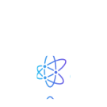
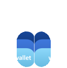

  

    

      
      
      
      
    

    

      <h1>Trusted by the best</h1>
      
Innovative projects are building with LDK

      <a href="/case-studies/">All case studies -></a>
    

  

  <a href="https://bitcoindevkit.org/">
  

    
    

    
The on-chain companion to LDK

  

  </a>

