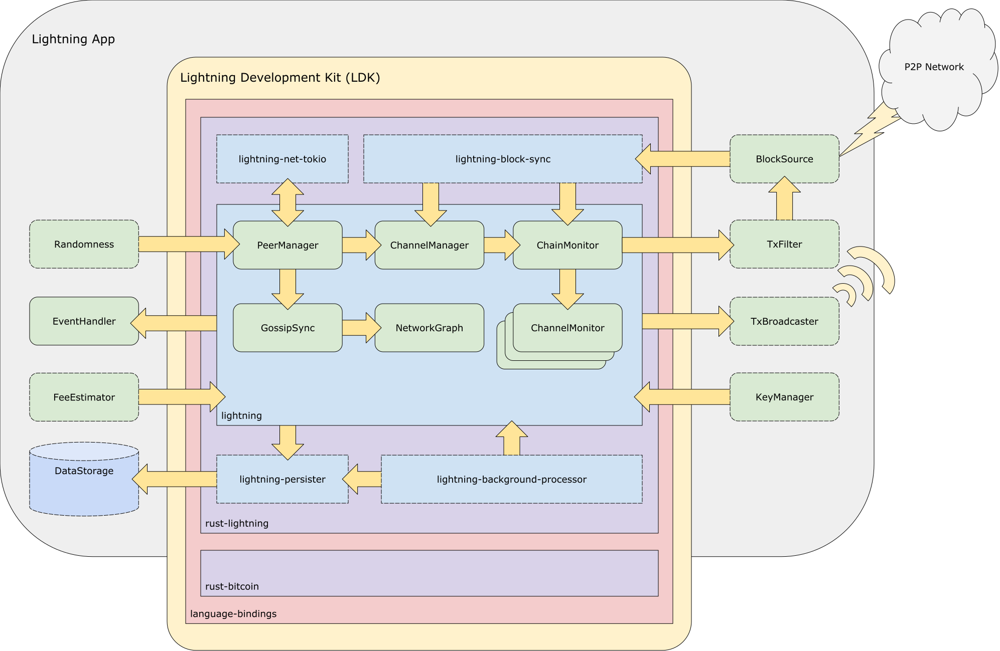

# Overview

LDK is a flexible lightning implementation with supporting batteries (or modules).

**To jump into integrating LDK with your application:**

* [Click here for Java](build_node.md)
* [Click here for Rust](build_node_rust.md)

## Introduction
LDK/Rust-Lightning is a generic library which allows you to build a lightning
node without needing to worry about getting all of the lightning state machine,
routing, and on-chain punishment code (and other chain interactions) exactly
correct. LDK tends to be suitable for use cases where a degree of
customization is desired, e.g. your own chain sync, your own key management
and/or your own storage/backup logic.

We are currently working on a demo node which fetches blockchain data and
on-chain funds via Bitcoin Core RPC/REST. The individual pieces of that demo
are/will be composable, so you can pick the off-the-shelf parts you want and
replace the rest.

## LDK Batteries
While LDK provides all the core lightning state machine logic, other
batteries/modules are needed to run a node. LDK interacts with these modules
through generic interfaces, meaning the user can choose the implementation that
best suits their needs. LDK provides sample implementations for many of these
batteries, which are enumerated below.

* On-disk storage
  * You can store the channel state any way you want - whether Google
  Drive/iCloud, a local disk, any key-value store/database/a remote server, or
  any combination of them - we provide a clean API that provides objects which
  can be serialized into simple binary blobs, and stored in any way you wish.
  * [**Sample module in Rust**](https://github.com/rust-bitcoin/rust-lightning/tree/main/lightning-persister)
* Blockchain data
  * We provide a simple `block_connected`/`block_disconnected`
  API which you provide block headers and transaction information to. We also
  provide an API for getting information about transactions we wish to be
  informed of, which is compatible with Electrum server requests/neutrino
  filtering/etc.
  * [**Sample module in Rust**](https://github.com/rust-bitcoin/rust-lightning/tree/main/lightning-block-sync)
* On-chain funds wallet/UTXO management
  * Rust-Lightning/LDK owns on-chain funds as long as they are claimable as
  a part of a lightning output which can be contested - once a channel is closed
  and all on-chain outputs are spendable only by the user, we provide users
  notifications that a UTXO is "theirs" again and it is up to them to spend it
  as they wish. Additionally, channel funding is accomplished with a generic API
  which notifies users of the output which needs to appear on-chain, which they
  can then create a transaction for. Once a transaction is created, we handle
  the rest. This is a large part of our API's goals - making it easier to
  integrate lightning into existing on-chain wallets which have their own
  on-chain logic - without needing to move funds in and out of a separate
  lightning wallet with on-chain transactions and a separate private key system.
  * LDK does not currently provide a sample wallet module, but its sample node
    implementation uses Bitcoin Core's wallet for UTXO management e.g. [here](https://github.com/lightningdevkit/ldk-sample/blob/2cd778e7acc959689e3b8462c529ffb3509aa1ec/src/main.rs#L245-L260)
* Networking
  * To enable a user to run a full lightning node on an embedded
  machine, we don't specify exactly how to connect to another node at all! We
  provide a default implementation which uses TCP sockets, but, e.g., if you
  wanted to run your full lightning node on a hardware wallet, you could, by
  piping the lightning network messages over USB/serial and then sending them in
  a TCP socket from another machine.
  * [**Sample module in Rust**](https://github.com/rust-bitcoin/rust-lightning/tree/main/lightning-net-tokio)
  * [**Sample module in Java**](https://github.com/lightningdevkit/ldk-garbagecollected/tree/main/src/main/java/org/ldk/batteries)
* Private keys
  * LDK has "default implementations", but users can choose to provide private
  keys to RL/LDK in any way they wish following a simple API. We even support a
  generic API for signing transactions, allowing users to run RL/LDK without any
  private keys in memory and/or putting private keys only on hardware wallets.
  * [LDK's `KeysManager` docs](https://docs.rs/lightning/*/lightning/chain/keysinterface/struct.KeysManager.html).
  While LDK's default implementation is currently within Rust-Lightning, it is
  still considered a sample module.
* Transaction filtering
  * Clients running a light client may wish to filter for transactions on a separate server, in which case LDK will tell them about transactions to filter for. More information is available in the [Blockchain Data guide](blockdata.md).
* Fee estimation
  * LDK's sample node implementation uses Bitcoin Core's fee estimation API [here](https://github.com/lightningdevkit/ldk-sample/blob/2cd778e7acc959689e3b8462c529ffb3509aa1ec/src/bitcoind_client.rs#L98-L154).
* Transaction broadcasting
  * LDK's sample node implementation uses Bitcoin Core's transaction broadcasting API [here](https://github.com/lightningdevkit/ldk-sample/blob/2cd778e7acc959689e3b8462c529ffb3509aa1ec/src/bitcoind_client.rs#L235-L257).
* Random number generation
  * Because Rust-Lightning aims to make no system calls, it is restricted from generating its own randomness.
  * LDK's sample node implementation uses Rust's `rand` crate [here](https://github.com/lightningdevkit/ldk-sample/blob/2cd778e7acc959689e3b8462c529ffb3509aa1ec/src/main.rs#L464-L465) and elsewhere.

## LDK Architecture

LDK's core components are shown in the center box labeled `lightning`. Boxes
with dotted borders are LDK's batteries — these must be configured with either
off-the-shelf or custom implementations that you provide.

EventHandler in the diagram is not so much a necessary LDK battery, but instead
refers to the fact that LDK generates events that the user should handle (e.g.
the `PaymentReceived` event).

## References

### [Rust Documentation](https://docs.rs/lightning)

These provide the most searchable and comprehensive documentation on LDK.
If you're using Java and want more information on any method/struct/etc., searching
the Rust docs for the Rust version of that struct/method is your best bet.

### [Rust Sample Node](https://github.com/lightningdevkit/ldk-sample)

The sample serves as a complete reference for constructing a lightning node with
the LDK. This is a good starting point if you want a self-guided tour!

### [Swift LDK Documentation](https://github.com/arik-so/SwiftLightning/tree/master/Documentation)

These docs are mainly geared towards how Swift could call LDK C bindings directly, but still may
provide a useful overview of Rust Lightning in the context of language bindings.

### [LDK Architecture](https://docs.google.com/drawings/d/1Ql-q5gyrPnJhi7z_D39jayG0HEEVh6UEY1eULXb03Eg/edit?usp=sharing)

Gives a high-level organization of LDK and how the pieces fit together. Variations of this diagram
are used throughout the site. This is the primary source and is still a work in progress.
