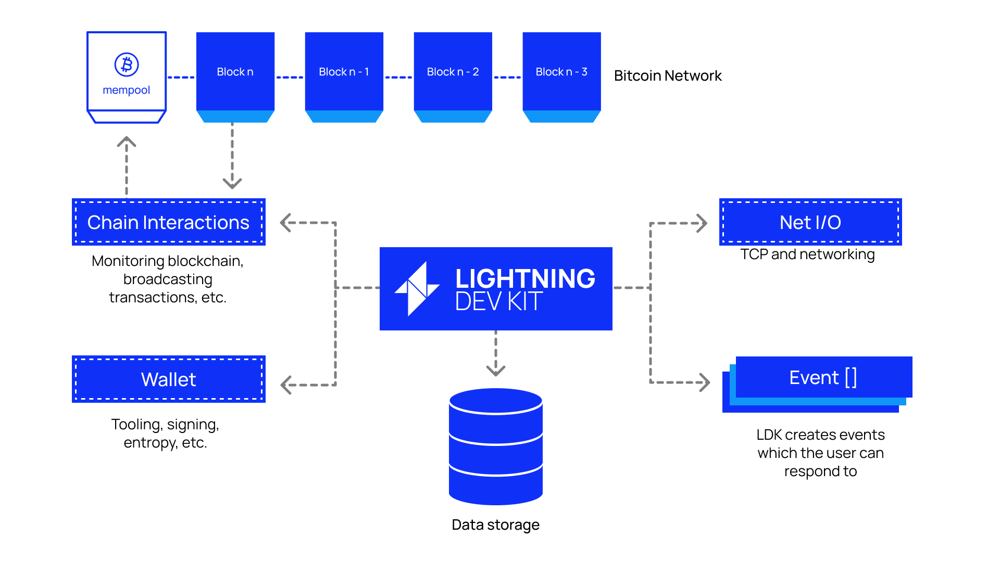

## Architecture

Firstly, LDK is not a daemon, but rather its own implementation of the Lightning network written as an SDK and designed to be complied and run in your own application. 

This makes it environment agnostic, allowing you to choose your own data storage, wallet, networking stack and blockchain monitoring. In the diagram above the boxes with dotted borders are LDK's modules — these must be configured with either default or custom implementations that you provide.

We also use an event driven archictecture that that will allow you to act upon number of things asynchronously. For example LDK will generate an event when a payment is received (`PaymentReceived`). More on this in a later section. 

::: tip Langauge Bindings

Although the core SDK is written in Rust, we support a number of other programming langauges. These include C/C++, Java, Kotlin, Swift, JavaScript/Typescript/WASM (Alpha). Check out [examples](../examples.md) to see some of the implementions out in the wild!
