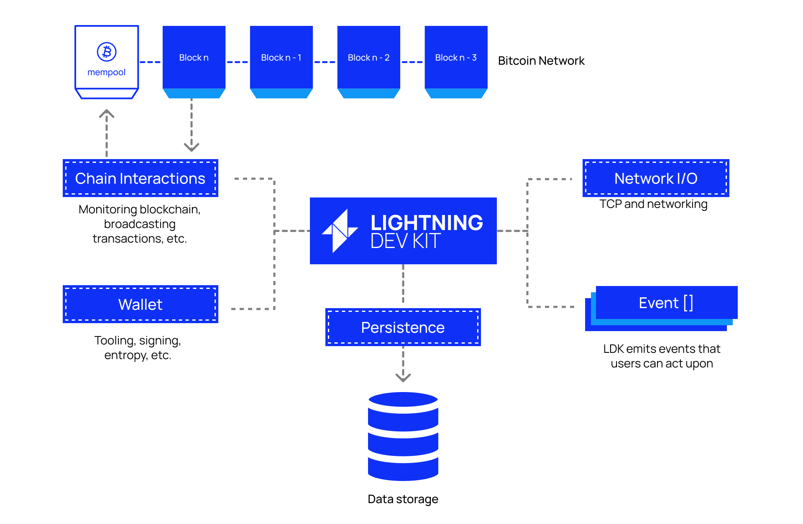

# Architecture

Firstly, LDK is not a daemon, but rather its own implementation of the Lightning protocol written as an SDK and designed to be compiled and executed in your application. 

This makes it environment agnostic, allowing you to choose your own data storage, wallet, networking stack and blockchain monitoring. In the diagram above the boxes with dotted borders are LDK's modules — these must be configured with either default or custom implementations that you provide.

LDK also uses an event-driven architecture which allows for asynchronous result notification. For example you perform actions like making payments without waiting for the result and are later made aware via an event if the payment was successful or not.

::: tip Language Bindings

Although the core SDK is written in Rust, LDK supports many other programming languages. These include Java/Kotlin, Swift, JavaScript/TypeScript (Beta), C++ (Alpha). Check out [examples](../examples.md) to see some of the implementations out in the wild!
