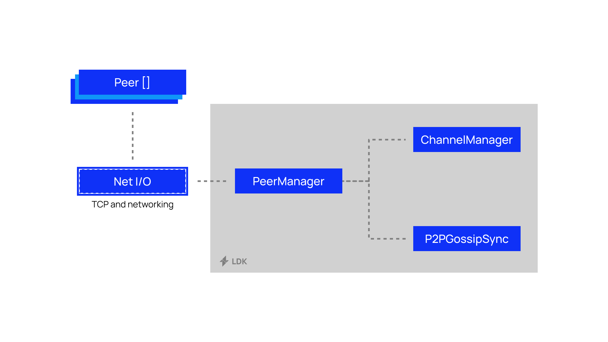

# Peer Management

One of the first things you'll need to do when building your own Lightning node is connect to a peer. In LDK this is handled by the [`PeerManager`](https://docs.rs/lightning/*/lightning/ln/peer_handler/struct.PeerManager.html).

The `PeerManager` has two dependencies: 
 - A [`ChannelManager`](https://docs.rs/lightning/*/lightning/ln/channelmanager/index.html) that enables it to notify peers when it wants to do things such as open channels.
 - A [`P2PGossipSync`](https://docs.rs/lightning/*/lightning/routing/gossip/struct.P2PGossipSync.html) that understands when peers you are connected to send you gossip messages, enables you to forward messages, announce channel opens and more. 

Since LDK knows nothing about your networking stack, you'll need to implement your own networking logic in order to connect to peers on the network. Provide LDK with raw TCP/IP socket data and the library will handle the rest for you.

LDK also handles a number of background tasks that need to happen periodically via [`BackgroundProcessor`](https://docs.rs/lightning-background-processor/*/lightning_background_processor/struct.BackgroundProcessor.html)

::: tip Default Implementation

If you are developing in a Rust [Tokio](https://tokio.rs/) environment, LDK ships with a socket handling [crate](https://docs.rs/lightning-net-tokio/*/lightning_net_tokio/) that let's you easily create new connections with peers. 

