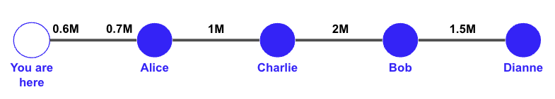

# Probing and Path Finding

## The Challenge of Routing Payments on the Lightning Network
The Lightning Development Kit (LDK) provides you with the software tools to run a node on the Lightning Network - a collection of tens of thousands of nodes that, together, enable cheap and private Bitcoin transactions. 

The challenge is that your node is just one among tens of thousands. While each node has its own internal representation of the Lightning Network Graph, the information within this graph is incomplete to optimally route payments. This is largely because, when nodes announce new (or updated) channels to the network, they do not specify how the capacity is distributed between the two channel parties, making it difficult to know for certain if a given channel is a viable option when routing payments. To further complicate things, your node may not be entirely certain that a given channel is online when routing a payment, further increasing the risk of payment failure.

This presents two fundamental challenges when routing payments on the Lightning Network:
1) **Missing Information**: Nodes may not know if a given channel's liquidity is prohibitively unbalanced.
2) **Path-Finding Optimization**: If multiple payment paths exist, we must decide which path is the best.

To help address both of the above challenges, LDK provides a ```ProbabilisticScorer``` struct. This structure holds information about our node's current view of the Lightning Network graph, including an estimate of available liquidity within each channel. It also records historical liquidity observations, which are updated each time our node either fails or succeeds at making a payment (or probe). It's important to note that our node can have multiple ```ProbabilisticScorer``` in use simultaneously. Furthermore, this can actually be quite beneficial, as it allows our node to leverage multiple perspectives of the Lightning Network graph, helping to ensure we don't become too reliant on the same paths when exploring potential payment paths.

Ultimately, a ```ProbabilisticScorer``` is used to identify the optimal path for routing a payment by scoring each channel in a candidate path. With this information, the ```ProbabilisticScorer``` helps identify routes with a high probability of success while minimizing transaction fees.

### Estimating Channel Ballance Distribution
There is a bit of a "cold-start problem" when encountering a new channel, as we have little information on which to base our initial estimates for available liquidity. Therefore, it's important to start gathering data to build up our LDK node's internal estimates of channel balance distributions. To do this, we **"probe"** the network. **Probing** is a process where we send a payment with an *invalid* payment hash along a route. Since the payment hash is invalid, we know the payment will ultimately fail, so we're not concerned with losing funds. However, we can pay special attention to how the payment fails and learn important information about the Lightning Network graph. 

For example, imagine our node has, via the gossip protocol, learned about the below path:



We know each channel's capacity, but we don't know how that capacity is distributed within the channel (**note**, we do know how our channel capacity is distributed between us and Alice). For example, would a 400,000 sats payment make its way from us to Dianne, or would it fail because almost all 2,000,000 sats are on Bob's side of his channel with Charlie? 

To answer this question, we decide to send a test payment (probe) of 400,000 sats to Dianne. If we do this, there are two possible outcomes:

1) The payment reaches Dianne, but she doesn't recognize the payment hash (because we sent an invalid one), so she sends an error back to us. If this happens, we've now learned that each channel has an available liquidity of at least 400,000 sats.
2) If the payment fails along the way, we'll get an error informing us *where* (which channel) the payment failed. If this happens, we've now learned which channel does not have the ability to forward a 400,000 sat payment.

If we'd like, we can repeat this process with varying amounts of sats to gain a more precise estimate of each channel's available liquidity for this route. We can then do the same for many other routes, thus building up a robust view of the Lightning Network and, ultimately, empowering us to select the optimal path when routing payments in the future.

Probing best practices are discussed in more detail in  [**Best Practices**](#best-practices), however, for now, it's sufficient to note that LDK will update its view of the graph each time real and test payments either succeed or fail. Successes and failures are communicated to our LDK node via the [ScoreUpdate](https://docs.rs/lightning/latest/lightning/routing/scoring/trait.ScoreUpdate.html) trait. These successes and failures serve as historical data points and influence our node's current estimate of available liquidity for each channel.

Given that the Lightning Network graph is constantly changing as payments flow throughout the ecosystem, our LDK node must account for the passage of time and assume that channel balances will change even if our node has not probed or otherwise interacted with a channel in a while. To accomplish this, LDK provides ```ProbabilisticScoringDecayParameters```. These parameters configure how each channel’s available liquidity estimates are updated over time. For example, one ```ProbabilisticScoringDecayParameters```configuration is ```liquidity_offset_half_life```. This configuration determines how frequently a channel's upper bound and lower bound available liquidity estimations are updated. For example, after the set time passes (default 6 hours), the channel’s lower bound estimate is cut in half, and the upper bound moves halfway to the channel’s total capacity. For example, if a channel has a 1 million sat capacity, and our node currently estimates its lower bound to be 200,000 sats and an upper bound to be 600,000 sats, then, after ```liquidity_offset_half_life```, it will be updated to 100,000 sats and 800,000 sats. While the ```ProbabilisticScoringDecayParameters``` can be customized, default parameters are provided. You can read more about the ```ProbabilisticScoringDecayParameters``` [here](https://docs.rs/lightning/latest/lightning/routing/scoring/struct.ProbabilisticScoringDecayParameters.html).

### Finding the Optimal Path
The ```ProbabilisticScorer``` assists in finding the optimal path by providing our node with a perspective of the Lightning Network graph and the estimated available liquidity for each channel. To assist in finding the optimal payment route, LDK provides ```ProbabilisticScoringFeeParameters```. These fee parameters impact how our node optimizes its routing decisions. Broadly speaking, ```ProbabilisticScoringFeeParameters``` contains various parameters that help select paths with desirable properties (ex: fewer hops, reliable, private, low fees, etc.). For example, one setting is ```liquidity_penalty_amount_multiplier_msat```. This configuration defines a multiplier that is used in conjunction with the total amount flowing over the given channel and our node's estimated probability of successfully routing the payment through the channel. This configuration will give a larger penalty to channels that have a low probability of success, and that penalty will grow larger as the payment amount increases.

Similar to the ```ProbabilisticScoringDecayParameters```, ```ProbabilisticScoringFeeParameters``` parameters are customizable, but defaults are provided. You can read more about the ```ProbabilisticScoringFeeParameters``` [here](https://docs.rs/lightning/latest/lightning/routing/scoring/struct.ProbabilisticScoringFeeParameters.html).

## The ```ProbabilisticScorer```

As discussed earlier, the ```ProbabilisticScorer``` (seen below) is responsible for maintaining and updating our node's estimates of available channel liquidity.

A ```ProbabilisticScorer``` has the following fields:
- ```decay_params```: This field holds the decay parameters (```ProbabilisticScoringDecayParameters```) for the scorer. As mentioned above, these are customizable, but LDK also provides defaults. You can learn more about them [here](https://docs.rs/lightning/latest/lightning/routing/scoring/struct.ProbabilisticScoringDecayParameters.html).
- ```network_graph```: This field holds a reference to the network graph.
- ```logger```: This field holds a reference to the logger.
- ```channel_liquidities```: This field holds a ```HashMap```, which maps **short channel IDs** to ```ChannelLiquidity``` objects. These objects include liquidity estimates, historical data for the respective channels, and timestamps indicating when the liquidity estimates were last updated.

Once implemented, the ```ProbabilisticScorer```, along with its parameters (```ProbabilisticScoringDecayParameters``` and ```ProbabilisticScoringFeeParameters```), becomes the backbone of path-finding in LDK. The next section will describe best practices for implementing, training, and serving the ```ProbabilisticScorer``` within your application.

``` rust
pub struct ProbabilisticScorer<G: Deref<Target = NetworkGraph<L>>, L: Deref>
where L::Target: Logger {
	decay_params: ProbabilisticScoringDecayParameters,
	network_graph: G,
	logger: L,
	channel_liquidities: HashMap<u64, ChannelLiquidity>,
}
```

## Best Practices

Before digging into best practices for probing, it's important to note that popular Lightning Network implementations such as Core Lightning (CLN), Lightning Network Daemon (LND), and Lightning Development Kit (LDK), have different internal representations of the Lightning Network. Therefore, it's not possible to simply "feed" CLN, LND, or LDK the same scoring file or information when setting up path-finding functionality.

### General Architecture Approaches
Now, let's review general architectural approaches for implementing and updating a ```ProbabilisticScorer``` in an LDK node. Before getting into the weeds, it's important to note that a ```ProbabilisticScorer``` does not perform the probing itself. Instead, it is passed as a parameter when our node finds a route. For a simple analogy, imagine you seeking advice on how to get from New York City to Washington, DC. There are many paths you can take, but the path you choose will depend on the person you ask. One may suggest taking a train, another a bus, and another a plane.

Similarly, the route-finding functionality in LDK is separate from the ```ProbabilisticScorer```, but it takes the scorer as input. If you provide a well-trained scorer, you will likely get a different route than if you provide a fresh scorer.

#### Background Process
The first approach to updating the ```ProbabilisticScorer``` within our application is to program our node to periodically probe in the background. For example, once a minute, our node can attempt to probe a random amount to a random node, updating the scorer with the successes and failures over time. The advantages to this approach are that our node always has access to real-time updates, and we have full control over the probing process. However, running a prober in the background may add additional resource constraints (CPU, memory, bandwidth, etc.) and complexity to our application.

#### Create A Separate Prober Application
Another approach for integrating the ```ProbabilisticScorer``` is to set up a separate application to perform the probing. In this scenario, the application will periodically probe the network, update the ```ProbabilisticScorer```, and make the serialized scorer available for us to fetch and incorporate into our application. For example, it may serialize and serve the scorer via an HTTP server or make it available on a file system shared by the two applications. The advantages of this approach are that we can simplify our application by moving this functionality to another application, thus reducing the resource usage of our node. However, this approach adds coordination complexity to our application and introduces the risk that our node's ```ProbabilisticScorer``` does not have the most current representation of the network.

### Probing
Regardless of which architectural approach you're taking, if you're setting up your own scoring functionality, you'll want to probe the network so that you can build a robust internal representation of the Lightning Network and optimally route payments. To accomplish this, there are a few options you can explore:

1) **Random Probing**: As discussed above, one simple approach to update your scorer is to pay a random amount to a random node every minute. While this may sound rudimentary, it's an effective way to build an internal state for how simple it is.
2) **Leverage Your Routing History**: If you record a history of payments forwarded by your node, you can leverage that by identifying large or well-ranked nodes that are 1 or 2 hops beyond frequent next-hops from your node. The goal here is to attempt to identify heavily used paths for payments that route through your node. Of course, you do not know the final destination of each payment, which is why you will need to use some heuristics (ex: channel capacity, node rank, etc.) to estimate which paths are heavily used.
3) **Probe Large Nodes**: As mentioned above, it can be beneficial to probe large nodes on the network, such as ACINQ. This is because large nodes can often be the final destination for payments, so probing these nodes will help your LDK node understand which paths are viable for varying payment amounts. It's also worth noting that since many channels on the Lightning Network are connected to large nodes, you will likely succeed in probing large nodes via the "Random Probing" approach.
4) **Use Multiple ```ProbabilisticScorer```**: Your node can leverage multiple ```ProbabilisticScorer``` at once. Remember, each scorer has its own internal liquidity estimates and payment history for each channel it knows about. Therefore, it may be beneficial to use a new scorer, which has not been updated, to select a route and then update a different scorer. This approach would help ensure that your node doesn't keep probing the same paths, as your node's updated scorer will likely begin to identify and prefer certain paths once it's sufficiently updated.
5) **Varry The Payment Amount**: Remember, a central part of the path-finding algorithm involves generating penalties for each channel so that your node can select the best path. A key variable when calculating the penalty for each channel is the payment amount. You will likely get different paths for the same source --> destination payment, depending on the amount. Therefore, it's important to varry the payment amount when setting up your application to probe the network. You can read more about the ```ProbabilisticScoringFeeParameters``` [here](https://docs.rs/lightning/latest/lightning/routing/scoring/struct.ProbabilisticScoringFeeParameters.html).

## Setting Up A ```ProbabilisticScorer```

Now that we've reviewed the ```ProbabilisticScorer``` and provided an overview of what it does within LDK, let's discuss how to implement it so that our node can find the optimal route for a payment.

#### Initializing the ```ProbabilisticScorer```
We'll start by initializing the ```ProbabilisticScorer```. For this example, we'll assume that various components, such as a ```Logger``` and ```ChannelManager```, have already been created. If you would like to view documentation on how to initialize these, please see [here](https://lightningdevkit.org/building-a-node-with-ldk/setting-up-a-channel-manager/).

```rust
// Initialize the Logger.
let logger = Arc::new(FilesystemLogger::new(ldk_data_dir.clone()));

// Initialize the Network Graph.
let network_graph_path = format!("{}/network_graph", ldk_data_dir.clone());
let network_graph = Arc::new(disk::read_network(Path::new(&network_graph_path), args.network, logger.clone()));

// Initialize the Scorer.
let scorer_path = format!("{}/scorer", ldk_data_dir.clone());
let scorer = Arc::new(RwLock::new(disk::read_scorer(
    Path::new(&scorer_path),
    Arc::clone(&network_graph),
    Arc::clone(&logger),
)));
```

To create the ```scorer```, the above code utilizes a ```read_scorer``` function, which resides in our application's ```disk.rs``` file. The function has been provided below. In it, you can see that we are first attempting to read the scorer from our application's data folder. If a scorer is available, we will use that. If not, we'll create a new scorer. It's worth noting that, if we decided to retrieve a scorer via an alternative method such as an HTTP server, we could adjust this function to include that logic.

```rust
pub(crate) fn read_scorer(
	path: &Path, graph: Arc<NetworkGraph>, logger: Arc<FilesystemLogger>,
) -> ProbabilisticScorer<Arc<NetworkGraph>, Arc<FilesystemLogger>> {
	let params = ProbabilisticScoringDecayParameters::default();
	if let Ok(file) = File::open(path) {
		let args = (params.clone(), Arc::clone(&graph), Arc::clone(&logger));
		if let Ok(scorer) = ProbabilisticScorer::read(&mut BufReader::new(file), args) {
			return scorer;
		}
	}
	ProbabilisticScorer::new(params, graph, logger)
}
```

#### Setting Up Our Probing Logic
For this example, we'll build a simple prober that fetches a random node from our ```NetworkGraph``` and attempts to send that node a random payment - up to 500,000,000 milli-satoshis. We'll start by creating a function that fetches a random node from our ```NetworkGraph```. If we cannot find a node, the function will return, and we will not probe any nodes. If we're able to identify a node to probe, then we'll select a random payment amount of up to 500,000,000 milli-satoshis. As a reminder, 1 satoshi = 1,000 milli-satoshis. Finally, we'll get the public key for the node we selected and call ```send_probe```, which is defined below.

```rust
fn send_rand_probe(
    channel_manager: &ChannelManager, graph: &NetworkGraph,
    logger: &disk::FilesystemLogger,
    scorer: &RwLock<ProbabilisticScorer<Arc<NetworkGraph>, Arc<disk::FilesystemLogger>>>
) {
    let recipient = {
	// Get read-only lock on graph.
        let read_only_graph = graph.read_only();

	// Check if graph has any nodes we can probe. If none, return.
        if read_only_graph.nodes().is_empty() { 
            return; 
        }
        // Select random node from the graph.
        let mut it = read_only_graph.nodes().unordered_iter().skip(::rand::random::<usize>() % read_only_graph.nodes().len());
        it.next().unwrap().0.clone()
    };
    
    // Generate a random amount for the probe - up to 500,000,000 milli-satoshis.
    let amt = ::rand::random::<u64>() % 500_000_000;

    // If we can convert the node ID to a public key, send probe.
    if let Ok(pk) = bitcoin::secp256k1::PublicKey::from_slice(recipient.as_slice()) {
        send_probe(channel_manager, pk, graph, logger, amt, scorer);

    // Else, return nothing and do not probe.
    } else {
    }
}
```

#### Sending Probes
Now that we've identified the recipient and amount for our probe, let's write a function to find the route for our payment. The ```ProbabilisticScorer``` that is used to score various routes will be passed as an input to this function. Recall that earlier, we discussed the concept of using multiple scorers. One scorer that we actually save results to and another un-updated scorer that can be used to identify routes with a "beginner's mind" - so to speak. If we'd like to leverage this approach, we can pass an un-updated scorer here and then update a different scorer with the results of the probe.

Also, note that this function is referencing a ```ScorerAccountingForInFlightHtlcs```. This structure wraps around an existing scorer and incorporates information regarding in-flight (not yet settled) HTLC's, allowing our scorer to incorporate real-time payment flows as part of its routing optimization. We also define the scoring parameters, ```ProbabilisticScoringFeeParameters```, in this function. As discussed earlier, LDK provides default parameters, but you can customize these if you like.

Finally, if we're able to find a route for our payment, we iterate over each path and send a probe.

```rust
fn send_probe(
    channel_manager: &ChannelManager, recipient: PublicKey, graph: &NetworkGraph,
    logger: &disk::FilesystemLogger, amt_msat: u64,
    scorer: &RwLock<ProbabilisticScorer<Arc<NetworkGraph>, Arc<disk::FilesystemLogger>>>
) {
    // Get usable channels from the channel manager.
    let chans = channel_manager.list_usable_channels();
    let chan_refs = chans.iter().map(|a| a).collect::<Vec<_>>();

    // Get payment parameters for the probe (payee features, route hints, max CLTV expiry delta, max hops, etc.)
    let mut payment_params = PaymentParameters::from_node_id(recipient, 144);
    payment_params.max_path_count = 1; // Limit to a single path for the probe

    // Get in-flight HTLCs so we can account for in-use channel liquidity.
    let in_flight_htlcs = channel_manager.compute_inflight_htlcs();

    // Acquire a read lock on the scorer.
    let scorer = scorer.read().unwrap();

    // Create a scorer that accounts for in-flight HTLCs.
    let inflight_scorer = ScorerAccountingForInFlightHtlcs::new(&scorer, &in_flight_htlcs);

    // Use default scoring fee parameters.
    let score_params: ProbabilisticScoringFeeParameters = Default::default();

    // Attempt to find a route for the probe (routes can contain multiple paths)
    let route_res = lightning::routing::router::find_route(
        &channel_manager.get_our_node_id(),
        &RouteParameters::from_payment_params_and_value(payment_params, amt_msat),
        &graph, Some(&chan_refs), logger, &inflight_scorer, &score_params, &[32; 32]
    );

    match route_res {
	Ok(route) => {
		// Iterate over each path.
		for path in route.paths {
			let _ = channel_manager.send_probe(path);
		}
	},
	Err(e) => {
		println!("Failed to find a route: {:?}", e);
	}
    }
}
```

#### Updating Our Scorer 

LDK leverages an event-driven architecture, allowing for asynchronous result notification. Therefore, to update our scorer over time, we'll want to inform our application that it should be on the lookout for payment or probing-related events, as these are what indicate to our node that a given route has succeeded or failed. The specific events that we should be watching for and handling are ```Event::PaymentPathFailed```, ```Event::PaymentPathSuccessful```, ```Event::ProbeSuccessful```, and ```Event::ProbeFailed```. There are many other event types. For extensive documentation of LDK events, please see [here](https://docs.rs/lightning/latest/lightning/events/enum.Event.html).

To handle the above events and other tasks that either can or should run in the background, LDK provides the ```process_events_async``` function within the ```lightning-background-processor``` crate. When instantiated, this starts an asynchronous process of handling lightning network node operations, such as maintaining our node's view of the network graph, updating the scorer, and more. 

To instantiate the background processor, you need to pass in the required components, handlers, and configuration parameters. It's worth noting that one of the handlers that is passed into this function is our own application's event handler. When the background processor picks up a new event, it will first intercept the event and, if applicable, handle it itself (ex: update and persist the scorer) before passing it on to the user's event handler.

```rust
// Create a watch channel for signaling background processor exit.
//
// bp_exit: Sender to signal the background processor to exit.
// bp_exit_check: Receiver to check for exit signals in the background processor.
//
// This channel allows for a graceful shutdown of the background processor
// by sending a signal that can be checked at appropriate intervals.
let (bp_exit, bp_exit_check) = tokio::sync::watch::channel(());
let mut background_processor = tokio::spawn(process_events_async(
    Arc::clone(&persister),  // Persister for writing/reading from file system.
    event_handler,           // Handler for processing various LDK events.
    chain_monitor.clone(),   // Monitors blocks for relevant activity.
    channel_manager.clone(), // Responsible for managing tasks related to channel state.
    GossipSync::p2p(gossip_sync.clone()), // Handles P2P network gossip.
    peer_manager.clone(),    // Manages peer connections and associated data.
    logger.clone(),          // Logger for recording events and errors.
    Some(scorer.clone()),    // Scorer for updating and persisting scoring updates.
    move |t| {
        // Custom sleep function that can be interrupted.
        let mut bp_exit_fut_check = bp_exit_check.clone();
        Box::pin(async move {
            tokio::select! {
                _ = tokio::time::sleep(t) => false,  // Sleep completed.
                _ = bp_exit_fut_check.changed() => true,  // Exit signal received
            }
        })
    },
    false,  // Flag to indicate whether to interrupt on shutdown.
    || Some(SystemTime::now().duration_since(SystemTime::UNIX_EPOCH).unwrap()),  // Current time provider.
));
```

Once the background processor is started, it will call ```update_scorer``` as it handles relevant events. For informational purposes, the code that is executed within the background processor to update the scorer is provided below, but you do not need to implement this yourself. As you can see, when payments or probes fail, we update our scorer, further refining its internal estimations of available liquidity on the Lightning Network so that we're better able to route "real" payments when the time comes.

```rust
/// Updates scorer based on event and returns whether an update occurred so we can decide whether
/// to persist.
fn update_scorer<'a, S: 'static + Deref<Target = SC> + Send + Sync, SC: 'a + WriteableScore<'a>>(
	scorer: &'a S, event: &Event, duration_since_epoch: Duration,
) -> bool {
	match event {
		Event::PaymentPathFailed { ref path, short_channel_id: Some(scid), .. } => {
			let mut score = scorer.write_lock();
			score.payment_path_failed(path, *scid, duration_since_epoch);
		},
		Event::PaymentPathFailed { ref path, payment_failed_permanently: true, .. } => {
			// Reached if the destination explicitly failed it back. We treat this as a successful probe
			// because the payment made it all the way to the destination with sufficient liquidity.
			let mut score = scorer.write_lock();
			score.probe_successful(path, duration_since_epoch);
		},
		Event::PaymentPathSuccessful { path, .. } => {
			let mut score = scorer.write_lock();
			score.payment_path_successful(path, duration_since_epoch);
		},
		Event::ProbeSuccessful { path, .. } => {
			let mut score = scorer.write_lock();
			score.probe_successful(path, duration_since_epoch);
		},
		Event::ailed { path, short_channel_id: Some(scid), .. } => {
			let mut score = scorer.write_lock();
			score.probe_failed(path, *scid, duration_since_epoch);
		},
		_ => return false,
	}
	true
}
```

It's important that our scorer also observes the passage of time. This is because if our scorer has not received any recent updates for a channel, it will need to broaden its current estimates for available channel liquidity. You can read more about the ```time_passed``` parameter [here](https://docs.rs/lightning/latest/lightning/routing/scoring/trait.ScoreUpdate.html#tymethod.time_passed).

Similar to handling payment and probe-related events, the background processor that we created in the previous section will call ```time_passed``` on our scorer and persist the updated scorer every 5 minutes.

#### Sending Probes

We're almost done! Now that we have probing functionality built out and the ability to update our scorer with the results, we just need to tell our application to send a probe randomly, once per minute. 

Within your application, you will likely have a main entry point where you initialize important LDK components such as the ```ChannelManager```, ```ChainMonitor```, and the ```ProbabilisticScorer``` itself. Since all of the required components will be available within this asynchronous entry point, we can configure our app to send a probe every 60 seconds by calling the functions we previously created and passing in the required components.

```rust
// Regularly probe.
let probing_cm = Arc::clone(&channel_manager);
let probing_graph = Arc::clone(&network_graph);
let probing_logger = Arc::clone(&logger);
let probing_scorer = Arc::clone(&scorer);
tokio::spawn(async move {
	let mut probe_interval = tokio::time::interval(Duration::from_secs(60));
	loop {
		probe_interval.tick().await;
		send_rand_probe(&*probing_cm, &*probing_graph, &*probing_logger, &*probing_scorer);
	}
});
```
